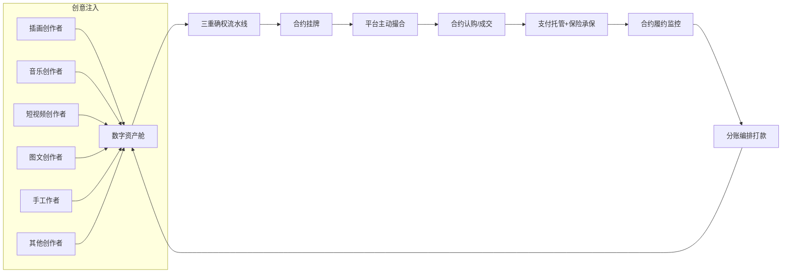
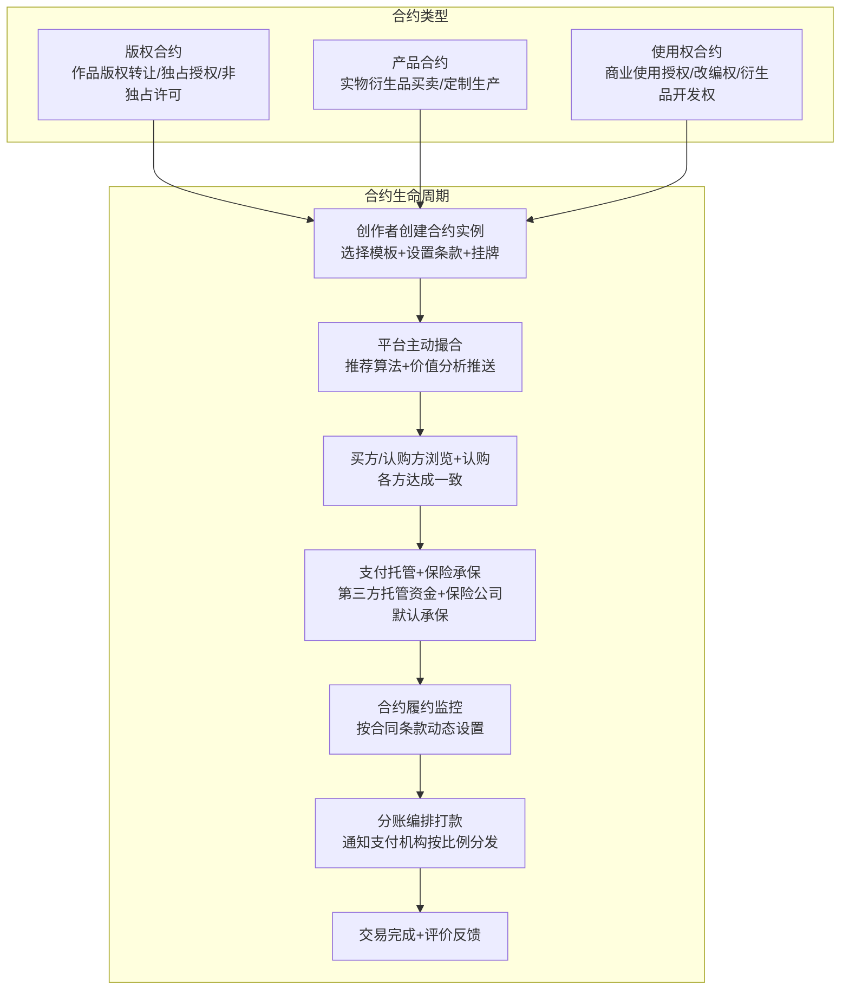
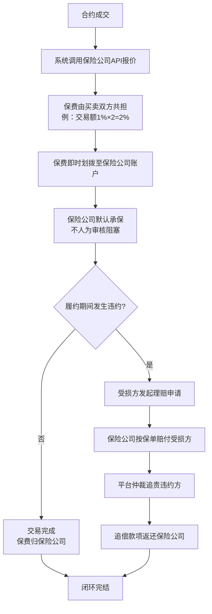
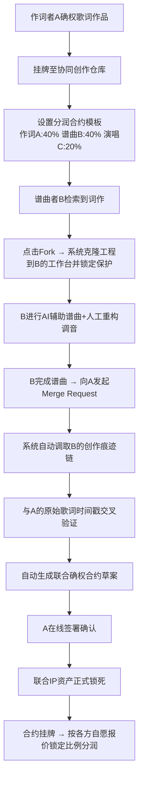
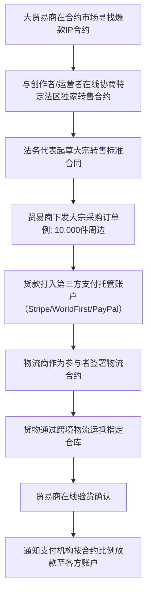
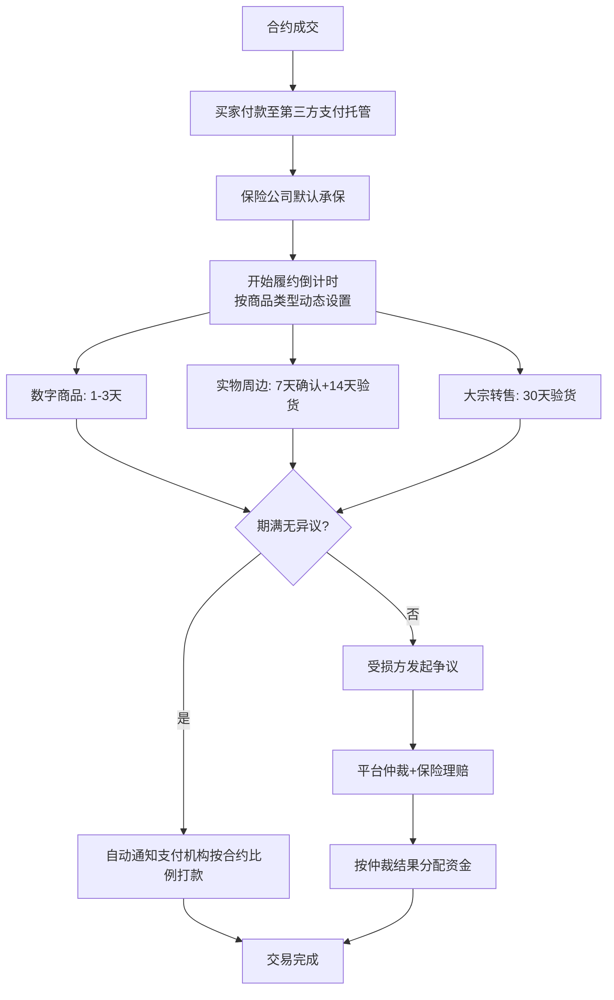
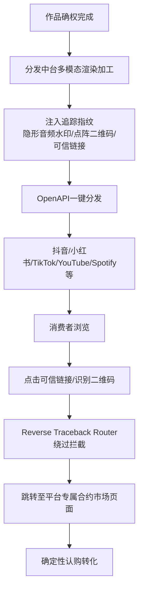
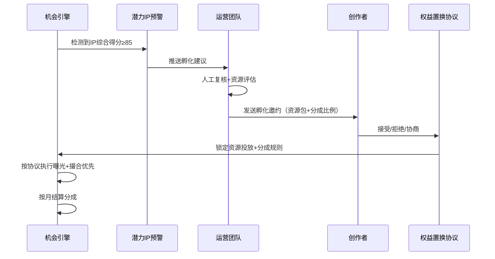

# **OriSpark 平台顶层工程设计方案**

> **版本：** v5.0 | **日期：** 2026-07-19
> **核心定位：** 类证券交易所模式的个体创作者IP全链路撮合交易平台
> **核心变更（v5.0）：** 平台不做重资产运营——不持有资金、不建3D渲染引擎、不做供应链集单调度、不接WMS系统；转为纯合约撮合平台，合约即交易标的（类似股票订单），支付通道可插拔（Stripe/WorldFirst/PayPal），交易保险作为独立参与者默认承保，法务代表保障法律效应，税务代理作为参与者签约，平台通过信息展示和推荐算法主动制造撮合机会。

---

## 一、顶层三大系统工程架构明细

### 1. 业务架构：全景业务矩阵与多边交互链路

平台构建于"海量长尾创意驱动，全球多法区清结算，合约撮合为核心"的多边网络之上。核心业务流向通过以下七个步骤实现完全闭环：



### 步骤详解

| 步骤 | 主体 | 动作 | 输出 |
|------|------|------|------|
| **1. 创意资产注入** | 六大个体创作者 | 通过平台工作台进行"人机协作(AI+人工)"创作，将原生创意及衍生设计资产注入平台"数字资产舱" | 数字资产（含人类贡献度审计日志） |
| **2. 三重确权流水线** | 平台信任底座 | 作品上传→C2PA Manifest注入→TSA时间戳→区块链哈希存证 | 三重确权证书（C2PA+TSA+区块链） |
| **3. 合约挂牌** | 创作者/合作创作者/运营者 | 将确权后的作品转化为标准化合约实例（版权合约/产品合约/使用权合约），选择合约模板（由法务代表创建并审核通过），设置分润比例和履约条款，挂牌至平台合约市场 | 挂牌合约实例（含分润规则、履约条件、保险条款） |
| **4. 平台主动撮合** | 平台机会引擎 | 基于合约属性、创作者历史、参与者偏好、市场趋势，通过信息展示、推荐算法、价值分析主动推送给潜在认购方/合作方 | 撮合匹配列表+价值分析报告 |
| **5. 合约认购/成交** | 买家/认购方 | 浏览/搜索/接收推送的合约挂牌，阅读合约条款（含分润比例、履约条件、保险范围），发起认购或接受要约，各方达成一致后合约成交 | 成交合约实例 |
| **6. 支付托管+保险承保** | 第三方支付机构+保险公司 | 买家付款至选定的第三方支付机构托管账户；保险公司按平台规则默认承保（不人为审核阻塞履约进度） | 托管资金确认+保险保单号 |
| **7. 分账编排打款** | 平台分账引擎+支付机构 | 监控合约履约状态→履约达成或超时无异议→通知支付机构按合约预设比例打款至各方账户（卖家、法务代表、税务代理、保险公司、平台等） | 交易完成记录+各方到账确认 |

---

### 2. 系统架构：模块化单体技术架构层级（v5.0）

平台采用**模块化单体（Monolith）**架构，非微服务部署。模块间通过数据库表关联，通过API路由隔离。

| 系统层级 | 核心子系统/组件名称 | 核心落地功能与技术选型描述 |
| :---- | :---- | :---- |
| **表现层 (Presentation)** | 创作者工作台 (Desktop App) | 基于 Electron 架构，集成 Vue 3 + CEP扩展，负责捕获人机协作痕迹数据。 |
|  | Web应用 (Vue 3) | 所有参与者的统一工作台浏览器端，共享同一套组件库和业务逻辑层。 |
|  | 宣传门户 (Nuxt 3 SSR) | 面向外部的独立站，SEO优化，交易信息展示，Phase 2建设。 |
| **网关与业务中台层** | API路由层 (FastAPI Router) | 模块化单体，模块隔离：auth/creator/collab/asset/trust/settlement/legal/distribution/scr/matching |
|  | 合约撮合模块 (Contract Matching Core) | 实现合约挂牌/认购/成交管理，平台主动撮合引擎（推荐算法+价值分析推送）。 |
|  | 支付渠道适配层 (Payment Gateway Adapter) | 统一支付接口抽象，插拔式适配 Stripe Connect / WorldFirst / PayPal，资金由第三方托管。 |
|  | 分账编排引擎 (Split Payment Orchestrator) | 按合约预设比例通知支付机构打款，支持多方分润（最多10+方）。 |
| **信任底座层 (Trust)** | AIGC 痕迹审计引擎 | 静默封装 Prompt 变化率、图层修改、音轨 Delta 数据，生成独创性智力劳动日志。 |
|  | C2PA 凭证注入 | 纯Python二进制嵌入，cryptography签名，无外部SDK依赖。 |
|  | TSA 国际可信时间戳网关 | 标准 RFC 3161 协议，直连国家授时中心及海外权威电子认证服务商（CA）。 |
|  | 分布式双层信任账本 | 国内锚定蚂蚁司法链（直通互联网法院）；海外锚定公链主网，实现去中心化存证。 |
| **外部生态对接层** | 跨国版权一键申报网关 | 集成中国版权保护中心（DCC）、美国版权局（USCO）、欧盟知识产权局（EUIPO）API。 |
|  | 交易保险网关 | 对接持牌保险公司API（如众安/平安），实时报价+出单+理赔追踪。 |
|  | 全球合规财税大脑 | 直连 Avalara、TaxJar 数据库，税务代理按合约比例获取税款部分。 |

---

### 3. 功能架构：六大核心功能矩阵明细

| 功能域 | 核心能力 | 说明 |
|--------|---------|------|
| **功能域一：创作者工作台与资产舱** | AIGC人机协同捕捉、全品类资产发布 | 挂载PS/Procreate/剪映/DAW插件，记录人类介入特征改动；大文件分片上传 |
| **功能域二：产权与信任保障中台** | 三位一体自动化确权、跨国产权一键申报、四级版权防御 | C2PA+TSA+区块链三重确权；L1基础→L2平台→L3法律→L4技术 |
| **功能域三：合约撮合矩阵** | 合约模板编辑器、合约挂牌/认购/成交、交易保险机制、平台主动撮合引擎 | 法务代表自建合约模板（平台审核）；合约即交易标的；保险公司默认承保 |
| **功能域四：跨境清算与法税系统** | 支付渠道插拔适配、分账编排引擎、税务代理参与者 | Stripe/WorldFirst/PayPal可插拔；按合约比例通知第三方打款 |
| **功能域五：媒体分发与回流系统** | 跨国媒体多端分发网关、流量防伪反向溯源 | OAuth 2.0一键同步；隐形水印+Reverse Traceback Router |
| **功能域六：生态信誉评价底座** | DID系统、SCR分布式信誉评分 | 多维度评分模型，差异化佣金/保证金/排产优先权 |

---

## 二、六大品类个人创作者"人机协同"创作与确权流水线

### 1. 各品类创作者在系统内的核心创作与资产加工流程

为满足全球多法区对"纯AI生成内容不予保护，必须具备人类实质性独创劳动"的法律红线，平台构建"人机协作痕迹链条审计"的生产体系：

* **手工作者（Manual Crafters）**  
  1. 匠人在工作台录入灵感来源、材质配比与工艺路径日志。  
  2. 阶段性产出后，利用智能手机对实物进行全方位多角度拍摄，系统内置的"3D高斯泼溅"引擎自动将其逆向转化为高精度3D网格模型（数字孪生资产）。  
  3. 匠人对3D模型进行人工轴心调整、拓扑优化、边缘修补。系统记录"实物→数字转化→人工修复"全流程操作日志。  
  4. 人类贡献度评分器根据手工类权重计算贡献分，≥0.60进入确权流水线。

* **图文创作者（Text & Prose Creators）**  
  1. 在平台富文本编辑器中创作。若调用平台集成LLM工具（辅助润色、翻译、大纲扩写），系统后台以Diff标准格式记录每个版本的字符改动率。  
  2. 终稿生成"人类编写比例分析报告"，包含人类原创字数、AI干预度、逻辑修改轨迹图谱。  
  3. 图文类权重分配：Prompt迭代(0.40)、时间投入(0.50)、逻辑修改(0.10)。

* **短视频创作者（Short Video Producers）**  
  1. 导入分镜脚本和原始素材。若使用AI文生视频、AI特效或AI声效辅助，系统实时监控非线性编辑轨道。  
  2. 精确记录人工多轨对齐、滤镜参数微调、蒙版抠图、字幕编排、转场特效等高级智力编排动作。  
  3. 视频渲染导出时，轨道编排元数据打包进底层资产包。

* **音乐创作者（Music Composers & Producers）**  
  1. 支持MIDI工程源文件与分轨音频在线导入。若采用AI工具生成底层伴奏或声线转换，系统MIDI监控模块记录创作者的和弦重构、人工声效包挂载、混音台动态参数拉写、人声切片等人為深度监制行为。  
  2. 导出成品音频时，自动在乐曲骨干频率段注入听觉不可察觉的"鲁棒性高频隐形音频水印"。

* **插画创作者（Illustrators & Digital Artists）**  
  1. 通过工作台插件连接Photoshop/Procreate或直接在平台画布中创作。使用SD/MJ等AI生成垫图或局部重绘时，系统自动捕捉底图输入、提示词迭代、负向提示词调优、人工涂抹图层、精细化线稿刻画手稿。  
  2. 终稿导出前，生成"人类创意劳动图谱"可视化证明。

### 2. 数字作品三重保障标准作业程序（确权SOP）

当作品点击"发布并确权"时，系统严格执行：

* **步骤一：C2PA Manifest元数据无损注入** — 作品二进制流拉入隔离沙箱，写入人类创作轨迹日志、Prompt演变哈希、作者DID公钥，使用平台根证书+创作者私钥双重复合数字签名。
* **步骤二：TSA国际可信时间戳加密** — 打包C2PA签名的作品特征Hash，通过国密SM2/国际RSA算法向国家授时中心及海外合规CA发起时间戳请求。
* **步骤三：区块链双层分布式锚定存证** — 融合Root Hash = 作品Hash + C2PA签名体 + TSA证书体，国内写入蚂蚁司法链+最高法授信联盟链，海外写入Polygon/Ethereum主网。

---

## 三、合约撮合核心业务流程

### 1. 合约即交易标的

**核心概念：** 在OriSpark平台上，交易的核心不是"作品"本身，而是**合约实例**。合约是参与平台交易的所有物品的载体——包括作品版权合约、作品生产的产品合约、作品使用权合约等。



### 2. 合约模板编辑器（法务代表参与）

| 功能 | 说明 | 负责人 |
|------|------|--------|
| **模板创建** | 法务代表使用平台提供的编辑器创建合约模板 | 法务代表 |
| **条款预置** | 分润比例配置、履约条件设置、争议处理规则、保险条款 | 法务代表 |
| **模板提交审核** | 提交至平台法务团队审核法律合规性 | 法务代表 → 平台法务 |
| **审核通过上线** | 审核通过后模板进入可用模板池，创作者可选择使用 | 平台法务 |
| **模板版本管理** | 每次修改生成新版本，已使用该模板的合约不受影响 | 系统自动 |
| **模板调用** | 创作者挂牌合约时选择模板，系统自动填充预置条款 | 创作者 |

**合约模板字段定义：**

```python
class ContractTemplate(Base):
    __tablename__ = "contract_templates"
    id = Column(String(36), primary_key=True)
    creator_id = Column(String(36), ForeignKey("users.id"))  # 法务代表ID
    name = Column(String(200))
    category = Column(String(50))  # copyright/product/license
    terms_json = Column(JSON)  # 条款定义
    split_rules_json = Column(JSON)  # 分润比例规则
    approval_status = Column(String(20))  # pending/approved/rejected
    approved_by = Column(String(36))  # 平台法务ID
    version = Column(Integer, default=1)
```

### 3. 平台主动撮合引擎

平台不是被动等待交易的交易所，而是**主动制造撮合机会的机会引擎**：

| 撮合方式 | 说明 | 触发时机 |
|---------|------|---------|
| **信息展示推荐** | 合约市场首页/分类页/标签页展示，按热度/新上架/价值评分排序 | 持续 |
| **个性化推送** | 基于参与者画像（创作者品类/运营者偏好/贸易商法区），推送匹配的合约挂牌 | 新合约挂牌时 |
| **价值分析报告** | 系统自动生成合约的价值分析（市场潜力、同类对比、预期收益），主动推荐给潜在认购方 | 合约挂牌时 |
| **需求反向匹配** | 运营者/贸易商发布需求 → 系统匹配符合条件的创作者和合约 | 需求发布时 |
| **协同创作仓库** | Fork-Merge半成品仓库，合作创作者检索并Fork派生 | 持续 |

### 4. 交易保险机制

保险公司作为独立参与者，具有特殊性：持牌机构少、与平台有合作协议、不能因人为审核阻塞履约进度。

**运作模式：**



**保险规则引擎（默认承保，不阻塞履约）：**

| 规则维度 | 默认值 | 说明 |
|---------|--------|------|
| 承保触发 | 合约成交自动触发 | 不调用人工审核 |
| 保费分担 | 买方50% + 卖方50% | 可在合约条款中自定义比例 |
| 赔付上限 | 合约交易额的100% | 全额保障交易资金安全 |
| 理赔响应 | T+3工作日 | 超时未响应视为默认同意赔付 |
| 免责条款 | 平台预置标准免责范围 | 不可抗力、欺诈、超出保期等 |

### 5. 支付渠道插拔适配层

**统一支付接口抽象：**

```python
class PaymentGateway(Protocol):
    """统一支付网关接口，三种实现可插拔"""
    async def create_escrow(self, amount: float, currency: str, 
                           parties: list[SplitParty]) -> EscrowRef: ...
    async def check_fulfillment(self, escrow_id: str) -> FulfillmentStatus: ...
    async def release_payment(self, escrow_id: str, 
                             split_rules: list[SplitRule]) -> PaymentReceipt: ...
    async def cancel_escrow(self, escrow_id: str, 
                           reason: str) -> RefundReceipt: ...

class StripeConnectGateway(PaymentGateway): ...   # 美欧日澳
class WorldFirstGateway(PaymentGateway): ...      # 中国+跨境人民币
class PayPalGateway(PaymentGateway): ...          # 小额/个人买家
```

**资金流转路径（市场化分润）：**

```
交易各方达成共识 → 创建标准化合约（含各方自愿报价的市场化分润比例）
→ 买家付款至第三方支付机构托管（Stripe/WorldFirst/PayPal）
→ 保险公司按规则默认承保（不人为审核阻塞）
→ 监控合约条款履约状态
→ 履约达成或超时无异议 → 通知支付机构按合约实例中锁定的市场化分润比例打款
   （各参与方报价竞争形成，非平台固定预设；仅平台3‰为暂定固定收入）
→ 交易完成
```

**分账比例示例（$1000交易，各参与方自愿报价竞争形成）：**

| 参与者 | 比例 | 金额 | 说明 |
|--------|------|------|------|
| 卖家/创作者 | ~65%（浮动） | ~$650 | 剩余部分为各方服务费，具体比例由市场竞争形成 |
| 法务代表 | 自愿报价 | $X | 合约模板创建者+法律效应保障者，参与价格竞争 |
| 税务代理 | 自愿报价 | $Y | 跨境税务申报/代扣服务方，参与价格竞争 |
| 保险公司 | 2% | $20 | 保费（买卖双方各承担1%），按平台规则默认承保 |
| 运营者（经理人） | 自愿报价 | $Z | 擅长创意宣发/产品生产/产品售卖的参与者，参与价格竞争 |
| 平台手续费 | 3‰ | $3 | 平台唯一收入来源（暂定比例） |
| **合计** | **~98.3%** | **~$983** | 剩余1.7%为支付通道手续费 |

**核心原则：除平台3‰固定收入外，所有参与方的分润比例均由其在撮合成交时的自愿报价和市场竞争决定。** 每个参与者都可以对自己的服务报价，最终分润比例由合约成交时各方自愿接受的价格锁定，写入合约实例中。

---

## 四、多边参与者协作SOP

### 1. 合作创作者Fork-Merge协同生命周期



### 2. 运营者IP商业化孵化流程

```mermaid
flowchart TD
    A[运营者在合约大厅筛选潜力合约] --> B[向创作者发起"全案衍生开发要约"]
    B --> C[双方在线签署标准电子IP独家商业运作授权协议]
    C --> D[运营者向托管账户打入履约保证金]
    D --> E[运营者创建产品化合约<br/>2D→周边产品授权合约]
    E --> F[生成高精度概念样品图和打样视频<br/>（使用外部工具/云服务，非平台内建）]
    F --> G[代表创作者发布合约挂牌]
    G --> H[买方认购/各方达成一致]
    H --> I[运营者按自愿报价提取服务费<br/>（参与市场竞争定价）]
    I --> J[分账编排引擎自动执行,秒级到账]
```

### 3. 大贸易商大宗转售流程



### 4. 合约履约与资金释放流程



### 5. 法律咨询与标准化合同拟定、线上仲裁流程

* **法务代表角色：** 法务代表是平台的独立参与者，通过创建和维护合约模板获得分润利益。其核心价值是提供法律约束力保障——平台只提供交易和操作基础设施，合约的法律效力由签署该合约的法务代表承担和保障。
* **合约模板挂牌：** 执业律师/跨国版权法专家在法务广场创建标准化合同数字模板，嵌入分润规则代码接口。创作者一键调用模板，系统从后续交易撮合费中自动扣除固定分成拨付给该法务代表。
* **线上分布式仲裁：** 一旦发生纠纷（违约、侵权等），受害方可一键提起"线上分布式仲裁申请"。系统自动打包争议合约、存证证书、C2PA痕迹文件。入驻律师可自愿选择接单。针对外部侵权，可采用"胜诉分成（风险代理）"机制——创作者无需垫付跨国律师费，胜诉后赔偿金按预设比例自动划转给律师。

---

## 五、系统工程撮合与信誉保障

### 1. 基于区块链的分布式信誉保障体系（SCR系统）

| 生态参与者角色 | 链上信誉核心数据监控指标 | 高信誉特权（SCR ≥ 95） | 低信誉惩戒（SCR < 70） |
| :---- | :---- | :---- | :---- |
| **创作者/运营者** | • 创意版权有效投诉率<br/>• 共创延迟交稿率<br/>• 合约按期履约交付率 | 1. 极低撮合佣金（常规费率降至20%）<br/>2. 合约市场置顶加权<br/>3. 免除首期保证金 | 1. 限制发起新合约挂牌<br/>2. 提现账期延长至90天<br/>3. 限制Fork他人作品权限 |
| **柔性生产厂商** | • 打样质检合格率<br/>• 大货出厂物流准时率<br/>• 售后质量纠纷率 | 1. "黄金履约工厂"授信勋章<br/>2. 系统优先派发订单<br/>3. 缩短放款账期 | 1. 竞标优先权重降低<br/>2. 强制缴纳高额保证金<br/>3. 连续两季度极低则注销DID |
| **采购商/贸易商** | • 订单到期货款付清率<br/>• 跨境到货恶意拒收率<br/>• 虚假交易与欺诈率 | 1. 更高等级拼团额度<br/>2. 海外仓延期免息付款特权 | 1. 取消拼单资格<br/>2. 100%全款预付机制 |

**注意：** 物流轨迹、仓库管理等不纳入系统。物流商作为独立参与者签约，只参与合约签署和分润，其履约情况通过SCR信誉系统间接评估。

---

## 六、落地实施路径建议

本顶层方案彻底理顺了系统架构中所有核心组件的落地产品细节与工程流向。建议系统落地实施分为三步走战略：

1. **第一阶段（1-4个月）：核心确权与国内跑通**  
   聚焦创作者工作台的AIGC痕迹捕捉、C2PA/TSA/区块链三重确权流水线开发，定向引入珠三角/长三角的POD按需印刷工厂，率先跑通国内市场。支付通道优先接入Stripe Connect（海外）或WorldFirst（国内），合约撮合MVP上线。

2. **第二阶段（5-8个月）：多边协同空间与法税中台部署**  
   上线合作创作者联合Git共创分润系统，接入全球多法区实时税务计算API（Avalara），建立税务代理参与者角色。律师/税务师入驻，合约模板编辑器上线。支付通道扩展至WorldFirst（国内人民币）+ PayPal（小额个人）。

3. **第三阶段（9-12个月）：全球媒体矩阵分发与反向回流**  
   对接TikTok、Instagram、YouTube等海外主流媒体OpenAPI网关，部署隐形数字水印与反向追踪可信链接路由。全面启动跨境IP全链路出海外循环，最终建成全球领先的分布式个体创作者经济生态孵化平台。

---

## 七、关键子系统详细工程设计

### 1. AIGC痕迹审计插件体系

| 插件名称 | 宿主应用 | 注入方式 | 捕获数据 |
|---------|---------|---------|---------|
| **OriSparkPS** | Photoshop CC 2022+ | CEP扩展（JavaScript + HTML UI） | 图层增删/合并/变换、画笔路径、蒙版操作、滤镜参数 |
| **OriSparkPro** | Procreate (iPad) | In-App Extension | 笔触坐标/压力/透明度、图层操作、调色参数 |
| **OriSparkCut** | 剪映专业版 | 桌面端Hook | 轨道增删、转场类型、字幕编排、特效参数 |
| **OriSparkMIDI** | Ableton/FL Studio | VST3插件 + MIDI回调 | MIDI音符事件、CC控制器、自动化曲线拉写 |
| **OriSparkWeb** | 平台内置富文本/画布 | JavaScript SDK | DOM操作、Canvas绘制、文本Diff、版本快照 |

### 2. 人类贡献度评分算法

```
HumanContributionScore = Σ(wi × fi) / Σwi

阈值:
- ≥ 0.60 → 通过（具备版权保护资格，进入确权流水线）
- 0.40-0.60 → 需补充AI使用声明
- < 0.40 → 标记为"低人类贡献"，不进入确权流水线
```

品类权重配置：

| 品类 | f1图层 | f2Prompt | f3涂抹 | f4调整 | f5时间 |
|------|--------|---------|--------|--------|--------|
| 插画类 | 0.30 | 0.20 | 0.20 | 0.15 | 0.15 |
| 视频类 | 0.25 | 0.00 | 0.30 | 0.20 | 0.25 |
| 音乐类 | 0.20 | 0.00 | 0.30 | 0.25 | 0.25 |
| 图文类 | 0.00 | 0.40 | 0.00 | 0.10 | 0.50 |
| 手工类 | 0.50 | 0.00 | 0.20 | 0.10 | 0.20 |

### 3. 合约实例数据结构

```python
class ContractInstance(Base):
    __tablename__ = "contract_instances"
    id = Column(String(36), primary_key=True)
    work_id = Column(String(36), ForeignKey("works.id"))
    template_id = Column(String(36), ForeignKey("contract_templates.id"))
    contract_type = Column(String(50))  # copyright/product/license
    seller_id = Column(String(36), ForeignKey("users.id"))
    buyer_id = Column(String(36), ForeignKey("users.id"), nullable=True)
    status = Column(String(20))  # listed/traded/completed/disputed/refunded
    total_amount = Column(Float)
    split_rules_json = Column(JSON)  # 各方分润比例
    fulfillment_terms_json = Column(JSON)  # 履约条款（动态）
    insurance_policy_id = Column(String(100))  # 保险保单号
    payment_gateway = Column(String(50))  # stripe/worldfirst/paypal
    escrow_ref = Column(String(200))  # 第三方支付托管引用
    created_at = Column(DateTime)
    traded_at = Column(DateTime)
    completed_at = Column(DateTime)
```

### 4. 支付渠道适配层详细设计

```python
# backend/shared/payment/gateway.py
from abc import ABC, abstractmethod

class SplitParty(TypedDict):
    user_id: str
    role: str  # seller/legal_agent/tax_agent/insurer/operator/platform
    percentage: int  # 万分比，如7000表示70%

class PaymentGateway(ABC):
    @abstractmethod
    async def create_escrow(self, amount: float, currency: str,
                           parties: list[SplitParty]) -> str:
        """创建托管账户，返回escrow_id"""
    
    @abstractmethod
    async def release_payment(self, escrow_id: str,
                             split_rules: list[SplitRule]) -> bool:
        """按分润规则释放资金"""
    
    @abstractmethod
    async def cancel_escrow(self, escrow_id: str, reason: str) -> bool:
        """取消托管，原路退款"""

# backend/shared/payment/stripe_gateway.py
class StripeConnectGateway(PaymentGateway):
    """Stripe Connect实现——Payment Transitions API"""
    # 支持Split Payments，最多10方分账
    # 适用于美国/欧洲/日本/澳大利亚
    ...

# backend/shared/payment/worldfirst_gateway.py
class WorldFirstGateway(PaymentGateway):
    """万里汇实现——多收款人分账"""
    # 支持跨境多币种+国内人民币
    # 适用于中国市场
    ...

# backend/shared/payment/paypal_gateway.py
class PayPalGateway(PaymentGateway):
    """PayPal Payouts实现"""
    # 用户基数大，接入简单
    # 适用于小额/个人买家
    ...
```

---

## 八、版权机构对接与四级版权防御

### 1. 四级版权防御体系工程实现

| 级别 | 工程实现 | 触发时机 | 成本 |
|------|---------|---------|------|
| **L1 基础层** | ©标记自动注入 + 工程文件保留 + 创作行为日志采集 | 作品发布时自动触发 | 零成本 |
| **L2 平台层** | YouTube Content ID / B站原创标识 / 抖音版权保护 API对接 | 作品分发到各平台时自动注册 | 免费或低费用 |
| **L3 法律层** | 一键申报网关：多语种转换→格式适配→规费代缴→证书回传 | 高价值作品主动申请 | $65-$500/法区 |
| **L4 技术层** | C2PA+TSA+区块链存证+数字水印+DRM+分布式仲裁 | 重大IP项目全量启用 | $0.01-$0.10/次 |

### 2. 多国地区适配能力

| 适配维度 | 实现方式 | 技术要点 |
|---------|---------|---------|
| 作品多国家发布 | 创作者发布时选择目标法区 | 系统为每个法区生成独立存证包和申报材料 |
| 各国版权机构对接 | 中国→DCC，美国→USCO eCO，欧盟→EUIPO，日本→JPO | 统一抽象层屏蔽各国接口差异 |
| 各国法规适配 | 内置多法区版权法规知识库 | 美国需人类实质性贡献证明、欧盟需AI参与度标注 |
| 跨国维权路由 | 侵权发生时自动判断法区并路由 | DMCA takedown（美国）/ 各地对应机制 + 当地合作律所 |

---

## 九、媒体分发与回流

### 1. 跨国媒体自动化分发链路



### 2. Reverse Traceback Router技术实现

| 组件 | 技术选型 | 说明 |
|------|---------|------|
| Deep Link URL | `https://link.orispark.com/u/{contract_id}` | 短链服务，携带contract_id + utm_source + utm_campaign |
| Router服务端 | Python/FastAPI中间件 | 请求拦截，检测UA/设备类型，返回对应构建产物 |
| iOS Universal Link | apple-app-site-association | iOS Safari自动唤起App或跳转购买页 |
| Android App Link | assetlinks.json | Android Chrome自动处理 |
| 归因 | Branch.io SDK | 跨设备归因，追踪从点击到转化的完整漏斗 |

---

## 十、新增收入引擎详解

### 10.1 IP孵化跟投机制（B方案：权益置换）

#### 核心逻辑

平台不出资，用**流量+撮合资源**换取潜力IP的长期收益分成。本质是"平台做VC，但不用真金白银"。

#### 识别标准

| 维度 | 指标 | 权重 | 说明 |
|------|------|------|------|
| **交易活跃度** | 7日内合约交易笔数、GMV增速 | 30% | 市场用脚投票 |
| **信誉值** | SCR评分≥A级 | 20% | 履约可靠性 |
| **运营者背书** | 头部运营者主动签约 | 20% | 专业杠杆角色判断 |
| **用户粘性** | 粉丝复购率、分享率 | 15% | 内容生命力 |
| **跨品类渗透** | 同一IP衍生作品数量 | 15% | IP延展性 |

综合得分≥85分触发"潜力IP预警"，进入孵化评估流程。

#### 孵化权益置换合同模板

```python
class IPIncubationAgreement(Base):
    """IP孵化权益置换协议"""
    __tablename__ = "ip_incubation_agreements"
    id = Column(String(36), primary_key=True)
    work_id = Column(String(36), ForeignKey("works.id"))
    creator_id = Column(String(36), ForeignKey("users.id"))
    
    # 平台投入资源
    traffic_credit = Column(Integer, default=0)  # 曝光积分（平台首页/推送位等）
    matchmaking_priority = Column(String(20))  # high/medium/low 撮合优先级
    operations_support = Column(JSON)  # 运营支持清单（宣发计划/工厂对接等）
    
    # 平台获取权益
    revenue_share_pct = Column(Float)  # 收益分成比例（通常5%-15%）
    share_duration_months = Column(Integer)  # 分成期限（通常6-24个月）
    share_cap = Column(Float, nullable=True)  # 分成上限（达到后自动终止）
    
    # 状态
    status = Column(String(20))  # proposed/accepted/rejected/expired
    proposed_at = Column(DateTime)
    accepted_at = Column(DateTime, nullable=True)
```

#### 置换流程



#### 关键设计原则

1. **非排他性**：平台不独占IP版权，创作者仍可自由授权其他方
2. **有时限性**：分成期限明确（6-24个月），到期自动终止
3. **有上限**：可设置分成上限（cap），防止无限期分成失衡
4. **可协商**：分成比例、资源包、期限均可谈判，无固定标准
5. **数据透明**：创作者可实时查看曝光量、撮合效果、分成明细

---

### 10.2 数据产品矩阵

#### 产品形态全景

| 产品 | 形态 | 目标客户 | 计费方式 | 数据来源 |
|------|------|---------|---------|---------|
| **市场趋势报告** | PDF/HTML交互式 | 投资者/产业分析师/平台运营 | 单次购买$99-$499或订阅$29/月 | 平台交易数据聚合 |
| **创作者画像API** | RESTful API | MCN/品牌方/广告主 | 按调用量计费（$0.01/次） | 创作者行为+信誉数据 |
| **实时行情Feed** | WebSocket流 | 量化交易者/数据终端 | 订阅$99/月起 | 合约交易实时数据 |
| **产业洞察白皮书** | 深度PDF+数据可视化 | 政府/智库/投资机构 | 定制报价（$1000-$10000） | 多源数据交叉分析 |

#### 数据脱敏与合规

```python
class DataProductGateway(Base):
    """数据产品出口网关 — 所有数据产品统一入口"""
    __tablename__ = "data_product_gateways"
    
    # 脱敏规则（不可绕过）
    MIN_GROUP_SIZE = 30  # 低于30人的群体不展示
    
    def anonymize(self, data: dict) -> dict:
        """K-匿名化 + 差分隐私噪声"""
        # 1. 移除所有直接标识符（姓名、DID、邮箱）
        # 2. K-匿名：每个准标识符组合至少出现MIN_GROUP_SIZE次
        # 3. 差分隐私：添加Laplace噪声（epsilon=0.1）
        # 4. 范围裁剪：极端值截断到95%分位数
        ...
```

#### 实时行情Feed数据结构

```python
class MarketFeedEvent(Base):
    """市场行情事件 — 推送给实时行情Feed订阅者"""
    __tablename__ = "market_feed_events"
    
    event_id = Column(String(36), primary_key=True)
    timestamp = Column(DateTime, nullable=False)
    contract_type = Column(String(50))  # copyright/product/license
    category = Column(String(50))  # 作品分类
    price = Column(Float)  # 成交价
    volume = Column(Integer)  # 成交量
    price_change_pct = Column(Float)  # 较上一成交价涨跌幅
    liquidity_score = Column(Float)  # 流动性评分
    creator_scr_score = Column(Float)  # 创作者信誉均分
    event_source = Column(String(50))  # trade_completed/refund/dispute
```

#### 数据产品收入预测

| 年份 | 市场趋势报告 | 创作者画像API | 实时行情Feed | 产业洞察白皮书 | 合计 |
|------|-----------|-------------|-----------|-----------|------|
| Year 1 | $5万 | $2万 | $1万 | $3万 | $11万 |
| Year 2 | $20万 | $15万 | $10万 | $15万 | $60万 |
| Year 3 | $50万 | $50万 | $40万 | $40万 | $180万 |
| Year 4 | $100万 | $120万 | $100万 | $80万 | $400万 |
| Year 5 | $200万 | $250万 | $200万 | $150万 | $800万 |

---

### 10.3 会员分级体系

#### 会员等级与信誉门槛关系

**核心原则：会员等级 ≠ 信誉值。** 会员等级是"准入条件"，信誉值是"交易结果"。

| 会员等级 | 月费 | 信誉门槛(最低SCR) | 核心权益 | 限制 |
|---------|------|------------------|---------|------|
| **免费** | $0 | 无 | 基础确权、发布作品、参与交易 | 每日发布限额5件 |
| **Standard** | $9.9/月 | B- | 无发布限额、基础数据分析 | 无法进入高价值撮合池 |
| **Professional** | $29.9/月 | B | 高级数据分析、优先曝光、API调用额度 | - |
| **Enterprise** | $99.9/月 | A- | 专属运营顾问、批量管理、自定义合约模板 | - |
| **Partner** | 邀请制 | A+ | 联合品牌、数据产品白标、API无限量 | 需平台审核 |

#### 信誉值产生机制

```python
class SCRScore(Base):
    """SCR分布式信誉评分 — 由交易结果产生"""
    __tablename__ = "scr_scores"
    
    user_id = Column(String(36), ForeignKey("users.id"), primary_key=True)
    
    # 三个维度
    settlement_rate = Column(Float)  # S: 履约完成率（越高越好）
    complaint_rate = Column(Float)  # C: 投诉率（越低越好）
    reputation_velocity = Column(Float)  # R: 信誉变化速度（正向加速为佳）
    
    # 综合评分（每月重新计算）
    overall_score = Column(Float)  # 0-100
    overall_grade = Column(String(5))  # AAA/AA/A/B+/B/B-/C
    
    # 链上不可篡改记录
    on_chain_hash = Column(String(128))  # 链上存证哈希
    
    def recalculate(self):
        """信誉评分算法 — 基于过去12个月交易结果"""
        # S权重40%，C权重35%，R权重25%
        s_norm = self._normalize_settlement_rate()
        c_norm = 1.0 - self._normalize_complaint_rate()
        r_norm = self._normalize_velocity()
        
        raw = s_norm * 0.4 + c_norm * 0.35 + r_norm * 0.25
        self.overall_score = round(raw * 100, 2)
        self.overall_grade = self._score_to_grade(self.overall_score)
        
        # 写入链上存证
        self.on_chain_hash = self._sign_and_commit()
```

#### 会员等级绑定信誉的动态规则

```python
class MembershipPolicy:
    """会员等级信誉绑定策略"""
    
    # 升级检查（每月1日自动评估）
    UPGRADE_RULES = {
        "免费": {"min_scr": "B-", "target": "Standard"},
        "Standard": {"min_scr": "B", "target": "Professional"},
        "Professional": {"min_scr": "A-", "target": "Enterprise"},
        "Enterprise": {"min_scr": "A+", "target": "Partner"},  # 需邀请
    }
    
    # 降级检查（季度评估）
    DOWNGRADE_RULES = {
        "Partner": {"min_scr": "A", "target": "Enterprise"},
        "Enterprise": {"min_scr": "A-", "target": "Professional"},
        "Professional": {"min_scr": "B", "target": "Standard"},
        # Standard和免费之间不降级（保护基本用户）
    }
    
    # 高价值撮合池的信誉门槛
    MATCHING_POOL_REQUIREMENTS = {
        "standard_pool": {"min_scr": "B-"},  # 所有付费会员
        "premium_pool": {"min_scr": "B"},    # Professional及以上
        "vip_pool": {"min_scr": "A-"},       # Enterprise及以上
        "whale_pool": {"min_scr": "A+"},     # Partner+AAA信誉
    }
```

#### 会员收入预测

| 年份 | Standard | Professional | Enterprise | Partner | 合计 |
|------|----------|-------------|-----------|---------|------|
| Year 1 | $18万 | $12万 | $2万 | $0 | $32万 |
| Year 2 | $120万 | $100万 | $30万 | $5万 | $255万 |
| Year 3 | $360万 | $360万 | $120万 | $30万 | $870万 |
| Year 4 | $720万 | $720万 | $280万 | $100万 | $1,820万 |
| Year 5 | $1,200万 | $1,200万 | $500万 | $300万 | $3,200万 |

---

## 十一、总结：平台商业模型全景

### 11.1 七类收入来源汇总

| # | 收入类别 | 占比预测(Y3) | 毛利率 | 核心驱动因素 |
|---|---------|------------|--------|-----------|
| 1 | **交易手续费**（3‰） | 15% | 85% | GMV规模 |
| 2 | **数据服务**（报告/API/Feed/白皮书） | 10% | 90% | 数据积累+品牌 |
| 3 | **IP孵化跟投**（权益置换分成） | 5% | 95% | 潜力IP发掘能力 |
| 4 | **增值服务**（曝光/推广/优先撮合） | 10% | 85% | 运营精细化 |
| 5 | **会员订阅**（分级体系） | 48% | 92% | 用户粘性和升级率 |
| 6 | **技术授权**（审计引擎/确权SDK） | 5% | 95% | 技术产品化能力 |
| 7 | **未来挂牌费**（数字产品/NFT结合） | 7% | 80% | 新业务线拓展 |

### 11.2 平台核心价值主张

```
OriSpark = 合约撮合交易所 × 机会引擎 × 信誉出清 × 数据网络

┌─────────────────────────────────────────────────────────┐
│                    OriSpark 平台                          │
│                                                         │
│  ┌──────────┐  ┌──────────┐  ┌──────────┐              │
│  │ 合约撮合  │  │ 机会引擎  │  │ 信誉出清  │  ← 核心三引擎 │
│  │ (交易所)  │  │ (主动撮合) │  │ (SCR)    │              │
│  └────┬─────┘  └────┬─────┘  └────┬─────┘              │
│       │             │             │                      │
│  ┌────▼─────────────▼─────────────▼─────┐              │
│  │         市场化分润机制                 │              │
│  │   所有参与方自愿报价竞争决定           │              │
│  └──────────────────┬───────────────────┘              │
│                     │                                   │
│  ┌──────────────────▼───────────────────┐              │
│  │         四级收入引擎                   │              │
│  │  交易手续费 + 会员 + 数据 + IP孵化    │              │
│  └──────────────────────────────────────┘              │
└─────────────────────────────────────────────────────────┘
```

### 11.3 与证券交易所的类比

| 维度 | 上交所/深交所 | OriSpark |
|------|------------|---------|
| 交易标的 | 股票/债券/基金 | 版权合约/产品合约/使用权合约 |
| 撮合方式 | 订单簿竞价 | 合约模板匹配+机会引擎主动撮合 |
| 收入来源 | 交易佣金+年费+数据服务 | 3‰手续费+会员+数据+IP孵化 |
| 投资者保护 | 信息披露+退市制度 | SCR信誉+四级版权防御+交易保险 |
| 市场监管 | 证监会监管+交易所自律 | 平台规则+链上存证+仲裁机制 |
| 数据产品 | 实时行情+研究报告 | 市场趋势+创作者画像+实时Feed |

OriSpark不是第二个证券交易所，但借鉴了其**轻资产、规则驱动、数据增值**的商业哲学。
