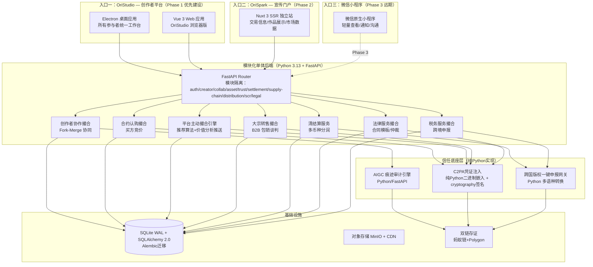
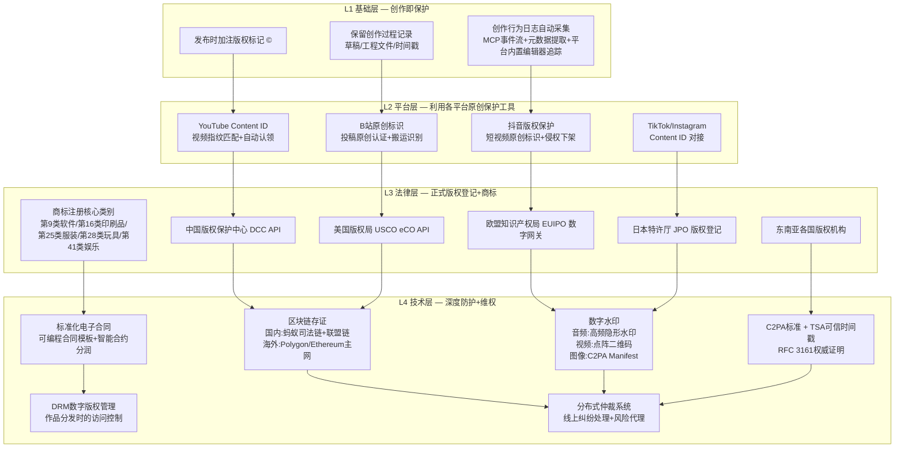

# OriSpark 项目可行性分析报告

> **版本：** v5.0 | **日期：** 2026-07-19
> **定位：** 面向内部决策层与技术评审委员会
> **声明：** 本报告基于用户战略方向 v5.0 修订——纯合约撮合交易所模式（类证券交易所）、四级版权防御、三大核心目标、四大核心点。
> **核心变化（v5.0）：** 核心定位从"交易所+制造撮合"改为"纯合约撮合平台（类证券交易所模式）"；移除3D渲染引擎、"异构创意-同质物料"集单算法、WMS系统对接、全球税收自动化隔离；C2M众筹预购改为平台内合约撮合；三级Escrow状态机改为交易保险机制；新增支付渠道插拔适配层、合约即交易标的、市场化分润（所有参与方自愿报价竞争决定）、IP孵化跟投（权益置换）、数据产品矩阵、会员分级体系。

---

## 一、项目概述

### 1.1 项目定位

OriSpark是一个**类证券交易所模式的全球AIGC时代个体创作者IP全链路撮合交易平台**。平台本身不做任何重资产运营——不销售产品、不拥有供应链、不碰库存。平台的唯一使命是**公平公正地撮合各方交易意图**，通过信息展示和推荐算法主动制造撮合机会，让所有参与者围绕平台市场运转。

**类比：** 就像上海证券交易所撮合买卖双方，但不自己炒股；OriSpark撮合作者、合作创作者、运营者、工厂、粉丝、贸易商、律师、税务师，但不自己做制造或销售。

### 1.2 核心三目标

| 目标 | 说明 | 衡量指标 |
|------|------|---------|
| **身份可信** | 让每个参与者的真实身份可验证、不可伪造 | DID认证率、KYC通过率 |
| **作品确权** | 让每份作品的版权归属清晰、可追溯、可维权 | 确权成功率、侵权案件解决率 |
| **市场流动性** | 让作品在市场中快速流转、高效匹配 | 作品周转天数、撮合成功率 |

### 1.3 四大核心点

| 核心点 | 具体手段 |
|--------|---------|
| **公正性** | 市场化分润（所有参与方自愿报价竞争决定）、交易保险机制、公开透明的竞价机制 |
| **多元撮合** | Fork-Merge协同创作、合约挂牌认购、大宗转售、合同授权 |
| **多渠道覆盖** | 国内（抖音/小红书/淘宝/站酷）+ 海外（TikTok/Instagram/Etsy/YouTube），不绑定单一平台 |
| **信誉出清** | SCR分布式信誉评级 + 低信誉惩戒红线 + 严重失信永久注销DID |

### 1.4 创作者经济定位

```
传统创作者经济：  创作者 → 平台（抽成30%） → 消费者
                    （去中介化理想：点对点价值交换）

OriSpark定位：    创作者 ↔ 交易所 ↔ 消费者
                    （平台是基础设施，不是中介剥削者）
```

**关键区别：** 滴滴式平台侵占某一方利润（抽成过高、算法黑箱、规则不公）。OriSpark作为市场基础设施，盈利来源于**促进更多交易**而非**压榨单笔交易**。平台收入与参与者利益一致——交易越多，平台收入越高，但每笔交易的费率公开透明（平台仅3‰固定手续费）。资金由第三方支付机构托管，保险公司作为独立参与者默认承保，税务代理按合约比例获取税款部分。

---

## 二、国际对标分析

### 2.1 全球竞品矩阵

本矩阵不是简单罗列竞品，而是深入拆解每一组竞品的"业务逻辑链"——从创作者上传到最终消费者购买的完整流程，然后逐维度与 OriSpark 对比。

#### 对标一：ArtStation → Etsy（创意→电商的断裂链路）

**ArtStation 的业务逻辑：**
```
数字艺术家注册 → 上传插画/3D模型 → ArtStation抽成20% → 买家购买数字素材包
                                    ↓
                           （交易闭环在数字文件下载处终止）
```
ArtStation 本质是"数字艺术家的 LinkedIn + 素材市场"。它的收入来自两部分：(1) 会员订阅 $9.99/月，提供作品集托管和求职功能；(2) Marketplace 数字资产销售抽成 20%。但它的交易只停留在"数字文件下载"这一步——买家买了 PSD 源文件后，如何变成实物商品、如何量产、如何分销，ArtStation 完全不参与。

**Etsy 的业务逻辑：**
```
手工创作者设计图案 → 上传至 Etsy 店铺 → 对接 Printful POD 工厂 → 
消费者下单 → Printful 自动印刷发货 → Etsy 抽成 6.5% + 支付费 3%
```
Etsy 是"手工+复古+创意商品的市场place"。它本身不生产任何商品，但要求创作者自己对接 Printful 等 POD 服务商——这个对接是手动的、非标准化的。Etsy 对创作者的期望是"你已经有能力运营一个微型电商品牌"。它不提供协同创作、不管理众筹、不做柔性集单。

**OriSpark 的差异化：**
| 环节 | ArtStation → Etsy | OriSpark |
|------|-------------------|---------|
| 创意注入 | 数字文件下载即终止 | Fork-Merge 协同开发，IP持续裂变 |
| 产品化 | 创作者手动对接 POD | 平台合约撮合让IP授权给任何有制造能力的第三方 |
| 版权保护 | 仅 DMCA 被动投诉 | 四级版权防御体系（见 4.1） |
| 商业模式 |  marketplace（Etsy 是实际卖家） | **纯交易所撮合**（平台不碰货、不拥有供应链） |

**核心洞察：** ArtStation+Etsy 代表了"创意→电商"的断裂式拼接——两个独立平台各收一层抽成（合计约 26%+），中间没有任何协同。OriSpark 用类证券交易所模式把整个链路压缩到一个平台内——创作者发布作品合约、运营者发起产品化要约、买卖双方通过合约撮合完成IP授权，平台仅收取3‰固定手续费。

#### 对标二：Midjourney → Stable Diffusion（AI 工具→商业化的断裂链路）

**Midjourney 的业务逻辑：**
```
用户订阅 $10-60/月 → AI 文生图 → 下载图片 → 自行寻找商业化路径
          ↓
   （平台在"生成图片"处彻底退出，不提供版权确权、不撮合交易、不连接供应链）
```
Midjourney 是全球最大的 AI 图像生成工具，月活超 1 亿。但它的商业模式极其单一：订阅费。它生成的图片版权归属模糊（Midjourney ToS 规定付费用户拥有图片所有权，但 USCO 明确要求人类实质性贡献才能获版权保护）。Midjourney 不记录人类的创作劳动痕迹，不提供 C2PA 元数据注入，不连接任何交易或制造渠道。

**Stable Diffusion / ComfyUI 的业务逻辑：**
```
开源模型下载 → 本地部署 → 自由生成 → 自行解决版权和商业化
          ↓
   （完全去中心化，平台方不存在，所有责任由用户自担）
```
SD 生态有 50 万+ 微调模型和 Civitai 等社区，但同样没有商业撮合基础设施。Civitai 有 NFT 集成实验，但已停滞。

**OriSpark 的差异化：**
| 环节 | Midjourney → SD | OriSpark |
|------|-----------------|---------|
| AI 创作支持 | 纯生成工具 | 全链路适配：捕捉 AIGC 人机协作痕迹，生成《人类贡献度审计报告》 |
| 版权认定 | 模糊（平台 ToS ≠ 法律版权） | 四级防御 + 跨国一键登记（DCC/USCO/EUIPO） |
| 商业化路径 | 无 | Fork-Merge 协同 → 合约挂牌认购 → 大宗转售全链路撮合 |
| 创作者经济 | 订阅制（平台赚用户钱） | 交易所模式（平台赚交易费，与创作者利益一致） |

**核心洞察：** Midjourney 证明了"AI 创作工具"的商业价值，但也暴露了致命缺陷——工具平台赚的是创作者的钱（订阅费），而 OriSpark 赚的是交易的钱。当 1 亿 Midjourney 用户寻求商业化时，他们需要一个不只是"生成图片"而是"让图片变成钱"的平台。

#### 对标三：Suno → Runway（AI 多媒体工具→商业化的断裂链路）

**Suno 的业务逻辑：**
```
用户输入歌词/风格提示词 → Suno AI 生成完整歌曲（含人声） → 下载音频文件
          ↓
   （平台在"生成歌曲"处退出，不提供版权登记、不撮合演唱者、不连接音乐发行渠道）
```
Suno 是 AI 音乐生成领域的 Midjourney。但它面临更大的版权争议——USCO 已明确拒绝纯 AI 生成音乐的版权注册。Suno 不提供人类贡献度审计，不记录 MIDI 工程中的手工和弦重构、混音参数拉写等独创性劳动。

**Runway 的业务逻辑：**
```
用户输入文本/视频片段 → Runway Gen-3 生成/编辑视频 → 下载视频文件
          ↓
   （同样在"生成视频"处退出，不追踪流量回流，不连接衍生品变现）
```
Runway 是 AI 视频生成领导者，但和 Midjourney 一样，止步于内容生成。

**OriSpark 的差异化：**
| 环节 | Suno/Runway | OriSpark |
|------|------------|---------|
| 人机协作审计 | 无 | 音频 MIDI 工程追踪 + 视频非线性编辑轨道监控 |
| 版权确定性 | 极低（纯 AI 生成物不受版权保护） | 通过人类贡献度审计证明独创性劳动 |
| 后续商业化 | 无 | 音乐→版权合约撮合；视频→IP授权→衍生品全链路 |
| 隐形水印 | 无 | 音频高频隐形水印 + 视频点阵二维码 + 流量反向溯源 |

**核心洞察：** AI 多媒体工具的竞争焦点已从"生成质量"转向"商业化能力"。Suno 和 Runway 拥有海量用户但没有变现基础设施——这正是 OriSpark 的机会窗口。

#### 对标四：Kickstarter → Printful（众筹→制造的断裂链路）

**Kickstarter 的业务逻辑：**
```
创作者发布项目 → 粉丝预付资金 → 30天募集期 → 
达标则资金全部释放给创作者 → 创作者自行找工厂生产 → 
（Kickstarter 在此彻底退出，不承担生产监督、不保证交付）
```
Kickstarter 年 GMV 超 $70 亿，验证了"创意众筹"模式的可行性。但它的缺陷明显：(1) 资金一次性全部释放，无分期风控；(2) 不连接任何制造渠道，创作者需自行处理供应链；(3) 无版权保护；(4) 不支持协同创作分润。

**Printful 的业务逻辑：**
```
创作者设计图案 → 上传至 Printful → 创建虚拟店铺 → 
消费者下单 → Printful 自动印刷发货 → Printful 收取生产成本 + 服务费
```
Printful 是 POD 制造的基础设施，但它只是一个执行端——它需要外部平台（如 Etsy、Shopify）带来订单。Printful 本身不撮合创作者和消费者，不参与 IP 开发，不做版权保护。

**OriSpark 的差异化：**
| 环节 | Kickstarter → Printful | OriSpark |
|------|----------------------|---------|
| 资金风控 | 全部或全部不退款 | 交易保险机制+第三方支付托管（保险公司作为独立参与者默认承保） |
| 制造撮合 | 创作者自行对接 | 合约撮合——买家购买的是版权合约/产品合约/使用权合约，生产履约由买卖双方自行安排 |
| 协同创作 | 无 | Git-style Fork-Merge + 市场化分润（所有参与方自愿报价竞争决定） |
| 版权保护 | 无 | 四级版权防御 |
| 大宗转售 | 无 | B2B 包销谈判大厅 |

**核心洞察：** Kickstarter+Printful 代表了"众筹+POD"的拼接模式，但两个平台之间没有任何系统级集成。OriSpark 将协同创作、合约撮合、大宗转售全部内建在一个交易所内——创作者发布作品合约、运营者发起产品化要约、买卖双方通过合约撮合完成IP授权，生产履约由合约买卖双方自行安排（物流商作为参与者接入，轨迹不纳入系统）。

#### 对标五：CopyrightCloud → VeChain → 蚂蚁司法链（版权存证的断裂链路）

**CopyrightCloud 的业务逻辑：**
```
用户上传作品 → Cloud 存储 + 时间戳 → 颁发存证证书
          ↓
   （仅做基础存证，不连接正式版权登记，不提供侵权取证，不跨法区）
```
CopyrightCloud 是全球最大的版权存证平台之一，服务超过 200 万创作者。但它只做一件事：存证。不连接 USCO/DCC/EUIPO 等正式版权登记机构，不提供 C2PA 元数据注入，不涉及 AIGC 人类贡献度审计。

**VeChain / 蚂蚁司法链 的业务逻辑：**
```
区块链存证 → 哈希上链 → （国内）直通互联网法院司法采信
          ↓
   （技术成熟但功能单一，仅解决"证据不可篡改"问题）
```
蚂蚁司法链已接入超 50 家机构，北京互联网法院已有区块链存证判例。但它是中国境内专用方案，不覆盖欧美法区，不包含 C2PA/TSA 等国际标准。

**OriSpark 的差异化：**
| 环节 | 现有存证方案 | OriSpark |
|------|------------|---------|
| 存证深度 | 仅哈希上链 | C2PA Manifest + TSA 时间戳 + 区块链双层锚定（蚂蚁链+Polygon） |
| AIGC 适配 | 无 | 人类贡献度审计引擎 + Prompt 演变哈希 |
| 跨国登记 | 无 | 一键对接 DCC/USCO/EUIPO，自动生成多语种申报材料 |
| 维权闭环 | 无 | 隐形水印侵权取证 + 分布式仲裁 + 律师风险代理 |

**核心洞察：** 现有版权存证方案都是"单点工具"，而 OriSpark 将其整合为四级防御体系——从基础的©标记到平台原创保护工具、正式版权登记、再到区块链存证+数字水印+仲裁的完整维权闭环。

#### 对标六：OpenSea / Foundation（NFT 交易所→实物商业化的断裂链路）

**OpenSea 的业务逻辑：**
```
创作者铸造 NFT → 二级市场交易 → 买家获得链上所有权 → 
（交易在加密货币市场内循环，不连接任何实物制造或消费）
```
OpenSea 证明了"数字作品链上交易"的技术可行性，但 NFT 热潮退去后暴露出根本缺陷：(1) 链上所有权≠法律版权；(2) 无实物变现通道；(3) 监管灰色地带；(4) 投机属性远大于实用价值。

**OriSpark 的差异化：**
| 环节 | OpenSea | OriSpark |
|------|--------|---------|
| 区块链定位 | 卖点（NFT 本身就是商品） | 底层技术（仅作为存证，不向用户推销） |
| 商品锚定 | 纯数字藏品 | 实物衍生品（T恤/手办/周边） |
| 法律合规 | 灰色 | 内置税务隔离+合规清算 |
| 实物化 | 无 | 合约撮合让IP授权给第三方（物流商作为参与者）+ B2B 大宗转售 |

**核心洞察：** OriSpark 吸取了 NFT 教训——区块链只作为信任底座的"管道工"，不面向用户推销概念。商品的价值来自实物衍生品的商业潜力，而非链上代币的投机价值。

#### 对标总结：市场空白定位

经过上述六组深度对标，市场空白清晰可见：

| 维度 | 现有平台状态 | OriSpark 位置 |
|------|------------|-------------|
| 纯交易所模式 | 无（Etsy 是 marketplace，Kickstarter 是众筹平台） | ✅ 独占 |
| AIGC 人机协作适配 | 无（Midjourney 排斥审计，CopyrightCloud 无 AI 适配） | ✅ 独占 |
| 四级版权防御 | 无（各方案均为单点存证） | ✅ 独占 |
| Fork-Merge 协同+市场化分润 | 无 | ✅ 独占 |
| 合约即交易标的（类证券交易所） | 无 | ✅ 独占 |
| 支付渠道插拔适配层 | 无 | ✅ 独占 |
| 交易保险机制 | 无 | ✅ 独占 |

**核心发现：** 市场上不存在一个同时满足以上全部七个条件的平台。现有方案要么是"工具+电商"的断裂拼接，要么是"存证+交易"的单点覆盖。OriSpark 填补的是"AIGC 时代个体创作者 IP 全链路交易所"这一结构性空白——类证券交易所模式、合约即交易标的、市场化分润（所有参与方自愿报价竞争决定）。

---

## 三、技术可行性分析

### 3.1 核心技术模块可行性评估

| 技术模块 | 成熟度 | 风险评估 | 缓解策略 |
|---------|-------|---------|---------|
| **C2PA Manifest注入** | 🟢 高 | C2PA标准已被Adobe/Microsoft/Google采纳，纯Python实现可用 | 直接集成cryptography库二进制嵌入，无外部SDK依赖 |
| **TSA时间戳** | 🟢 高 | RFC 3161是国际标准，DigiCert提供HTTP POST API | 对接权威CA机构（CFCA、GlobalSign） |
| **区块链存证** | 🟢 高 | 蚂蚁司法链已上线运行，Polygon ETH兼容 | 国内用蚂蚁链，海外用Polygon，双链并行；纯Python适配器 |
| **Git-style资产版本控制** | 🟡 中 | pygit2库成熟可用，需适配多媒体文件 | 基于pygit2二次开发，数据库元数据管理 |
| **AIGC痕迹审计引擎** | 🟡 中 | 采用集成枢纽方案（MCP/REST API），不直接依赖各创作软件内部API，兼容性风险可控 | 优先对接ComfyUI/SD/Midjourney等AI工具MCP协议，原生平台编辑器内置追踪作为Layer 1 |
| **合约撮合引擎** | 🟢 高 | 订单簿匹配+主动撮合为经典交易所模式 | 参考上交所/深交所撮合逻辑简化实现 |
| **支付渠道插拔适配层** | 🟢 高 | Stripe/WorldFirst/PayPal均有成熟API | 统一PaymentGateway接口抽象，三种实现可插拔 |
| **交易保险机制** | 🟢 高 | 保险公司承保规则引擎为经典业务逻辑 | 默认承保规则（不人为审核阻塞履约） |
| **隐形音频水印** | 🟡 中 | Steganography技术成熟但抗攻击性需测试 | 多频段冗余水印+频域编码 |
| **反向回流追踪** | 🟢 高 | 短链服务+Deep Link技术成熟 | 结合Universal Link/App Link + Branch归因 |

### 3.2 技术架构可行性

#### 3.2.1 三入口架构设计

平台对外提供三个独立但互联的前端入口，按建设优先级分三阶段实施：

| 入口 | 定位 | 目标用户 | 技术实现 | 建设阶段 |
|------|------|---------|---------|---------|
| **OriStudio**（创作者平台） | 所有参与者的工作台——发布作品、协同创作、撮合交易、清结算管理 | 创作者/合作创作者/运营者/工厂/贸易商/律师/税务代表/仲裁机构 | Electron 桌面 + Vue 3 Web（同一套组件库 + Python/FastAPI 后端） | **Phase 1（优先）** |
| **OriSpark**（宣传门户） | 面向外部的交易信息展示、合作机会曝光、作品画廊、市场数据看板 | 潜在创作者、投资者、媒体、普通访客 | Nuxt 3 SSR 独立站（SEO 优化） | Phase 2（OriStudio 稳定后） |
| **微信小程序**（轻量入口） | OriStudio + OriSpark 的轻量结合体——查看发布信息、接收通知、沟通处理 | 所有参与者（移动端轻操作） | 微信原生小程序 | Phase 3（远期扩展） |

**核心原则：** OriStudio 是所有参与者的统一工作台，不存在"只有创作者用桌面端"的功能歧视。不同角色只是权限和数据视图不同。

#### 3.2.2 技术栈选型

| 层级 | 技术选型 | 理由 |
|------|---------|------|
| **前端-桌面端** | Electron + Vue 3 | 跨平台桌面应用，复用Vue组件库，通过MCP Server与专业创作工具连通 |
| **前端-Web端** | Vue 3 (Composition API + <script setup>) + TypeScript + Pinia + Vite (:5174) | SPA架构，组件可复用，Pinia状态管理，Axios HTTP客户端 |
| **后端-API** | Python 3.13 + FastAPI | 高性能异步 API，天然契合 AIGC 生态（PyTorch/Transformers），自动 OpenAPI 文档 |
| **后端-AI** | Python 3.13 + FastAPI + PyTorch | AIGC 审计引擎、NLP 分类、推荐算法 |
| **数据库** | SQLite（WAL模式） | 生产级配置，MVP阶段足够；SQLAlchemy 2.0声明式；Alembic迁移管理 |
| **对象存储** | MinIO (自建) + CDN | 大文件存储 + 全球分发 |
| **区块链-国内** | 蚂蚁区块链（蚂蚁司法链） | 司法采信，直通互联网法院 |
| **区块链-海外** | Polygon (PoS) | ETH 兼容，Gas 费低，生态成熟 |
| **清结算** | 数据库事务（单体架构） | Escrow/分润/税金隔离在同一DB事务内完成，区块链仅作为存证管道 |
| **API路由** | FastAPI Router（模块化单体） | 每个模块独立router.py，非Kong网关 |
| **部署** | Docker + systemd/supervisor | 单体架构无需K8s，Docker容器化部署 |
| **消息队列** | 暂不使用（单体阶段） | 异步任务通过Celery+Redis处理，后续按需引入RabbitMQ/Kafka |
| **CI/CD** | GitHub Actions | 自动化构建 + 测试 + Docker镜像推送 |

**为什么选 FastAPI：**
1. **Python 生态优势**：AIGC 领域（PyTorch、Transformers、OpenCV）全部基于 Python，FastAPI 让 AI 服务与业务 API 共享语言栈，降低维护成本
2. **异步高性能**：原生 async/await 支持，QPS 可达 10,000+，满足高并发撮合需求
3. **自动文档**：Swagger/OpenAPI 自动生成，前端/第三方对接零学习成本
4. **类型安全**：Pydantic V2 提供运行时类型校验，减少线上 bug
5. **Vue 3 + TypeScript 在前端**：Composition API + <script setup> 语法清晰，Pinia状态管理轻量高效，Vite构建极速，TypeScript提供类型安全

#### 3.2.3 架构图（OriStudio 为核心）



**结论：** 技术栈均为业界成熟方案。**Python 3.13 + FastAPI** 作为后端核心，天然契合 AIGC 审计引擎的 Python 生态需求；**Vue 3 + TypeScript + Vite** 作为前端核心，提供组件复用和极速构建体验。主要挑战在于系统集成复杂度而非单项技术难度。

---

## 四、法律与合规可行性分析

### 4.1 四级版权防御体系

这是 OriSpark 最核心的法律护城河。体系从基础到高级逐层递进，每一级都为下一级提供支撑：



**各级说明：**

| 级别 | 保护内容 | 技术手段 | 法律效力 | 适用阶段 |
|------|---------|---------|---------|---------|
| **L1 基础层** | 作品存在证明+创作过程可追溯 | ©标记 + 工程文件保留 + 创作行为日志自动采集 | 初步证据效力（创作时间证明） | 作品发布时自动触发，零成本 |
| **L2 平台层** | 利用各发布平台的原创保护工具 | YouTube Content ID / B站原创标识 / 抖音版权保护 / TikTok/Instagram 对接 | 平台规则层面的快速下架权 | 作品分发到各平台时自动注册 |
| **L3 法律层** | 正式版权登记+商标保护 | 一键对接各国版权机构 API + 商标核心类别注册 | 法定版权证书（跨国司法采信） | 高价值作品主动申请，或平台代申请 |
| **L4 技术层** | 深度防护+侵权取证+维权 | 区块链存证 + 数字水印 + C2PA+TSA + 合同+DRM + 分布式仲裁 | 司法采信证据 + 强制执行 | 重大 IP 项目全量启用 |

#### 4.1.1 多国地区适配能力（Platform Baseline Requirement）

**多国家/地区适配是 OriSpark 的基本素质，不是可选功能。** 平台的核心要求是：一个作品可以发布到多个国家/地区，自动连通对应国家的版权注册机构和法规要求。

| 适配维度 | 实现方式 |
|---------|---------|
| **作品多国家发布** | 创作者发布作品时可选择目标法区（中国/美国/欧盟/日本/东南亚等），系统自动为每个法区生成独立的存证包和申报材料 |
| **各国版权注册机构对接** | 中国→DCC，美国→USCO eCO，欧盟→EUIPO，日本→JPO，东南亚→各国本地机构 API；统一抽象层屏蔽各国接口差异 |
| **各国法规适配** | 内置多法区版权法规知识库：美国需"人类实质性贡献"证明、欧盟需 AI 参与度标注、中国已有司法先例（北京互联网法院 2023 AI 绘画案）、日本需透明度声明 |
| **商标多类别注册** | 自动识别作品衍生品可能的商标类别（第9类软件、第16类印刷品、第25类服装、第28类玩具、第41类娱乐等），推荐注册组合 |
| **跨国维权路由** | 侵权发生时，自动判断侵权发生地法区，路由至当地合作律所/仲裁机构，启动 DMCA takedown（美国）/ 各地对应机制 |

**适配架构：** 各国版权机构对接通过统一的"跨国版权一键申报网关"抽象层实现。创作者只需选择目标法区，系统自动完成：(1) 元数据多语种转换；(2) 各国格式适配；(3) 官方规费代缴；(4) 电子证书回传。

### 4.2 AIGC版权认定——全球主要法区立场

| 法区 | 立场 | 对OriSpark的影响 | 应对策略 |
|------|------|----------------|---------|
| **美国** | USCO：纯AI生成物不受版权保护；需"人类实质性贡献" | 必须证明每件作品有人类劳动 | 《人类贡献度审计报告》作为强制附件提交USCO |
| **欧盟** | EU AI Act要求AI生成内容标注；版权法侧重人类作者 | 需区分AI辅助内容和AI生成内容 | C2PA中标注AI参与度和人类贡献比例 |
| **中国** | 北京互联网法院已有AI作品判例（2023） | 相对开放，已有司法先例 | 依托北京互联网法院+蚂蚁司法链构建证据链 |
| **日本** | 政府发布AI生成内容指南，未禁止但要求透明度 | 影响较小 | 遵循透明度要求即可 |
| **东南亚** | 各国法规不一，多数沿用传统版权法 | 新兴市场机会 | 第二阶段再进入 |

### 4.3 法律可行性结论

**可行，但需要专业法务团队支撑。** 核心法律风险不在于"能不能做"，而在于"哪些国家/地区可以合法经营"。建议：

1. **第一阶段（中国境内）**：依托北京互联网法院司法先例，蚂蚁司法链存证
2. **第二阶段（欧美）**：聘请美国知识产权律师+欧盟GDPR合规顾问
3. **第三阶段（全球）**：通过各地本地化合规合作伙伴落地

---

## 五、业务难点与风险评估

### 5.1 核心难点

#### 难点一：冷启动——双边市场困境

**问题描述：** 交易所需要同时吸引供给方（创作者）和需求方（消费者/采购商/工厂）。没有创作者→没有作品→没有人交易；没有交易→没有收益→没有创作者加入。

**缓解策略：**
- **工具先行：** 免费开放"创作者工作台"工具，积累用户后再引入交易
- **供给侧优先：** 从现有AI创作者社区定向邀请种子创作者
- **示范案例：** 平台资助标杆项目，展示完整撮合闭环

#### 难点二：信任建立——跨国多边交易

**问题描述：** 创作者担心IP被盗用，合约买方担心交易不履约，合约卖方担心货款收不到。

**缓解策略：**
- 交易保险机制+第三方支付托管是基础（保险公司作为独立参与者默认承保，不人为审核阻塞履约）
- SCR分布式信誉系统让失信成本链上可见
- 四级版权防御体系降低侵权风险
- 标准化合同模板+线上仲裁降低纠纷处理门槛

#### 难点三：信誉出清——如何保证市场质量

**问题描述：** 如果平台上存在大量失信参与者（抄袭者、违约合约方、欺诈交易者），整个市场的信任体系会崩塌。

**缓解策略：**
- SCR分级：黄金/白银/青铜/失信四级
- 低信誉惩戒：限制功能、延长提现、取消资格
- 严重失信：永久注销DID身份，链上记录不可删除
- 正向激励：高信誉享受优先撮合、免保证金

### 5.2 法律风险及针对性解决方案

| 法律风险 | 风险描述 | 概率 | 影响 | 针对性解决方案 |
|---------|---------|------|------|--------------|
| **AIGC版权政策收紧** | 美欧可能进一步收紧AI生成内容版权保护范围，要求更严格的人类贡献度证明 | 中 | 高 | **方案1：** 坚持"人类贡献度审计"底线，平台只接受含人类独创性劳动的作品。<br/>**方案2：** 《人类贡献度审计报告》作为强制附件，满足USCO"human authorship"要求。<br/>**方案3：** 作品按人类贡献比例分级：100%人工（完整版权）、80-99% AI辅助（部分版权）、50-79% AI辅助（仅构图/编排版权）、<50%（不确权）。 |
| **跨境数据合规** | GDPR/中国《个人信息保护法》/美国CIPA等多法区数据法规冲突 | 高 | 高 | **方案1：** 数据本地化架构——欧洲用户数据存欧洲节点，中国用户数据存中国节点，通过加密通道跨境同步。<br/>**方案2：** DID去中心化身份设计——个人身份信息（PII）本地存储，链上仅存哈希值，符合GDPR"被遗忘权"。<br/>**方案3：** 聘请三地合规顾问（中美欧），每个法区设立独立法律实体。 |
| **加密货币监管** | 区块链存证涉及公链（Polygon），可能被认定为证券或虚拟货币交易 | 中 | 高 | **方案1：** Polygon仅用于哈希存证，不涉及任何代币流通或交易。<br/>**方案2：** 明确声明平台不使用加密货币进行任何支付——所有资金通过持牌第三方支付机构（Stripe/万里汇/PayPal企业版）合规流转。<br/>**方案3：** 国内完全使用蚂蚁司法链（ Permissioned链，非公链），与海外Polygon物理隔离。 |
| **跨境资金流动管制** | 多国外汇管制限制跨境分拨 | 高 | 高 | **方案1：** 通过持牌支付机构的多币种钱包实现"境内人民币结算+境外本地货币结算"，避免跨境资金流动。<br/>**方案2：** 大额交易（>1万美元）通过银行电汇+贸易背景审核合规通道。<br/>**方案3：** 建立各地本地清算节点，资金在法区内闭环清算。 |
| **商标抢注风险** | 热门IP在目标市场被第三方抢先注册商标 | 中 | 中 | **方案1：** L3法律层自动推荐商标注册核心类别（第9/16/25/28/41类）。<br/>**方案2：** 作品发布时自动在马德里体系成员国提交商标预告。<br/>**方案3：** 连接各地商标监测服务，发现抢注立即异议。 |
| **合同法律效力** | 智能合约/可编程合同在不同法区的法律效力不确定 | 中 | 中 | **方案1：** 智能合约仅作为"执行层"，上层始终有传统自然语言法律文本。<br/>**方案2：** 合同模板经三地律师交叉审查，确保每条款在各法区均有判例支撑。<br/>**方案3：** 参考联合国《电子通信公约》和欧盟eIDAS条例，智能合约代码可作为合同履行的证据。 |

### 5.3 SWOT 劣势与威胁的针对性解决方案

| SWOT 项 | 具体描述 | 针对性解决方案 |
|---------|---------|--------------|
| **W: 冷启动难度大** | 双边市场需要同时吸引供需双方 | **① 工具获客先行：** 免费开放创作者工作台（含AIGC审计+C2PA+TSA），不强制交易即可获取创作者。<br/>**② 供给侧定向邀请：** 从Civitai/LiblibAI/站酷/ArtStation定向邀请高质量创作者。<br/>**③ 示范项目兜底：** 平台出资资助3-5个标杆项目，完成从确权→撮合→交易的完整闭环，形成口碑。 |
| **W: 技术集成复杂度高** | C2PA+TSA+区块链+支付渠道插拔+交易保险，系统集成难度极大 | **① 分阶段实施：** 第一阶段仅做确权+基础撮合（MVP），第二阶段加合约撮合+跨境清结算，第三阶段加媒体分发+反向回流。<br/>**② 成熟方案复用：** C2PA用纯Python实现、TSA用RFC 3161标准、区块链用蚂蚁链+Polygon现成节点，不重复造轮子。<br/>**③ 核心自研+外围外包：** 人类贡献度审计引擎和合约撮合引擎自研，其他模块集成开源/商业方案。 |
| **W: 跨国合规成本高** | 中美欧三地版权/税务/数据合规需要专业团队 | **① 第一阶段聚焦中国境内：** 依托北京互联网法院司法先例+蚂蚁司法链，跑通国内闭环。<br/>**② 第二阶段再进入欧美：** 通过本地化合规合作伙伴落地，不自建全职法务团队。<br/>**③ 自动化替代人工：** 跨国版权一键申报网关+全球税收隔离大脑，将合规成本从"人均$200/月"降至"API调用$0.01/次"。 |
| **W: 团队从零组建** | 缺少AIGC+版权+区块链+跨境电商复合型人才 | **① 核心岗位P0保障：** CEO/CTO/AI工程师/全栈工程师/区块链工程师必须全职到岗。<br/>**② 顾问外脑补充：** 合规法务顾问（兼职）、柔性供应链专家（兼职）、版权律师（按项目付费）。<br/>**③ 远程优先文化：** 不局限于一地招聘，全球招募AIGC+创作者经济领域人才。 |
| **T: 巨头入场复制** | Adobe/Canva/Shopify复制核心功能 | **① 网络效应壁垒：** 双边市场一旦跨越临界点（创作者>1万+交易活跃），后来者极难颠覆。<br/>**② 聚焦细分纵深：** 巨头做通用工具，OriSpark做IP撮合全链路——从确权到合约撮合到清结算的深度集成是通用工具难以复制的。<br/>**③ 先发优势：** 四级版权防御体系+SCR信誉系统+合约撮合引擎需要12-18个月开发周期，先发者积累的数据和网络效应构成护城河。 |
| **T: AIGC版权政策不确定性** | 各国对AI生成内容的版权态度分化 | **① 不押注单一法区立场：** 四级版权防御体系设计为"人类贡献度越高，保护越强"的渐进式框架，无论各国政策如何变化都能自适应。<br/>**② 坚持人类独创性底线：** 平台不接纳纯AI生成物，从根本上规避政策风险。<br/>**③ 政策监测+快速响应：** 建立全球AIGC版权政策追踪机制，政策变化时48小时内更新平台策略。 |
| **T: 地缘政治影响跨境业务** | 中美关系影响数据流动和支付通道 | **① 双链架构天然隔离：** 国内蚂蚁链（permissioned）和海外Polygon（public）物理隔离，互不影响。<br/>**② 各国本地化部署：** 关键业务节点在当地部署，数据不出境。<br/>**③ 多元支付通道：** Stripe+万里汇+PayPal+本地支付机构并行，不依赖单一支付渠道。 |
| **T: 经济下行压缩消费预算** | 全球经济衰退导致创作者经济和衍生品消费萎缩 | **① 交易所模式抗周期：** 经济下行期创作者更需要变现渠道，平台GMV不一定下降。<br/>**② 低成本工具获客：** 经济不好时创作者更倾向免费工具，正好契合"工具先行"策略。<br/>**③ 多元化收入结构：** 交易抽成+SaaS订阅+清结算手续费+法律服务费分成，不依赖单一收入来源。 |

| 风险类型 | 风险项 | 概率 | 影响 | 等级 | 应对措施 |
|---------|-------|------|------|------|---------|
| **技术** | AIGC痕迹审计集成枢纽兼容性不足 | 低 | 高 | 🟡中 | 优先覆盖头部5款AI工具MCP协议，其余通过REST API上传补充 |
| **技术** | 区块链性能无法满足海量交易 | 低 | 中 | 🟡中 | 国内蚂蚁链（高吞吐），海外Polygon |
| **业务** | 创作者不愿迁移到新平台 | 高 | 高 | 🔴高 | 工具免费+独家分润合约+迁移补贴 |
| **业务** | 冷启动失败 | 高 | 高 | 🔴高 | 工具先行+示范项目+社区驱动 |
| **法律** | 美欧AIGC版权政策收紧 | 中 | 高 | 🔴高 | 坚持"人类贡献度审计"底线 |
| **法律** | 跨境资金流动管制 | 高 | 高 | 🔴高 | 通过持牌第三方支付机构合规通道 |
| **竞争** | 巨头（Adobe/Canva）复制核心功能 | 高 | 中 | 🟡中 | 快速建立网络效应和生态壁垒 |
| **财务** | 前期研发投入大，盈利周期长 | 高 | 高 | 🔴高 | 分阶段投入，工具免费获客+交易抽成变现 |

---

## 六、可行性综合结论

### 6.1 SWOT分析（含针对性缓解措施）

| 优势 S | 劣势 W |
|--------|--------|
| - 纯交易所轻资产模式，scalability高<br/>- 四级版权防御体系（L1基础→L2平台→L3法律→L4技术）构成法律护城河<br/>- Fork-Merge协同创作创造独特网络效应<br/>- 市场化分润（所有参与方自愿报价竞争）降低交易摩擦成本<br/>- 多国地区适配是平台基线能力 | - **冷启动难度大** → 工具获客先行+示范项目兜底+供给侧定向邀请<br/>- **技术集成复杂度高** → 分阶段实施（MVP→合约撮合→跨境清结算）+ 核心自研/外围外包<br/>- **跨国合规成本高** → 第一阶段聚焦中国+自动化替代人工（API调用$0.01/次）<br/>- **团队从零组建** → 核心P0全职+顾问外脑补充+远程优先文化 |
| **机会 O** | **威胁 T** |
| - AIGC创作者经济爆发（2025年$4,920亿）<br/>- 柔性供应链成熟（POD验证按需生产模式）<br/>- 区块链存证司法认可（北京互联网法院判例）<br/>- 跨境电商业态增长（2025年$5.8万亿）<br/>- 创作者逃离平台抽成（YouTube 30%/TikTok Creator Fund不足）→ 需要新平台提供更公平分润 | - **巨头入场复制** → 网络效应壁垒+聚焦细分纵深+先发12-18个月开发周期优势<br/>- **AIGC版权政策不确定** → 渐进式保护框架（人类贡献度越高保护越强）+ 坚持人类独创性底线<br/>- **地缘政治影响跨境** → 双链架构物理隔离+各国本地化部署+多元支付通道<br/>- **经济下行压缩消费** → 交易所模式抗周期+低成本工具获客+多元化收入结构 |

**SO 战略（优势+机会）：** 利用四级版权防御+Fork-Merge协同创作，抓住AIGC创作者逃离传统平台的窗口期，快速建立双边网络效应。

**WO 战略（劣势+机会）：** 通过免费工具获客弥补冷启动劣势，利用柔性供应链成熟趋势降低技术集成难度（POD基础设施已就绪）。

**ST 战略（优势+威胁）：** 用纯交易所轻资产模式和跨国合规能力抵御地缘政治风险——不拥有供应链意味着不受贸易管制直接影响。

**WT 战略（劣势+威胁）：** 分阶段实施降低技术和合规风险，第一阶段聚焦中国境内跑通闭环，第二阶段再进入欧美市场。

### 6.2 最终结论

| 评估维度 | 结论 | 信心指数 |
|---------|------|---------|
| **技术可行性** | ✅ 可行 | 80% — 核心技术均为成熟方案，集成挑战小于研发挑战 |
| **法律可行性** | ⚠️ 有条件可行 | 65% — 四级版权防御体系在中国境内路径清晰，欧美需专业法务 |
| **业务可行性** | ✅ 可行 | 70% — 纯合约撮合模式轻资产可执行性高，冷启动策略明确 |
| **财务可行性** | ✅ 可行 | 70% — 多元化收入结构降低单一依赖，会员+数据+交易手续费三足鼎立 |

**总体评价：交易所模式（轻资产、纯撮合）比原方案的可执行性更高。四级版权防御体系构建了坚实的法律护城河。成功的关键在于冷启动策略的执行力和信誉出清机制的公信力建设。**

---

## 七、附录：对标数据来源

1. Statista — Global AI Image/Video Generation Market Size 2025
2. Deloitte — Global Digital Media Outlook 2025
3. US Copyright Office — Copyright Registration Guidance: AI Works (2023)
4. EU AI Act — Official Text (2024)
5. 北京互联网法院 — "AI绘画第一案"判决书 (2023)
6. Etsy Q4 2024 Earnings Report
7. Kickstarter 2024 Annual Report
8. C2PA Specification — Content Authenticity Initiative
9. 蚂蚁集团 — 司法区块链白皮书
10. Grand View Research — On-Demand Manufacturing Market Size 2025
