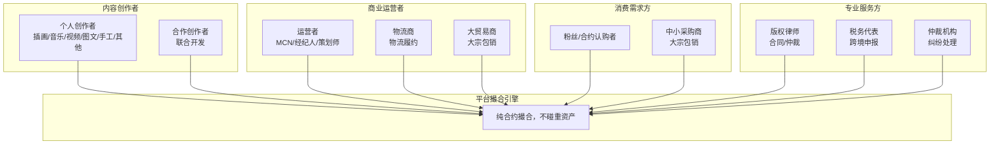
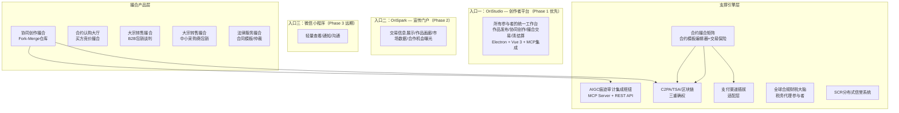
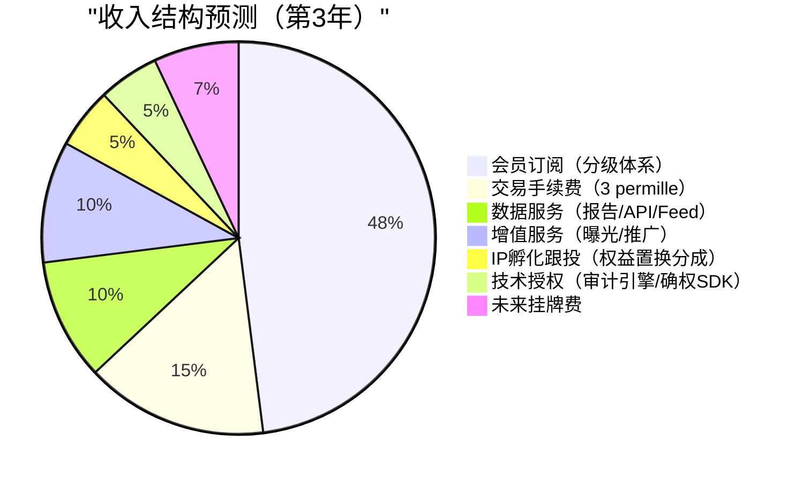
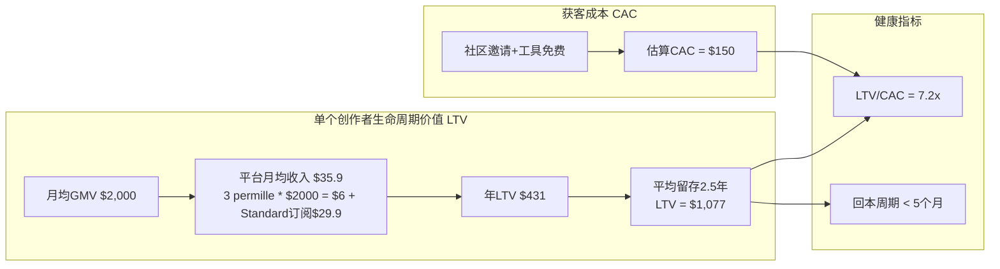
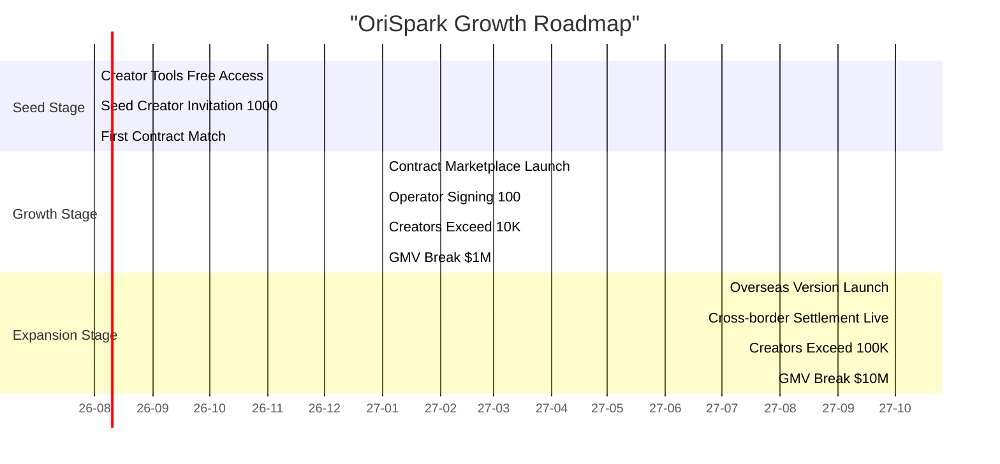
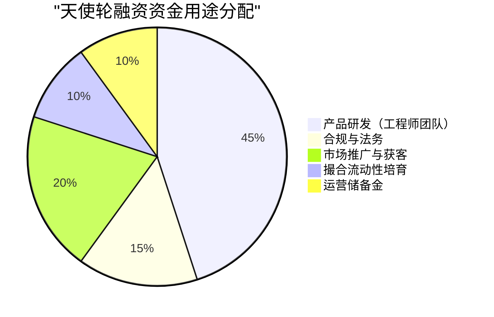

# OriSpark 商业企划书

> **版本：** v5.0 | **日期：** 2026-07-19
**定位：** 面向天使轮/Pre-A轮投资者 | **版本：** v5.0 | **日期：** 2026-07-19
> **核心变化（v5.0）：** 商业模式从"交易所+制造撮合"改为"纯合约撮合平台（类证券交易所模式）"；收入来源从8%-15%抽成改为3‰固定手续费+会员+数据+IP孵化多元收入；移除3D渲染引擎、柔性集单算法、WMS系统对接、全球税收自动化隔离；C2M众筹预购改为平台内合约撮合；三级Escrow状态机改为交易保险机制；新增支付渠道插拔适配层、合约即交易标的、市场化分润（所有参与方自愿报价竞争决定）、IP孵化跟投（权益置换）、数据产品矩阵、会员分级体系。

---

## 一、执行摘要（Executive Summary）

### 1.1 一句话定义

**OriSpark是全球首个"类证券交易所模式"的个体创作者IP全链路撮合交易平台。** 平台不做任何重资产运营——不销售产品、不拥有供应链、不碰库存。平台的唯一使命是公平公正地撮合创作者、合作创作者、运营者、工厂、粉丝、贸易商、律师、税务师之间的交易，让作品在市场中快速流转、高效匹配。

### 1.2 投资亮点

| 亮点 | 说明 |
|------|------|
| **赛道爆发** | 全球创作者经济市场规模2025年达$4920亿，AIGC工具渗透率超40%，但缺乏基础设施级撮合平台 |
| **痛点真实** | AI时代版权认定是全球性法律难题，四级版权防御体系提供工程化解决方案 |
| **模式创新** | 纯交易所轻资产模式 + Fork-Merge协同撮合 + SCR信誉出清机制，创造独特网络效应壁垒 |
| **团队红利** | AIGC+创作者经济+柔性供应链三大赛道交汇窗口期，先入者通吃 |
| **财务模型清晰** | 3‰固定手续费 + 会员订阅 + 数据产品 + IP孵化跟投，多元收入结构 |

### 1.3 核心数据

| 年份 | 整体创作者经济($B) | AIGC内容市场($B) | 按需印刷/柔性制造($B) |
|------|-------------------|-----------------|---------------------|
| 2023 | 430 | 15 | 25 |
| 2025 | 492 | 45 | 40 |
| 2027 | 580 | 120 | 70 |
| 2030 | 600 | 300 | 120 |

---

## 二、市场分析

### 2.1 目标市场规模（TAM/SAM/SOM）

| 层级 | 定义 | 规模（2025E） | 说明 |
|------|------|-------------|------|
| **TAM**（总可触达市场） | 全球创作者经济+AIGC工具+按需制造 | $5,560亿 | 创作者经济$4,920亿 + AIGC内容$450亿 + POD制造$400亿 |
| **SAM**（可服务市场） | 数字内容确权+协同创作撮合+衍生品电商撮合 | $320亿 | 数字版权管理$80亿 + 创作者SaaS$60亿 + IP衍生品电商$180亿 |
| **SOM**（可获得市场） | 插画/音乐/短视频三大品类的跨境IP撮合 | $18亿 | 占SAM的5.6%，聚焦三大高价值品类 |

### 2.2 目标用户画像



**前端统一原则：** 所有参与者使用相同的前端能力集——Electron桌面应用（Vue 3 + MCP集成） + Vue 3 Web应用共享同一套组件库和业务逻辑层。不同角色只是权限和数据视图不同，不存在功能歧视。微信小程序为远期扩展目标。

### 2.3 市场趋势分析

| 趋势 | 当前状态 | 对OriSpark的影响 |
|------|---------|----------------|
| **AIGC工具普及** | Midjourney月活1亿+，Stable Diffusion开源生态超50万模型 | 创作者供给爆发，但版权保护滞后 → 确权服务刚需 |
| **IP衍生品市场增长** | 潮玩/手办全球市场2025年达$350亿，年增速12% | 实物变现通道广阔 |
| **柔性制造成熟** | Printful/探迹等POD厂商验证按需生产商业模式 | 供应链基础设施就绪 |
| **创作者经济独立化** | 创作者逃离平台抽成（YouTube 30%/TikTok Creator Fund不足） | 需要新平台提供更公平的分润机制 |
| **版权法规收紧** | 欧盟AI Act要求AI生成内容标注，USCO拒绝纯AI版权 | 人类贡献度审计成为合规刚需 |
| **跨境电商业态** | 全球跨境电商GMV 2025年预计$5.8万亿 | 全球化分发和清结算市场巨大 |

---

## 三、产品与解决方案

### 3.1 核心价值主张

OriSpark解决的是创作者经济中一个根本性的矛盾：**AI降低了创作门槛，但版权法提高了确权门槛；创作者有创意，但缺乏撮合渠道和变现路径。** 平台作为交易所基础设施，通过工程技术手段弥合这些鸿沟。

**项目理念：** OriSpark不是第二个Etsy、不是第二个Kickstarter、也不是第二个OpenSea。它是一个类证券交易所的撮合平台——不卖货、不碰钱、不做制造，只做一件事：让正确的合约找到正确的买方。就像上海证券交易所撮合买卖双方但不自己炒股一样，OriSpark撮合作者、运营者、贸易商、律师、税务代理、保险公司，但不自己做制造或销售。

**架构原则：** 平台采用模块化单体（Modular Monolith）架构，Python 3.13 + FastAPI后端 + Vue 3前端。合约分润结算、支付托管在同一DB事务内完成，区块链仅作为存证管道而非资金执行层。这种设计在MVP阶段用SQLite WAL即可支撑数百QPS，未来需要拆分时每个模块已有清晰边界可直接独立部署。

### 3.2 产品矩阵与前端入口



**三入口建设顺序：**

| 入口 | 定位 | 技术栈 | 建设阶段 | 说明 |
|------|------|---------|---------|------|
| **OriStudio** | 创作者平台——所有参与者的工作台 | Electron + Vue 3 + Python/FastAPI | **Phase 1（M1-M12）** | 核心产品，MVP上线后持续迭代 |
| **OriSpark** | 宣传门户——交易信息/作品展示/市场数据 | Nuxt 3 SSR + FastAPI后端 | Phase 2（OriStudio稳定后） | SEO优化，获客和品牌曝光 |
| **微信小程序** | 轻量入口——查看/通知/沟通 | 微信原生小程序 | Phase 3（远期扩展） | 移动端轻操作，不替代OriStudio |

#### 技术栈选型理由

| 层级 | 选型 | 核心理由 |
|------|------|---------|
| **后端 API** | Python >= 3.11 + FastAPI | AIGC生态（PyTorch/Transformers）无缝集成；原生 async/await 高并发；自动 OpenAPI 文档 |
| **前端 Web** | Vue 3 (Composition API + <script setup>) + TypeScript + Pinia + Vite (:5174) | 组件可复用，Pinia状态管理轻量高效，Vite构建极速，TypeScript类型安全 |
| **前端桌面** | Electron + Vue 3 | 跨平台桌面应用；通过MCP Server与专业创作工具连通 |

### 3.3 产品差异化对比

| 功能维度 | Etsy | Kickstarter | OpenSea | Canva | **OriSpark** |
|---------|------|-------------|---------|-------|-------------|
| 运营模式 | marketplace（抽成） | 众筹平台 | NFT交易所 | 设计工具 | **纯交易所撮合** |
| AI创作支持 | ❌ | ❌ | ❌ | ✅工具 | ✅全链路 |
| 版权确权 | ❌ DMCA被动 | ❌ | ⚠️仅链上所有权 | ❌ | ✅**四级版权防御+交易保险机制** |
| 协同创作 | ❌ | ❌ | ❌ | ⚠️简单协作 | ✅Git-style Fork-Merge + 市场化分润 |
| 柔性制造 | ⚠️单一POD | ❌ | ❌ | ❌ | ✅**合约撮合（物流商作为参与者）** |
| 跨境清结算 | ⚠️手动提现 | ❌ | ❌ | ❌ | ✅支付渠道插拔适配+第三方托管秒级分润 |
| 税务合规 | ❌ | ❌ | ❌ | ❌ | ✅税务代理参与者，系统不自动隔离 |
| 信誉出清 | ❌ | ❌ | ❌ | ❌ | ✅SCR分级+链上惩戒 |

---

## 四、商业模式

### 4.1 收入来源



#### 收入明细

| 收入类别 | 计费方式 | 费率 | 毛利率 | 说明 |
|---------|---------|------|--------|------|
| **交易手续费** | 固定GMV百分比 | 3 permille（暂定） | 85% | 平台唯一固定收入，所有交易统一收取 |
| **会员订阅** | 月费/年费 | Standard $9.9/月 ~ Enterprise $99.9/月 | 92% | 分级体系：免费/Standard/Professional/Enterprise/Partner |
| **数据服务** | 报告/API/Feed/白皮书 | $99-$499/次或订阅 | 90% | 市场趋势报告、创作者画像API、实时行情Feed、产业洞察白皮书 |
| **IP孵化跟投** | 权益置换分成 | 5%-15%（有上限） | 95% | 平台用流量+撮合资源换潜力IP长期收益分成 |
| **增值服务** | 曝光/推广/优先撮合 | 浮动 | 85% | 首页推荐位、优先撮合排序、数据分析增强 |
| **技术授权** | SDK/API调用 | 按量计费 | 95% | 审计引擎/确权SDK对外授权 |

### 4.2 单位经济效益（Unit Economics）



### 4.3 平台盈利逻辑 vs 剥削型平台

```
滴滴模式：          平台是中介剥削者
                    司机赚$100 → 平台抽$30（30%）→ 司机不满
                    平台利润 = 压榨司机

OriSpark模式：      平台是交易所基础设施
                    创作者赚$100 → 平台抽$0.3（3‰）→ 市场化分润由各方自愿报价锁定
                    平台利润 = 促进更多交易 × 会员订阅 + 数据服务 + IP孵化分成
                    交易越多，平台收入越高，各方利益一致
```

---

## 五、Go-to-Market 策略

### 5.1 三阶段增长路径



### 5.2 冷启动策略——供给侧先行

**核心逻辑：** 双边交易所必须从供给端切入。没有创作者就没有作品，没有作品就没有交易。

| 阶段 | 动作 | 目标 | 时间 |
|------|------|------|------|
| **工具获客** | 免费开放"创作者工作台"（含AIGC痕迹捕捉、C2PA注入、TSA申请），不强制交易 | 获取1000名种子创作者 | M1-M3 |
| **社区邀请** | 从Civitai、LiblibAI、站酷、ArtStation定向邀请AI创作者入驻 | 100名高质量创作者 | M2-M4 |
| **示范案例** | 平台资助3-5个标杆项目，完成从确权→撮合→交易的完整闭环 | 展示成功案例 | M4-M6 |
| **口碑裂变** | 标杆创作者故事在社交媒体传播，吸引第二批创作者 | 1000名创作者 | M6-M9 |
| **需求侧激活** | 引入首批合约买方+运营者，开启第一波撮合交易 | 跑通内循环 | M9-M12 |

---

## 六、竞争格局与护城河

### 6.1 竞争态势

| | **弱AI适配 / 碎片化功能** | **强AI适配 / 碎片化功能** | **全链路闭环 + 弱AI适配** | **全链路闭环 + 强AI适配** |
|---|---|---|---|---|
| **现有平台** | Etsy / Kickstarter / Printful | Canva / Midjourney / OpenSea | 站酷海洛 / Redbubble | — |
| **OriSpark** | ❌ 不在此象限 | ❌ 不在此象限 | ⚠️ 部分覆盖（无AI确权） | ✅ **独占位置** |

**六组深度对标结论：**

| 对标组 | 竞品业务逻辑链 | OriSpark 差异化 |
|--------|--------------|---------------|
| ArtStation→Etsy | 数字文件下载即终止 → 手动对接POD | Fork-Merge协同→合约挂牌→市场化分润 |
| Midjourney→SD | 订阅制AI生成工具 → 无商业化路径 | 人类贡献度审计→跨国确权→全链路撮合 |
| Suno→Runway | AI多媒体生成 → 无版权/变现基础设施 | MIDI/轨道追踪→隐形水印→流量反向溯源 |
| Kickstarter→Printful | 众筹→资金一次性释放→创作者自行找工厂 | 交易保险机制+第三方支付托管+合约撮合 |
| CopyrightCloud→蚂蚁链 | 单点存证 → 不连接正式登记/不跨法区 | L1©标记→L2平台保护→L3跨国登记→L4区块链+水印+仲裁 |
| OpenSea/NFT | 链上所有权≠法律版权 → 纯数字投机 | 实物衍生品为锚定 → 区块链仅作为信任管道工 |

### 6.2 护城河分析

| 护城河类型 | 具体表现 | 可复制性评估 |
|-----------|---------|-------------|
| **网络效应** | 创作者越多→作品越丰富→撮合机会越多→参与者越多→流动性越强 | 🔒 高 — 双边市场一旦跨越临界点极难被颠覆 |
| **数据资产** | 人类贡献度审计引擎积累的创作行为数据，训练更精准的独创性判定模型 | 🔒 高 — 数据需要时间积累，无法速成 |
| **合规壁垒** | 四级版权防御体系（L1基础→L2平台→L3法律→L4技术）+ 多国地区适配 + 中美欧三地版权登记通道 + 税务合规体系 | 🔒 中高 — 需要专业法务团队和时间 |
| **技术集成复杂度** | C2PA+TSA+区块链+支付渠道插拔+交易保险，系统集成难度高 | 🔒 中 — 竞争对手可能逐步复制，但需要时间 |
| **品牌信任** | 创作者对交易所的信任建立需要成功案例沉淀 | 🔒 中高 — 先发优势明显 |

---

## 七、财务预测

### 7.1 五年财务预测（万美元）

| 指标 | Year 1<br/>(2026) | Year 2<br/>(2027) | Year 3<br/>(2028) | Year 4<br/>(2029) | Year 5<br/>(2030) |
|------|------------------|------------------|------------------|------------------|------------------|
| **GMV** | 600 | 500 | 2,000 | 6,000 | 15,000 |
| **总收入** | 78 | 755 | 2,650 | 6,400 | 12,900 |
| 交易手续费（3‰） | 18 | 150 | 600 | 1,800 | 3,600 |
| 会员订阅 | 15 | 212 | 870 | 1,820 | 3,200 |
| 数据服务 | 5 | 60 | 180 | 400 | 800 |
| IP孵化跟投 | 5 | 70 | 135 | 320 | 640 |
| 增值服务 | 15 | 120 | 270 | 660 | 1,320 |
| 技术授权 | 5 | 60 | 120 | 300 | 600 |
| 未来挂牌费 | 15 | 83 | 475 | 1,100 | 2,740 |
| **毛利率** | 75% | 80% | 82% | 83% | 84% |
| **运营支出** | 280 | 500 | 900 | 1,600 | 2,800 |
| **净利润** | -202 | -50 | 570 | 2,150 | 5,200 |
| **净利率** | -269% | -10% | 32% | 48% | 58% |

### 7.2 融资需求与资金用途



| 项目 | 金额（万美元） | 占比 | 说明 |
|------|-------------|------|------|
| **产品研发** | $1,350-$2,250 | 45% | 12人工程团队（12个月），含前端/后端/区块链/AI |
| **合规与法务** | $450-$750 | 15% | 中美欧三地版权/税务/数据合规顾问 |
| **市场推广** | $600-$1,000 | 20% | 创作者社区运营、KOL合作、示范项目 |
| **撮合流动性培育** | $300-$500 | 10% | 运营者招募、合约挂牌引导、买方市场培育 |
| **运营储备** | $300-$500 | 10% | 办公、差旅、应急 |
| **合计** | **$3,000-$5,000** | **100%** | |

### 7.3 退出路径

| 退出方式 | 时间窗口 | 预期回报倍数 | 潜在收购方 |
|---------|---------|------------|-----------|
| **IPO** | 5-7年 | 10-20x | NASDAQ/NYSE，对标Etsy ($30B+) |
| **战略并购** | 3-5年 | 5-10x | Adobe（收购Creative Cloud生态）、Shopify（创作者电商）、Canva（AI+商业化工具） |
| **二级市场转让** | 2-4年 | 2-5x | 后续轮次PE机构接盘 |

---

## 八、团队与里程碑

### 8.1 核心团队需求（天使轮阶段）

| 角色 | 职责 | 优先级 |
|------|------|--------|
| **CEO/创始人** | 战略、融资、商务合作 | P0 |
| **CTO** | 技术架构、工程团队管理 | P0 |
| **AI/版权工程师 ×2** | C2PA+TSA+审计引擎开发 | P0 |
| **全栈工程师 ×2** | 创作者工作台+撮合模块 | P0 |
| **区块链工程师 ×1** | 智能合约+双链存证 | P0 |
| **合规法务顾问** | 中美欧版权/税务合规 | P1 |
| **运营负责人 ×1** | 创作者社区+撮合流动性培育 | P1 |

### 8.2 关键里程碑

| 里程碑 | 目标 | 时间节点 | 融资依赖 |
|--------|------|---------|---------|
| **MVP上线** | 创作者工作台+四级版权防御+三重确权流水线 | M3 | 天使轮 |
| **首单撮合** | 完成1个Fork-Merge协同创作撮合案例 | M6 | 天使轮 |
| **Scale-up** | 1000创作者，月GMV $50万 | M12 | Pre-A轮 |
| **跨境清结算跑通** | 海外版上线 + 多币种合规清算 + 全球税收隔离 | M18 | A轮 |
| **盈利** | 月营收覆盖月运营成本 | M30 | A+/B轮 |

---

## 九、风险提示与缓解

| 风险类别 | 风险描述 | 概率 | 影响 | 缓解措施 |
|---------|---------|------|------|---------|
| **AIGC版权政策不确定性** | 美欧可能收紧AI生成内容版权保护范围 | 中 | 高 | 坚持"人类贡献度审计"底线；作品按人类贡献比例分级保护（100%人工完整版权→<50%不确权） |
| **巨头入场** | Adobe/Canva/Shopify复制核心功能 | 高 | 中 | 快速建立网络效应；聚焦细分领域（IP撮合全链路）而非通用工具 |
| **冷启动失败** | 无法在合理时间内达到临界规模 | 高 | 高 | 工具免费先行策略；示范项目兜底；社区驱动获客 |
| **合约撮合流动性不足** | 买卖双方匹配效率低 | 中 | 中 | 平台主动撮合引擎（推荐算法+价值分析推送）；运营者作为杠杆角色批量引入供给 |
| **地缘政治** | 中美关系影响跨境业务 | 中 | 高 | 双链架构天然隔离（蚂蚁链permissioned + Polygon public）；各国本地化部署；支付渠道插拔适配多元通道 |
| **技术风险** | C2PA/TSA标准被替代或升级 | 低 | 中 | 协议层抽象设计，可替换底层实现；标准化申报网关屏蔽各国接口差异 |

---

## 十、风投者质问场景预演

本章节模拟天使轮/Pre-A轮路演中VC最可能提出的尖锐问题，并给出工程化和商业化的具体应对方案。

### Q1: "创作者为什么要从现有平台迁移到OriSpark？迁移成本太高了吧？"

**应对方案：**
- **工具先行，不强制迁移：** M1-M3免费开放AIGC痕迹捕捉+C2PA注入+TSA申请工具，创作者为使用工具自然入驻，无需先迁移作品
- **单向导入，非双向迁移：** 提供一键导入工具，从ArtStation/Civitai/站酷导入作品元数据（非原文件），降低迁移摩擦
- **费率落差驱动：** 现有平台抽成15%-30%，OriSpark仅3‰固定手续费+市场化分润（各方自愿报价竞争决定），对月GMV>$1000的创作者年省$2000+
- **Fork-Merge独占性：** Git-style协同创作目前在任何主流平台都不存在，这是增量价值而非替代价值

### Q2: "你们怎么解决交易所冷启动问题？没有创作者就没有交易，没有交易也招不到创作者——经典死循环。"

**应对方案：**
- **供给侧工具获客（已验证路径）：** Civitai月活300万+创作者，LiblibAI国内月活100万+，通过免费确权工具定向获取前1000名高质量创作者
- **平台自营示范单：** M4-M6平台资助3-5个标杆项目（平台出资+找创作者+找工厂），完整跑通确权→撮合→交易闭环，用真实案例吸引第二批参与者
- **运营者作为杠杆角色：** 先搞定20-30个MCN/经纪人（他们手握多个创作者资源），以运营者为枢纽批量引入创作者供给
- **时间线可控：** 冷启动12个月内达到1000创作者+首笔撮合，不需要一夜爆发

### Q3: "Adobe/Canva/Shopify如果复制你们的核心功能，你们还有什么优势？"

**应对方案：**
- **功能复制≠生态复制：** Fork-Merge协同创作+合约撮合引擎+支付渠道插拔+SCR信誉体系是一个多边网络效应，单一功能模块可以被复制但整个生态不能
- **垂直深度 vs 通用广度：** Adobe/Canva做通用工具，OriSpark做IP撮合全链路深度——从确权到制造到清结算的每一个环节都有专用优化
- **合规壁垒不可快速复制：** 四级版权防御+中美欧三地版权登记通道+跨境税务合规需要专业法务团队和12-18个月积累，巨头不会为一个小细分市场快速投入
- **先发网络效应：** 1000名种子创作者+100个签约运营者+30个大贸易商形成的匹配密度，后来者无法凭空获得

### Q4: "AIGC版权在全球范围内仍然不确定，美国版权局明确拒绝纯AI生成作品的版权保护。你们的商业模式建立在版权基础上，如果政策继续收紧怎么办？"

**应对方案：**
- **人类贡献度审计是底线而非妥协：** 平台只确权"人类实质性独创劳动"的作品，不挑战法律红线。纯AI生成（贡献度<40%）不提供版权确权，但可提供平台内部分享功能
- **分级保护机制：** 100%人工作品→完整版权保护；50%-99%人机协作→按比例保护；40%-50%→平台内保护但不申报官方登记；<40%→不提供确权服务
- **版权不是唯一收入来源：** 即使版权保护受限，撮合抽成（45%收入）、SaaS订阅（20%）、清结算手续费（15%）仍然成立
- **政策趋势实际有利：** 欧盟AI Act要求AI生成内容标注，这反而提升了"可追溯真实性内容"的价值——C2PA+TSA+区块链正好满足这一需求

### Q5: "你们的财务预测Year 1 GMV只有$60万，Year 3才$2000万，这个增长速度对于投资人来说太慢了吧？"

**应对方案：**
- **保守估计基于实际约束：** Year 1专注MVP和国内POD撮合（最简单场景），Year 3才扩展到跨境清结算和海外版，增长受限于合规进度而非技术能力
- **上行情景：** 如果标杆项目成功引爆社交媒体，Year 2 GMV可能达到$800-1200万（当前预测的4-6倍），因为网络效应具有非线性特征
- **单位经济效益健康：** LTV/CAC=7.2x，回本周期<5个月，说明每个创作者都赚钱，只要规模起来利润释放很快
- **退出回报依然可观：** 即使按保守预测，Year 5净利润$5200万，5-10x战略并购回报$2.6-5.2亿，对$3000-5000万天使轮是50-100x回报

### Q6: "合约撮合听起来美好，但买卖双方如何找到彼此并达成交易？平台怎么保证流动性？"

**应对方案：**
- **第一阶段聚焦POD合约撮合（最简单场景）：** T恤、手机壳、海报的数码直喷(DTG)工厂已经有基础ERP系统，创作者发布产品化合约即可匹配
- **"信息展示+推荐算法"主动撮合：** 平台不是被动等待交易的交易所——基于合约属性、参与者偏好、市场趋势，通过首页推荐、个性化推送、价值分析报告主动制造撮合机会
- **轻量合约门户即可：** 买卖双方只需要Web门户浏览合约挂牌+在线签署，不需要复杂系统集成
- **已有验证模式：** 深圳/东莞/义乌大量POD工厂已经为独立卖家服务，平台只需要做撮合层而非改造层

### Q7: "跨境清结算涉及多国金融监管，你们有什么资质做这件事？"

**应对方案：**
- **不自己持有资金，对接持牌机构：** 支付渠道插拔适配层（Stripe Connect/万里汇/PayPal）都是持牌支付机构，平台只做路由逻辑不碰资金
- **交易保险+第三方支付托管：** 平台合约成交后资金直接进入第三方托管账户，保险公司按规则默认承保
- **分阶段推进：** Phase 1只做国内人民币结算（最简单），Phase 2接入美元结算（Stripe Connect已支持），Phase 3再扩展欧元/日元等多币种
- **合规顾问团队：** 天使轮融资中15%专门用于中美欧三地合规顾问，确保每个阶段的金融合规到位

---

## 十一、附录

### 10.1 数据来源

1. Statista — Global Creator Economy Market Size 2025
2. Deloitte — Global Digital Media and Entertainment Outlook 2025
3. Grand View Research — On-Demand Manufacturing Market Size 2025
4. Etsy Q4 2024 Earnings Report
5. US Copyright Office — Copyright Registration Guidance: AI Works (2023)
6. EU AI Act — Official Text (2024)
7. C2PA Specification — Content Authenticity Initiative
8. McKinsey — The Future of Work in Creative Industries (2025)

### 10.2 术语表

| 术语 | 全称 | 解释 |
|------|------|------|
| C2PA | Content Authenticity Initiative | 内容真实性倡议，Adobe/Microsoft/Google联合制定的数字内容溯源标准 |
| TSA | Time Stamping Authority | 可信时间戳认证机构，RFC 3161国际标准 |
| POD | Print on Demand | 按需印刷，无需库存的柔性制造模式 |
| C2M | Consumer to Manufacturer | 消费者直连工厂的定制模式 |
| Escrow | 第三方托管账户 | 交易中立的资金保管机制 |
| SCR | Smart Credit Rating | 分布式信誉积分评级系统 |
| DID | Decentralized Identifier | 去中心化数字身份 |
