# OriSpark 项目建设方案

> **版本：** v5.0 | **日期：** 2026-07-19
> **定位：** 面向技术团队、产品经理、运营团队的工程化落地指导文档
> **核心变更（v5.0）：** 技术架构从微服务改为模块化单体（Monolith）；前端统一为Vue 3 + TypeScript + Electron(Vue)；后端锁定Python 3.13 + FastAPI + SQLAlchemy 2.0 + SQLite WAL；移除Rust/Go/Java/K8s/Kong/Solidity等技术栈依赖。平台不做重资产运营——不持有资金、不建3D渲染引擎、不做供应链集单调度、不接WMS系统；转为纯合约撮合平台，合约即交易标的（类似股票订单），支付通道可插拔（Stripe/WorldFirst/PayPal），交易保险作为独立参与者默认承保，法务代表保障法律效应，税务代理作为参与者签约，平台通过信息展示和推荐算法主动制造撮合机会。

---

# 第一部分：业务架构

## 一、全景业务矩阵

OriSpark的业务逻辑构建于"海量长尾创意驱动，全球多法区清结算，合约撮合为核心"的多边网络之上。核心业务流向通过以下七个步骤实现完全闭环：

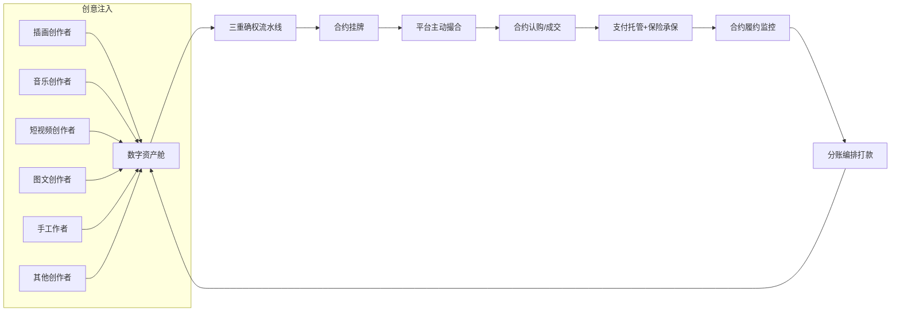

### 步骤详解

| 步骤 | 主体 | 动作 | 输出 |
|------|------|------|------|
| **1. 创意资产注入** | 六大个体创作者 | 通过平台工作台进行"人机协作(AI+人工)"创作，将原生创意及衍生设计资产注入平台"数字资产舱" | 数字资产（含人类贡献度审计日志） |
| **2. 三重确权流水线** | 平台信任底座 | 作品上传→C2PA Manifest注入→TSA时间戳→区块链哈希存证 | 三重确权证书（C2PA+TSA+区块链） |
| **3. 合约挂牌** | 创作者/合作创作者/运营者 | 将确权后的作品转化为标准化合约实例（版权合约/产品合约/使用权合约），选择合约模板（由法务代表创建并审核通过），设置分润比例和履约条款，挂牌至平台合约市场 | 挂牌合约实例（含分润规则、履约条件、保险条款） |
| **4. 平台主动撮合** | 平台机会引擎 | 基于合约属性、创作者历史、参与者偏好、市场趋势，通过信息展示、推荐算法、价值分析主动推送给潜在认购方/合作方 | 撮合匹配列表+价值分析报告 |
| **5. 合约认购/成交** | 买家/认购方 | 浏览/搜索/接收推送的合约挂牌，阅读合约条款（含分润比例、履约条件、保险范围），发起认购或接受要约，各方达成一致后合约成交 | 成交合约实例 |
| **6. 支付托管+保险承保** | 第三方支付机构+保险公司 | 买家付款至选定的第三方支付机构托管账户；保险公司按平台规则默认承保（不人为审核阻塞履约进度） | 托管资金确认+保险保单号 |
| **7. 分账编排打款** | 平台分账引擎+支付机构 | 监控合约履约状态→履约达成或超时无异议→通知支付机构按合约预设比例打款至各方账户（卖家、法务代表、税务代理、保险公司、平台等） | 交易完成记录+各方到账确认 |

---

## 二、业务参与方全景

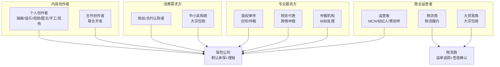

**前端统一原则：** 所有参与者使用相同的前端能力集——Electron桌面应用（Vue 3 + MCP集成） + Vue 3 Web应用共享同一套组件库和业务逻辑层。不同角色只是权限和数据视图不同，不存在功能歧视。微信小程序为远期扩展目标。

| 参与者类型 | 前端入口 | 核心功能模块 |
|-----------|---------|-------------|
| 个人创作者（六大品类） | Electron桌面 + Web | AIGC痕迹捕捉、作品发布、三重确权、Fork-Merge协同、合约挂牌 |
| 合作创作者 | Electron桌面 + Web | 半成品Fork、Merge Request、联合确权、智能合约签署 |
| 运营者（MCN/经纪人） | Web + 桌面 | IP授权要约、合约挂牌管理、产品化合约创建、分销管理 |
| 物流商 | Web Portal | 签署物流合约、上传运单号 |
| 大贸易商 | Web | 大宗包销谈判、跨境采购订单、海关报关单上传 |
| 粉丝/合约认购者 | Web 独立站 | 浏览合约、认购合约、追踪履约进度、评价反馈 |
| 中小采购商 | Web 独立站 | 合约市场浏览、大宗采购谈判、物流追踪 |
| 版权律师 | Web 法务广场 | 标准合同模板挂牌、线上仲裁接单、风险代理、DMCA函件 |
| 税务代表 | Web | 跨境税务申报、批量完税操作、各国税法知识库 |
| 仲裁机构 | Web | 纠纷受理、证据调取、裁决执行、链上记录 |

---

# 第二部分：功能架构

## 一、六大核心功能域

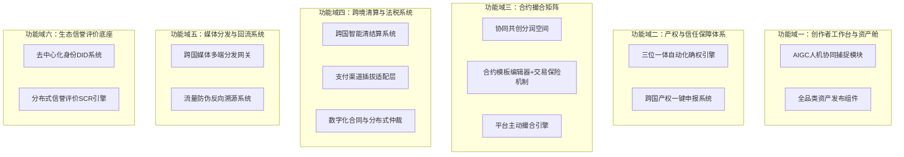

## 二、功能域详细说明

### 功能域一：创作者工作台与资产舱

| 功能模块 | 核心能力 | 技术要点 |
|---------|---------|---------|
| AIGC人机协同捕捉 | 集成枢纽：提供MCP/REST API标准协议，接收专业工具事件流与创作者上传文件，进行元数据提取和人类贡献度评分 | MCP Server（实时事件流+取证查询）+ REST API（成品上传+自声明）+ 平台内置编辑器原生追踪 |
| 全品类资产发布 | 支持大文件无损上传、多模态类目智能预检 | 分片上传（≥4GB）、CDN加速、AI自动分类打标 |

### 功能域二：产权与信任保障体系

| 功能模块 | 核心能力 | 技术要点 |
|---------|---------|---------|
| 三位一体自动化确权 | 作品上传→C2PA Manifest注入→TSA时间戳→区块链哈希存证 | 纯Python二进制嵌入、RFC 3161协议、版权家/蚂蚁链/至信链/Polygon适配器 |
| 跨国产权一键申报 | 自动将存证包及"人类智力贡献报告"转化为符合中、美、欧官方要求的标准化电子申报材料 | DCC/USCO/EUIPO API对接、WIPO标准格式转换 |

### 功能域三：合约撮合矩阵

| 功能模块 | 核心能力 | 技术要点 |
|---------|---------|---------|
| 协同共创分润空间 | 半成品有条件Fork、数据库事务版税比例锁死、联合署名工具 | pygit2版本控制、Python多层签名验证 |
| 合约模板编辑器+交易保险 | 法务代表创建合约模板、合约挂牌/认购/成交、保险公司默认承保 | 合约实例数据结构、交易保险网关API |
| 平台主动撮合引擎 | 信息展示推荐、个性化推送、价值分析报告、需求反向匹配 | 推荐算法+价值分析推送引擎 |

### 功能域四：跨境清算与法税系统

| 功能模块 | 核心能力 | 技术要点 |
|---------|---------|---------|
| 跨国智能清结算 | 多币种秒级自动拆单，网状清算与钱包隔离 | Stripe Connect/WorldFirst/PayPal API集成 + 支付渠道插拔适配 |
| 税务代理参与者 | 税务代理作为独立参与者签约，按合约比例获取税款部分 | Avalara/TaxJar数据库直连，不自动化隔离 |
| 数字化合同与仲裁 | 律师挂牌标准合同模板，内置履约逾期/侵权下架线上仲裁 | 可编程合同模板、风险代理维权通道 |

### 功能域五：媒体分发与回流系统

| 功能模块 | 核心能力 | 技术要点 |
|---------|---------|---------|
| 跨国媒体多端分发 | 官方OpenAPI一键同步内容至海内外主流流量公域 | OAuth 2.0授权、抖音/小红书/TikTok/YouTube/Spotify |
| 流量防伪反向溯源 | 强制对多媒体包裹高频隐形音频水印或隐形点阵二维码 | 频域编码水印、Reverse Traceback Router |

### 功能域六：生态信誉评价底座

| 功能模块 | 核心能力 | 技术要点 |
|---------|---------|---------|
| 去中心化身份DID | 为所有生态参与者颁发唯一数字身份，将履约记录挂钩 | W3C DID标准、链上身份锚定 |
| 分布式信誉评价SCR | 动态更新参与者信用分，执行差异化佣金、阶梯保证金、排产优先权加权 | 多维度评分模型、链上信誉不可篡改 |

---

# 第三部分：系统架构

## 一、四层架构与模块化单体设计（v5.0）

**四层架构定义：**

| 层级 | 定位 | 核心组件 | 技术实现 |
|------|------|---------|---------|
| **表现层** | 所有参与者的统一工作台 + 对外门户 + 移动端 | OriStudio / OriSpark / 微信小程序 | Electron + Vue 3 / Nuxt 3 SSR / 微信原生 |
| **网关与业务中台层** | 模块化单体后端，所有业务逻辑在此 | API网关 + 合约撮合 + 支付适配 + 分账 + 法律 + SCR + 协同创作 + 数据产品 | Python 3.13 + FastAPI |
| **信任底座层** | C2PA/TSA/区块链三重确权 + AIGC痕迹审计 | 人类贡献度评分 + 凭证注入 + 时间戳 + 链上存证 | 纯Python实现 |
| **外部生态对接层** | 与外部机构/平台/工厂/物流的标准化接口 | 跨国版权申报 + 合规清算 + 财税大脑 + POD工厂 + 物流商 | HTTP API / MCP协议 |

**核心原则：** OriStudio 是所有参与者的统一工作台，不存在"只有创作者用桌面端"的功能歧视。不同角色只是权限和数据视图不同。采用模块化单体架构（Monolith），非微服务部署。

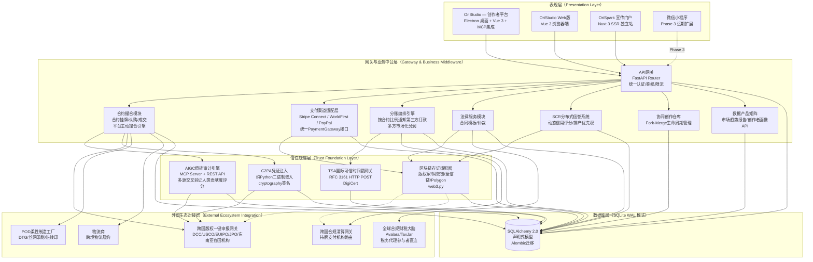

## 二、模块化单体架构设计

### 2.1 架构原则

OriStudio 采用**模块化单体（Modular Monolith）**架构，不是微服务。模块间通过数据库表关联，通过 API 路由隔离。设计上是模块化单体，每个模块有独立的 `models/schemas/service/router`，未来可以拆分为独立服务。

**为什么选择单体而非微服务：**
- 合约分润结算、支付托管在单体下是一个 DB 事务，微服务需要分布式事务
- Fork-Merge 交叉验证需要同步读取两个创作者的数据，单体下无网络延迟
- 所有业务逻辑在同一进程内，调试和性能分析更简单
- MVP 阶段 SQLite WAL 模式足以支撑数百 QPS 并发

### 2.2 后端模块划分

| 模块路径 | 职责 | 子模块结构 | 技术实现 |
|---------|------|-----------|---------|
| **api/auth** | 用户注册、登录、DID管理、KYC验证 | models.py / schemas.py / router.py / service.py | FastAPI + JWT + WebAuthn |
| **api/creator** | 创作者信息管理、作品发布、资产舱管理 | models.py / schemas.py / router.py / service.py | SQLAlchemy 2.0 + Pydantic v2 |
| **api/collab** | Fork-Merge协同创作、版本控制、Merge Request | models.py / schemas.py / router.py / service.py | pygit2 + 数据库事务 |
| **api/asset** | 大文件上传/下载、分片处理、CDN管理 | models.py / schemas.py / router.py / service.py | 分片上传 + httpx + MinIO/S3 |
| **api/trust** | C2PA注入、TSA申请、区块链存证 | models.py / schemas.py / router.py / service.py | cryptography + RFC 3161 + web3.py |
| **api/legal** | 跨国版权一键申报、多语种材料转换、各国机构API | models.py / schemas.py / router.py / service.py | httpx + PDF生成 |
| **api/settlement** | 多币种清结算、支付渠道适配、分账编排、钱包管理 | models.py / schemas.py / router.py / service.py | 数据库事务 + Stripe/WorldFirst/PayPal SDK |
| **api/matching** | 合约挂牌/认购/成交管理、平台主动撮合引擎 | models.py / schemas.py / router.py / service.py | 推荐算法+价值分析推送 |
| **api/tax** | 税务代理参与者对接、跨境税务数据查询 | models.py / schemas.py / router.py / service.py | Avalara/TaxJar API (httpx异步调用) |
| **api/distribution** | 媒体分发、水印注入、反向路由 | models.py / schemas.py / router.py / service.py | OAuth 2.0 + ffmpeg-python + 频域编码 |
| **api/scr** | 分布式信誉评分、DID链上锚定 | models.py / schemas.py / router.py / service.py | 多维度评分模型 + 区块链适配器 |

### 2.3 数据库架构

| 组件 | 选型 | 说明 |
|------|------|------|
| **数据库** | SQLite（WAL 模式） | 生产级配置，多读一写足够MVP阶段使用 |
| **ORM** | SQLAlchemy 2.0（声明式） | 每个模块独立 models.py，预留切换 PostgreSQL 的抽象层 |
| **迁移工具** | Alembic | 数据库版本管理，每次模型变更生成迁移脚本 |
| **连接池** | 同步模式（SQLite特性） | 不使用连接池，直接文件级锁控制 |

### 2.4 前端模块划分

| 模块 | 技术栈 | 说明 |
|------|--------|------|
| **Vue 3 Web应用** | Vue 3 + TypeScript + Pinia + Vite (:5174) + Axios | OriStudio浏览器端，所有参与者统一工作台 |
| **Electron桌面应用** | Electron + Vue 3构建产物 + MCP Client集成 | 复用Web构建产物，通过MCP协议与专业创作工具连通 |
| **Nuxt 3宣传门户** | Nuxt 3 + TypeScript + Pinia + SSR | OriSpark独立项目，Phase 2建设 |
| **微信小程序** | 微信原生框架 | Phase 3远期扩展 |

### 2.5 目录结构

```
orispark/
├── backend/                          # 模块化单体后端
│   ├── main.py                       # FastAPI 应用入口
│   ├── config.py                     # 全局配置 (SQLite路径、区块链适配器配置等)
│   ├── database.py                   # SQLAlchemy 引擎初始化 (WAL模式)
│   ├── dependencies.py               # 全局依赖 (JWT认证、角色校验)
│   ├── api/                          # 模块API路由
│   │   ├── auth/
│   │   │   ├── __init__.py
│   │   │   ├── models.py             # 用户/DID/权限数据模型
│   │   │   ├── schemas.py            # Pydantic v2 请求/响应模型
│   │   │   ├── router.py             # FastAPI APIRouter
│   │   │   └── service.py            # 业务逻辑
│   │   ├── creator/
│   │   │   ├── __init__.py
│   │   │   ├── models.py
│   │   │   ├── schemas.py
│   │   │   ├── router.py
│   │   │   └── service.py
│   │   ├── collab/                   # Fork-Merge协同
│   │   ├── asset/                    # 大文件上传
│   │   ├── trust/                    # C2PA/TSA/区块链
    │   │   ├── settlement/               # 清结算/支付渠道适配/分账编排
    │   │   ├── matching/                 # 合约撮合引擎+主动撮合
    │   │   ├── tax/                      # 税务代理对接
    │   │   ├── legal/                    # 法律服务
    │   │   └── distribution/             # 媒体分发
│   │   ├── legal/                    # 法律服务
│   │   └── tax/                      # 税务服务
│   ├── shared/                       # 跨模块共享代码
│   │   ├── blockchain/               # 区块链适配器 (版权家/蚂蚁链/至信链/Polygon)
│   │   ├── c2pa/                     # C2PA凭证注入 (纯Python)
│   │   ├── tsa/                      # RFC 3161 TSA客户端 (DigiCert)
│   │   ├── watermark/                # 隐形水印 (音频频域编码/视频点阵二维码)
│   │   ├── audit_integration/        # AIGC痕迹捕捉集成枢纽（MCP Server + REST API）
│   │   └── utils/                    # 通用工具函数
│   └── migrations/                   # Alembic迁移脚本
├── frontend-web/                     # Vue 3 Web应用 (Vite :5174)
│   ├── src/
│   │   ├── views/                    # 按角色划分的页面
│   │   ├── components/               # 共享组件库
│   │   ├── stores/                   # Pinia状态管理
│   │   ├── router/                   # Vue Router路由
│   │   ├── api/                      # Axios HTTP客户端封装
│   │   └── types/                    # TypeScript类型定义
│   └── package.json
├── frontend-electron/                # Electron桌面应用
│   ├── electron-main/                # Electron主进程
│   ├── electron-renderer/            # 复用frontend-web构建产物
│   ├── mcp-client/                   # MCP Client 集成（与专业创作工具连通）
│   └── package.json
├── frontend-nuxt/                    # Nuxt 3宣传门户 (独立项目)
│   ├── app/
│   │   ├── pages/                    # SEO优化页面
│   │   ├── components/
│   │   ├── stores/
│   │   └── server/                   # Nuxt API路由 (轻量后端代理)
│   └── nuxt.config.ts
├── frontend-miniprogram/             # 微信小程序 (Phase 3)
└── tests/                            # Playwright E2E测试 + pytest单元测试
```

### 2.6 未来微服务拆分路径

当前单体架构下，每个模块已有清晰的边界。当业务规模需要时，可按以下顺序拆分：

| 拆分优先级 | 目标模块 | 拆分方式 | 新服务技术栈 |
|-----------|---------|---------|-------------|
| **P1（最先拆分）** | api/trust | 独立为 trust-service | Python/FastAPI（C2PA/TSA/区块链计算密集） |
| **P2** | api/distribution | 独立为 distribution-service | Python/FastAPI + FFmpeg容器 |
| **P3** | api/settlement | 独立为 settlement-service | Python/FastAPI（资金安全需隔离） |
| **P4** | api/matching | 独立为 matching-service | Python/FastAPI |
| **其余模块** | 保持单体 | 暂无拆分必要 | — |

---

## 三、三入口详细功能规格

### 2.1 OriStudio — 创作者平台（Phase 1 核心产品）

OriStudio 是所有参与者的统一工作台，通过 Electron 桌面应用 + Vue 3 Web 应用双入口提供。所有参与者共享同一套 Vue 组件库和业务逻辑层，不同角色仅权限和数据视图不同。

#### 2.1.1 创作者/合作创作者功能清单

| 功能模块 | 子功能 | 桌面端(Electron) | Web端(Vue 3) | 优先级 |
|---------|-------|:--------------:|:-------------:|--------|
| **作品发布** | 大文件分片上传（≥4GB） | ✅ | ✅ | P0 |
| | 多模态类目智能预检 | ✅ | ✅ | P0 |
| | 3D模型/无损音频/4K视频专用上传通道 | ✅ 原生优化 | ⚠️ Web限制500MB | P1 |
| **AIGC痕迹捕捉** | REST API上传 + MCP事件流 + 平台内置编辑器追踪 | ✅ Web端完整支持 | ✅ Web端完整支持 | P0 |
| | 导出文件元数据自动提取（EXIF/XMP/C2PA） | ✅ | ✅ | P0 |
| | 创作者自声明系统 + 概率性抽查 | ✅ | ✅ | P0 |
| | 过程文件可选上传（端到端加密，仅存哈希） | ✅ | ✅ | P1 |
| **确权流水线** | C2PA Manifest注入 | ✅ | ✅ | P0 |
| | TSA时间戳申请 | ✅ | ✅ | P0 |
| | 区块链哈希存证（双链并行） | ✅ | ✅ | P0 |
| | 人类贡献度报告生成与导出 | ✅ | ✅ | P0 |
| **Fork-Merge协同** | 半成品仓库检索与Fork | ✅ | ✅ | P0 |
| | Merge Request发起与交叉验证 | ✅ | ✅ | P0 |
| | 智能合约版税比例锁死 | ✅ | ✅ | P0 |
| **创作分析** | 作品浏览量和互动数据看板 | ✅ | ✅ | P1 |
| | 收入分润明细查询 | ✅ | ✅ | P1 |

#### 2.1.2 运营者(MCN/经纪人)功能清单

| 功能模块 | 子功能 | 桌面端 | Web端 | 优先级 |
|---------|-------|:------:|:-----:|--------|
| **IP授权管理** | 潜力作品筛选与商业运作要约 | ❌ | ✅ | P0 |
| | 独家商业开发协议在线签署 | ❌ | ✅ | P0 |
| | 履约保证金Escrow托管 | ❌ | ✅ | P0 |
| **产品化合约创建** | 产品化合约发布（使用外部工具/云服务生成样品图） | ❌ | ✅ | P0 |
| | 高精度概念样品图批量生成 | ❌ | ✅ | P0 |
| | 打样视频自动生成 | ❌ | ✅ | P1 |
| **合约撮合管理** | 合约挂牌管理、认购方匹配、动态分润报价 | ❌ | ✅ | P0 |
| | 粉丝社群管理与进度推送 | ❌ | ✅ | P1 |
| **分销管理** | 分销渠道配置与佣金设定 | ❌ | ✅ | P1 |

#### 2.1.3 物流商功能清单

| 功能模块 | 子功能 | 桌面端 | Web端(ERP Portal) | 优先级 |
|---------|-------|:------:|:----------------:|--------|
| **合约签署** | 物流合约在线签署 | ❌ | ✅ | P0 |
| | 运单号上传与绑定 | ❌ | ✅ | P0 |
| **运单追踪** | 物流费率查询与运单状态更新 | ❌ | ✅ | P0 |
| | 物流轨迹实时更新 | ❌ | ✅ | P0 |
| **签收确认** | 物流标签生成与扫码发货 | ❌ | ✅ | P0 |
| | 签收状态反馈 | ❌ | ✅ | P0 |

#### 2.1.4 贸易商功能清单

| 功能模块 | 子功能 | 桌面端 | Web端 | 优先级 |
|---------|-------|:------:|:-----:|--------|
| **大宗交易** | 转售大宗交易厅浏览与谈判 | ❌ | ✅ | P0 |
| | 特定法区独家转售合同在线签署 | ❌ | ✅ | P0 |
| **采购管理** | 大宗采购订单下发 | ❌ | ✅ | P0 |
| | 海关报关单API上传 | ❌ | ✅ | P1 |
| | 海外仓验货确认 | ❌ | ✅ | P0 |

#### 2.1.5 法律/税务/仲裁专业服务方功能清单

| 功能模块 | 子功能 | 桌面端 | Web端 | 优先级 |
|---------|-------|:------:|:-----:|--------|
| **版权律师** | 法务广场标准合同模板挂牌 | ❌ | ✅ | P0 |
| | 线上仲裁申请/接单 | ❌ | ✅ | P0 |
| | 风险代理案件管理 | ❌ | ✅ | P1 |
| | DMCA下架函批量生成与下发 | ❌ | ✅ | P1 |
| **税务代表** | 跨境税务申报批量操作 | ❌ | ✅ | P0 |
| | 各国税法知识库维护 | ❌ | ✅ | P1 |
| | 税务代理签约与税款分配 | ❌ | ✅ | P0 |
| **仲裁机构** | 纠纷受理与证据调取 | ❌ | ✅ | P0 |
| | 裁决执行与链上记录 | ❌ | ✅ | P0 |

#### 2.1.6 OriStudio 技术实现要点

```
OriStudio 统一前端架构
├── 共享层（Electron + Web 共用）
│   ├── Vue 3 + TypeScript 组件库（500+ 组件）
│   ├── 状态管理：Pinia（Vue 3 官方推荐）
│   ├── 样式系统：Tailwind CSS + CSS Modules
│   ├── 网络层：Axios（统一拦截器 + 请求取消）
│   └── 权限控制：RBAC 角色-权限中间件
├── Electron 桌面专属层
│   ├── MCP Client 集成（与专业创作工具连通）
│   ├── 原生文件系统访问（大文件分片上传优化）
│   ├── AIGC 痕迹采集（MCP Server + REST API）
│   └── 自动更新机制（electron-updater）
└── Vue 3 Web 专属层
    ├── Composition API + <script setup>
    ├── Vue Router 路由隔离（按角色划分页面）
    └── Vite 构建优化（代码分割、懒加载）
```

### 2.2 OriSpark — 宣传门户（Phase 2）

OriSpark 是面向外部的独立宣传门户，核心目标是 SEO 获客、品牌曝光、交易信息展示。

| 功能模块 | 具体页面/功能 | 技术实现 | 说明 |
|---------|-------------|---------|------|
| **首页** | 价值主张+核心数据+CTA | Nuxt 3 SSR + GSAP/Nuxt Animations | 首屏加载<1s，Lighthouse评分>90 |
| **作品画廊** | 热门/精选/新上架作品展示 | ISR 增量静态再生 + 懒加载 | 支持按品类/标签/热度筛选 |
| **交易市场** | 在售合约+大宗采购+撮合机会信息 | SSR 服务端渲染 | SEO友好，搜索引擎可索引 |
| **合作机会** | 运营者招募+物流商入驻+律师入驻 | SSR | 在线申请表单 |
| **市场数据看板** | 实时交易数据可视化（GMV/作品数/创作者数） | SSR + WebSocket 实时更新 | 面向投资者和媒体 |
| **创作者故事** | 标杆案例展示+收入报告 | ISR | 社交媒体分享卡片优化 |
| **API文档** | 面向开发者的开放API文档 | SSR + Swagger UI嵌入 | 工厂/WMS/媒体API接入指南 |
| **关于页面** | 团队介绍+融资信息+联系方式 | SSR | 投资人入口 |

**SEO 策略：**
- 所有作品页/交易页使用 Nuxt 3 SSR 确保搜索引擎可索引
- 结构化数据标记（Schema.org Product/CreativeWork）
- OpenGraph + Twitter Card 社交媒体分享优化
- Sitemap 自动生成 + robots.txt 配置
- 目标：Google搜索"AI copyright platform""creator marketplace"等关键词进入前3页

### 2.3 微信小程序 — 轻量入口（Phase 3 远期）

微信小程序是 OriStudio + OriSpark 的轻量结合体，覆盖移动端轻操作场景。

| 功能模块 | 具体功能 | 来源 | 优先级 |
|---------|---------|------|--------|
| **作品浏览** | 查看已发布作品详情/画廊 | OriSpark 子集 | P0 |
| **通知推送** | 撮合成功/合约成交/分润到账实时通知 | OriStudio 子集 | P0 |
| **简单沟通** | 与合作方/运营者/贸易商即时通讯 | OriStudio 子集 | P1 |
| **数据查看** | 个人收入概览/作品浏览量/SCR信誉分 | OriStudio 子集 | P1 |
| **审批操作** | Merge Request审批/合约签署/认购确认 | OriStudio 子集 | P1 |
| **物流签收** | 运单签收确认/物流轨迹验证 | OriStudio 子集 | P2 |
| **媒体分发** | 一键同步内容到抖音/小红书/TikTok | OriStudio 子集 | P2 |

**重要约束：** 小程序绝不替代 OriStudio 的核心创作和撮合功能，仅作为通知/查看/轻操作的补充入口。

---

## 三、数据架构

```mermaid
erDiagram
    USERS ||--o{ WORKS : creates
    USERS ||--o{ SCORES : has
    USERS ||--o{ WALLETS : owns
    WORKS ||--o{ WORK_VERSIONS : branches
    WORKS ||--|| TRUST_CERTS : holds
    WORKS ||--o{ CONTRACT_INSTANCES : listed_as
    WORKS ||--o{ DISTRIBUTIONS : published_to
    COLLAB_WORKS ||--|| WORK : references_left
    COLLAB_WORKS ||--|| WORK : references_right
    COLLAB_WORKS ||--|| SMART_CONTRACTS : locks
    CONTRACT_INSTANCES ||--o{ CONTRACT_BIDS : receives
    CONTRACT_INSTANCES ||--o{ CONTRACT_FULFILLMENTS : tracks
    CONTRACT_INSTANCES ||--|| INSURANCE_POLICIES : covered_by
    ORDERS ||--o{ ORDER_ITEMS : contains
    ORDERS ||--o{ CONTRACT_FULFILLMENTS : linked_to
    LOGISTICS_PROVIDERS ||--o{ SHIPMENTS : handles
    ORDER_ITEMS ||--|| SHIPMENTS : shipped_via
    INSURANCE_POLICIES ||--o{ CLAIMS : has
    SETTLEMENTS ||--o{ WALLET_TRANSACTIONS : splits_into

    INSURANCE_POLICIES {
        string policy_id PK
        string contract_id FK
        string insurer_id FK
        decimal premium
        string status
        datetime issued_at
        datetime expires_at
    }
    CLAIMS {
        string claim_id PK
        string policy_id FK
        string claimant_id FK
        decimal claim_amount
        string status
        datetime filed_at
        datetime resolved_at
    }

    USERS {
        string user_id PK
        string did DID
        string name
        string email
        string country
        int scr_score
        boolean kyc_verified
        datetime created_at
    }
    WORKS {
        string work_id PK
        string owner_id FK
        string category
        string title
        string c2pa_manifest
        string root_hash
        datetime created_at
    }
    WORK_VERSIONS {
        string version_id PK
        string work_id FK
        string parent_version
        string fork_from_user
        string merge_status
        json diff_data
        datetime created_at
    }
    TRUST_CERTS {
        string cert_id PK
        string work_id FK
        string c2pa_signature
        string tsa_timestamp
        string blockchain_tx
        string chain_name
        datetime issued_at
    }
    SCORES {
        string user_id PK, FK
        int scr_score
        float fulfillment_rate
        float complaint_rate
        float delay_rate
        datetime last_updated
    }
    WALLETS {
        string wallet_id PK
        string user_id FK
        string currency
        decimal balance
        string blockchain_addr
        datetime created_at
    }
    CONTRACT_INSTANCES {
        string contract_id PK
        string work_id FK
        string template_id FK
        string contract_type
        string seller_id FK
        string buyer_id FK
        decimal total_amount
        string status
        datetime created_at
        datetime completed_at
    }
    CONTRACT_BIDS {
        string bid_id PK
        string contract_id FK
        string bidder_id FK
        decimal bid_amount
        string status
        datetime submitted_at
    }
    ORDERS {
        string order_id PK
        string buyer_id FK
        string contract_id FK
        decimal total_amount
        string currency
        string status
        datetime created_at
    }
    ORDER_ITEMS {
        string item_id PK
        string order_id FK
        string work_id FK
        int quantity
        decimal unit_price
    }
    CONTRACT_FULFILLMENTS {
        string fulfillment_id PK
        string contract_id FK
        string buyer_id FK
        string seller_id FK
        string status
        datetime started_at
        datetime completed_at
    }
    LOGISTICS_PROVIDERS {
        string provider_id PK
        string did DID
        string name
        string country
        int scr_score
    }
    SHIPMENTS {
        string shipment_id PK
        string order_item_id FK
        string provider_id FK
        string tracking_number
        string status
        datetime shipped_at
        datetime delivered_at
    }
    TAX_DECLARATIONS {
        string decl_id PK
        string contract_id FK
        string jurisdiction
        decimal tax_amount
        string form_type
        datetime submitted_at
    }
    SETTLEMENTS {
        string settlement_id PK
        string contract_id FK
        decimal total_net
        datetime settled_at
    }
    WALLET_TRANSACTIONS {
        string tx_id PK
        string settlement_id FK
        string wallet_id FK
        decimal amount
        string counterparty_role
        string status
        datetime created_at
    }
```

---

# 第四部分：六大品类创作者SOP

## 一、通用创作与确权流程框架

所有品类创作者遵循统一的三步确权标准作业程序：

```mermaid
flowchart TD
    A[创作完成] --> B["步骤一：C2PA Manifest元数据无损注入"]
    B --> B1[作品二进制流拉入隔离沙箱]
    B1 --> B2[写入人类创作轨迹日志/Prompt演变哈希<br/>作者DID公钥]
    B2 --> B3[使用平台根证书+创作者私钥双重复合数字签名]
    B3 --> C["步骤二：TSA国际可信时间戳加密"]
    C --> C1[打包C2PA签名的作品特征Hash]
    C1 --> C2[向国家授时中心及海外合规CA发起时间戳请求]
    C2 --> C3[获得含权威第三方数字签名的TSA时间戳凭证]
    C3 --> D["步骤三：区块链双层分布式锚定存证"]
    D --> D1[融合Root Hash = 作品Hash + C2PA签名体 + TSA证书体]
    D1 --> D2[国内写入蚂蚁司法链+最高法授信联盟链]
    D2 --> D3[海外写入Polygon/Ethereum主网]
    D3 --> E[生成"数字资产防伪存证确权证书"]
```

## 二、各品类创作者详细SOP

### SOP-01：手工作者（Manual Crafters）

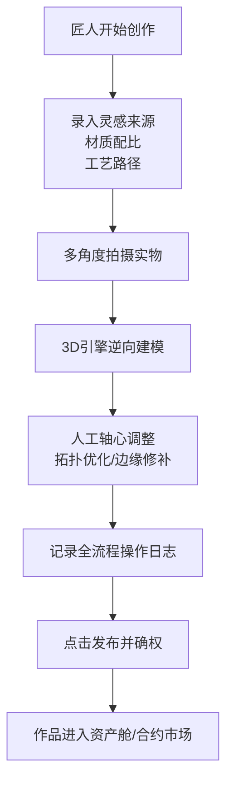

| 步骤 | 操作者 | 系统动作 | 输出 |
|------|--------|---------|------|
| 1 | 匠人 | 录入创作日志（灵感来源、材质配比、工艺路径） | 结构化创作日志JSON |
| 2 | 匠人 | 手机多角度拍摄实物（≥8个视角） | 原始照片序列 |
| 3 | 系统 | 3D高斯泼溅引擎逆向建模 | 高精度3D网格模型（.obj/.glb） |
| 4 | 匠人 | 人工调整3D模型（轴心、拓扑、边缘修补） | 修正后的3D模型 |
| 5 | 系统 | 记录全流程操作日志 → 生成人类贡献度审计报告 | PDF版审计报告 |
| 6 | 系统 | C2PA Manifest注入 → TSA时间戳 → 区块链存证 | 三重确权证书 |
| 7 | 匠人 | 选择发布路径（协同仓库/合约市场/直接上架） | 作品上线 |

### SOP-02：图文创作者（Text & Prose Creators）

```mermaid
flowchart TD
    A[创作者在富文本编辑器中创作] --> B{是否调用AI辅助?}
    B -->|否| C[纯人工创作 → 直接保存版本]
    B -->|是| D[系统后台以Diff标准格式记录每个版本的字符改动率]
    D --> C
    C --> E[最终输出作品]
    E --> F[系统强制生成"人类编写比例分析报告"]
    F --> F1[人类原创字数统计]
    F --> F2[AI干预度评估]
    F --> F3[逻辑修改轨迹图谱]
    F3 --> G[点击"发布并确权"触发三重确权流水线]
    G --> H[作品进入资产舱]
```

| 步骤 | 操作者 | 系统动作 | 输出 |
|------|--------|---------|------|
| 1 | 创作者 | 在平台富文本编辑器中创作 | 草稿 |
| 2 | 创作者 | 可选：调用平台集成LLM（润色/翻译/大纲扩写） | AI辅助文本 |
| 3 | 系统 | Diff标准格式记录每个版本的字符改动率 | 版本Diff日志 |
| 4 | 系统 | 终稿生成"人类编写比例分析报告" | PDF版审计报告 |
| 5 | 系统 | C2PA+TSA+区块链三重确权 | 三重确权证书 |
| 6 | 创作者 | 选择发布路径 | 作品上线 |

### SOP-03：短视频创作者（Short Video Producers）

```mermaid
flowchart TD
    A[导入分镜脚本和原始素材] --> B{是否使用AI辅助?}
    B -->|是| C[系统实时监控非线性编辑轨道]
    B -->|否| D[纯人工剪辑]
    C --> E[系统精确记录：<br/>多轨对齐/滤镜参数<br/>蒙版抠图/字幕编排/转场特效]
    D --> E
    E --> F[视频渲染导出]
    F --> G[轨道编排元数据打包进底层资产包]
    G --> H[点击"发布并确权"触发三重确权流水线]
    H --> I[作品进入资产舱+自动分发]
```

| 步骤 | 操作者 | 系统动作 | 输出 |
|------|--------|---------|------|
| 1 | 创作者 | 导入分镜脚本+原始素材 | 素材包 |
| 2 | 创作者 | 使用AI文生视频/AI特效/AI声效（可选） | AI辅助素材 |
| 3 | 系统 | 实时监控非线性编辑轨道，记录人工高级智力编排动作 | 轨道操作日志 |
| 4 | 创作者 | 多轨对齐/滤镜微调/蒙版抠图/字幕编排/转场特效 | 编辑中的视频 |
| 5 | 系统 | 渲染导出，将轨道编排元数据打包进资产包 | 成品视频+元数据包 |
| 6 | 系统 | 三重确权流水线 | 确权证书 |
| 7 | 创作者 | 选择分发平台 | 视频上线 |

### SOP-04：音乐创作者（Music Composers & Producers）

```mermaid
flowchart TD
    A[导入MIDI工程源文件或分轨音频] --> B{是否使用AI辅助?}
    B -->|是| C[AI生成底层伴奏/声线转换]
    B -->|否| D[纯人工编曲]
    C --> E[系统MIDI监控模块记录：<br/>和弦重构/声效包挂载<br/>混音参数拉写/人声切片]
    D --> E
    E --> F[导出成品音频]
    F --> G[系统自动在乐曲骨干频率段注入<br/>鲁棒性高频隐形音频水印]
    G --> H[点击"发布并确权"触发三重确权流水线]
    H --> I[作品进入资产舱+音频水印嵌入分发包]
```

| 步骤 | 操作者 | 系统动作 | 输出 |
|------|--------|---------|------|
| 1 | 创作者 | 导入MIDI工程源文件或分轨音频 | 工程文件 |
| 2 | 创作者 | 使用AI辅助编曲/声线转换（可选） | AI辅助音频 |
| 3 | 系统 | MIDI监控模块记录人类深度监制行为 | MIDI操作日志 |
| 4 | 创作者 | 和弦重构/声效包挂载/混音参数拉写/人声切片 | 混音工程 |
| 5 | 系统 | 导出成品音频，注入高频隐形音频水印 | 带水印成品音频 |
| 6 | 系统 | 三重确权流水线 | 确权证书 |
| 7 | 创作者 | 选择分发平台（Spotify/Apple Music等） | 音乐上线 |

### SOP-05：插画创作者（Illustrators & Digital Artists）

```mermaid
flowchart TD
    A[通过MCP Client连接外部工具<br/>或直接平台画布创作] --> B{是否使用AI辅助?}
    B -->|是| C[SD/MJ垫图/局部重绘]
    B -->|否| D[纯人工绘制]
    C --> E[系统自动捕捉：<br/>底图输入/提示词迭代/负向提示词调优<br/>人工涂抹图层/线稿刻画]
    D --> E
    E --> F[终稿导出前]
    F --> G[系统生成"人类创意劳动图谱"<br/>可视化证明]
    G --> H[点击"发布并确权"触发三重确权流水线]
    H --> I[作品进入资产舱+可进入合约市场/协同仓库]
```

| 步骤 | 操作者 | 系统动作 | 输出 |
|------|--------|---------|------|
| 1 | 创作者 | 通过MCP Client连接外部工具或平台画布开始创作 | 创作中草稿 |
| 2 | 创作者 | 使用Stable Diffusion/Midjourney生成垫图或局部重绘（可选） | AI辅助底图 |
| 3 | 系统 | 捕捉底图输入、Prompt迭代、负向提示词调优、人工涂抹图层、线稿刻画 | 创作行为日志 |
| 4 | 创作者 | 人工精细绘制、线稿刻画、色彩调整 | 完成画作 |
| 5 | 系统 | 生成"人类创意劳动图谱"可视化证明 | PDF版审计报告 |
| 6 | 系统 | 三重确权流水线 | 确权证书 |
| 7 | 创作者 | 选择发布路径 | 画作上线 |

### SOP-06：其他创作者（Other Categories）

涵盖播客创作者、在线教育讲师、电商店主等未在上述五类中明确归类的创作者。通用流程：

```mermaid
flowchart TD
    A[创作者选择"其他"类别] --> B[填写创作过程自述表单]
    B --> C[上传原始素材/工作记录]
    C --> D[系统生成人类贡献度基线报告]
    D --> E[如有AI辅助 → 补充AI使用声明]
    E --> F[三重确权流水线]
    F --> G[作品进入资产舱]
```

---

# 第五部分：版权机构对接

## 一、国内外版权机构一键式对接路由（v3.0 多国适配）

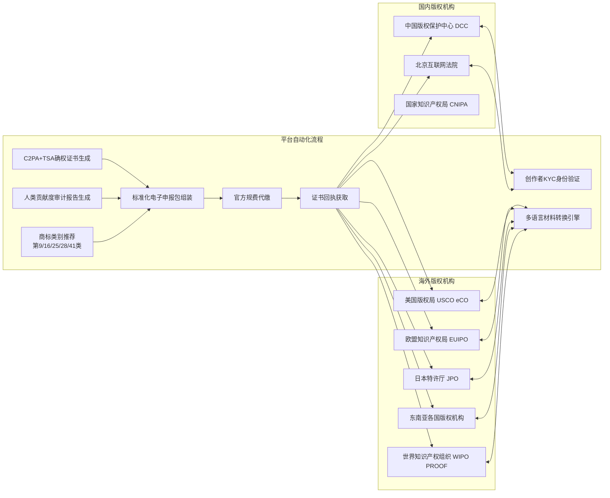

### 1.1 多国地区适配能力（Platform Baseline Requirement）

**多国家/地区适配是 OriSpark 的基本素质，不是可选功能。** 一个作品可以发布到多个国家，系统自动连通对应国家的版权注册机构和法规要求。

| 适配维度 | 实现方式 | 技术要点 |
|---------|---------|---------|
| **作品多国家发布** | 创作者发布时选择目标法区 | 系统为每个法区生成独立存证包和申报材料 |
| **各国版权机构对接** | 中国→DCC，美国→USCO eCO，欧盟→EUIPO，日本→JPO，东南亚→各国本地机构 | 统一抽象层屏蔽各国接口差异 |
| **各国法规适配** | 内置多法区版权法规知识库 | 美国需人类实质性贡献证明、欧盟需AI参与度标注、中国已有司法先例、日本需透明度声明 |
| **商标多类别注册** | 自动识别衍生品可能的商标类别 | 第9类软件/第16类印刷品/第25类服装/第28类玩具/第41类娱乐 |
| **跨国维权路由** | 侵权发生时自动判断法区并路由 | DMCA takedown（美国）/ 各地对应机制 + 当地合作律所 |

### 1.2 四级版权防御体系工程实现

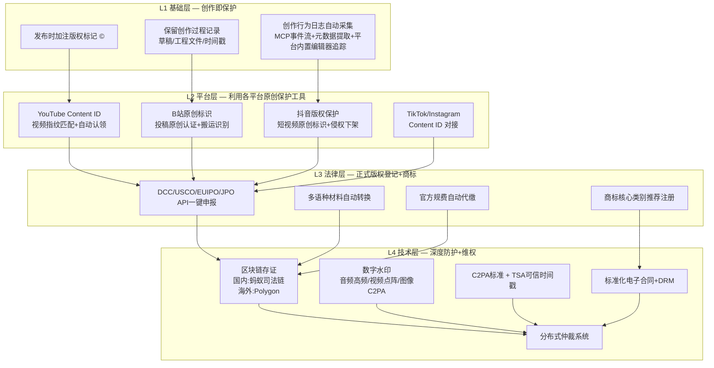

| 级别 | 工程实现 | 触发时机 | 成本 |
|------|---------|---------|------|
| **L1 基础层** | ©标记自动注入 + 工程文件保留 + 创作行为日志采集 | 作品发布时自动触发 | 零成本 |
| **L2 平台层** | YouTube Content ID / B站原创标识 / 抖音版权保护 API对接 | 作品分发到各平台时自动注册 | 免费或低费用 |
| **L3 法律层** | 一键申报网关：多语种转换→格式适配→规费代缴→证书回传 | 高价值作品主动申请 | $65-$500/法区 |
| **L4 技术层** | C2PA+TSA+区块链存证+数字水印+DRM+分布式仲裁 | 重大IP项目全量启用 | $0.01-$0.10/次 |

## 二、中国版权保护中心（DCC）对接SOP

| 步骤 | 系统动作 | 所需数据 | 输出 |
|------|---------|---------|------|
| 1 | 调取创作者真实身份信息 | SFZ号码/活体人脸识别结果 | 已验证身份 |
| 2 | 自动映射填报主体、作品类目、作品说明书 | 作品元数据+C2PA证书+审计报告 | 结构化填报数据 |
| 3 | 将C2PA及TSA司法存证证书作为"实质独创性证明"附件 | 三重确权证书 | 附件包 |
| 4 | 自动填充《作品著作权登记申请表》 | 步骤2+3数据 | 电子申请表 |
| 5 | 提交DCC开放电子版权登记网关API | 步骤4完整申报包 | 受理通知书 |
| 6 | 官方审查通过后接收电子著作权登记证书 | 审查结果 | 电子著作权证书 |

## 三、美国版权局（USCO）/欧盟知识产权局（EUIPO）对接SOP

| 步骤 | 系统动作 | 所需数据 | 输出 |
|------|---------|---------|------|
| 1 | 自动将作品元数据转化为符合WIPO国际标准的英文材料 | 中文元数据+C2PA证书 | 英文申报包 |
| 2 | **关键动作：** 将《人类贡献度审计报告（英文版）》作为强制性第三方技术佐证附件 | 审计报告原文 | 英文版审计报告 |
| 3 | 自动触发跨境支付接口代缴官方规费 | 费用标准（USCO $65/份） | 缴费凭证 |
| 4 | 通过eCO在线申报API / EUIPO数字资产网关提交 | 完整申报包 | 受理回执 |
| 5 | 获取具备跨国法律效力的电子版权登记凭证 | 审查结果 | 电子版权证书 |

---

# 第六部分：媒体分发与回流

## 一、跨国媒体自动化分发链路

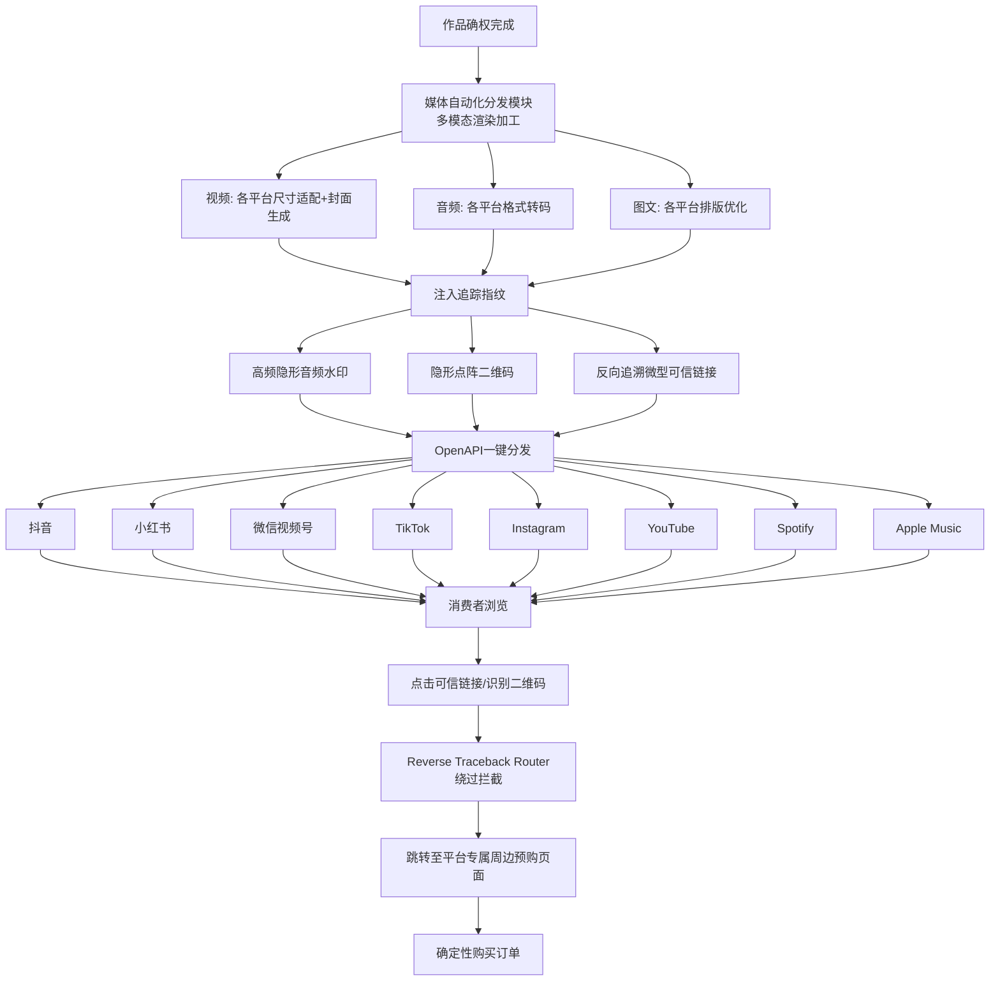

## 二、分发平台分类

| 分类 | 平台 | 内容类型 | API状态 |
|------|------|---------|---------|
| **国内视频** | 抖音、快手、哔哩哔哩 | 短视频/中长视频 | OpenAPI可用 |
| **国内社交** | 小红书、微信视频号、微博 | 图文/短视频 | 部分API可用 |
| **海外视频** | TikTok、YouTube | 短视频/长视频 | OpenAPI可用 |
| **海外社交** | Instagram、Facebook、X | 图文/短视频 | OpenAPI可用 |
| **音乐** | Spotify、Apple Music、网易云音乐、QQ音乐 | 音频 | 需要合作伙伴接入 |
| **电商** | Etsy、Amazon、淘宝、Shopee | 商品页面 | API可用 |

---

# 第七部分：全球税收自动化隔离与分润清算

## 一、税务代理对接流程（v5.0 变更）

**核心变更：** v5.0 移除"全球税收自动化隔离"概念。平台不自动隔离税金，税务代理作为独立参与者签约，按合约约定的市场化分润比例获取税款部分。

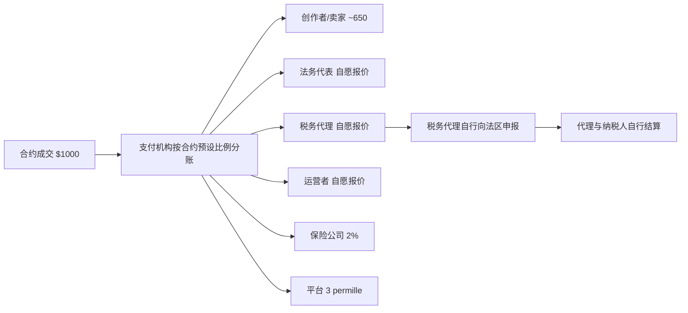

**说明：** 税务代理是平台上的独立参与者（类似律师创建合约模板），他们通过竞争获得税务代理合约，按约定比例从交易分润中获取服务费。税款申报和缴纳由代理自行完成，平台不做自动化隔离。

## 二、市场化分润机制（v5.0 变更）

**核心原则：** 除平台3‰固定收入外，所有参与方的分润比例均由其在撮合成交时的自愿报价和市场竞争决定，平台不预设固定比例。

| 参与者 | 定价方式 | 说明 |
|--------|---------|------|
| **创作者/卖家** | 市场竞价 | 剩余部分为各方服务费，具体比例由市场竞争形成 |
| **法务代表** | 自愿报价 | 合约模板创建者+法律效应保障者，参与价格竞争 |
| **税务代理** | 自愿报价 | 跨境税务申报/代扣服务方，参与价格竞争 |
| **保险公司** | 固定费率 | 保费约为交易额1%-2%（买卖双方各承担1%） |
| **运营者** | 自愿报价 | IP孵化/宣发/产品生产/售卖服务方，参与价格竞争 |
| **物流商** | 自愿报价 | 物流履约服务方，按运单量或交易额报价 |
| **平台手续费** | 3‰（暂定） | 平台唯一固定收入来源 |

**分润锁定机制：** 合约成交时，各方自愿报价形成的分润比例写入合约实例（split_rules_json），后续分账按此锁定比例执行，不可单方修改。

---

# 第八部分：多边参与者协作SOP

## 一、合作创作者Fork-Merge协同生命周期

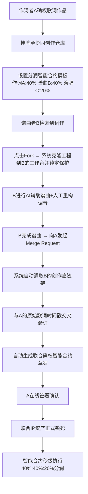

## 二、运营者IP商业化孵化流程

```mermaid
flowchart LR
    A[运营者在合约市场筛选潜力合约] --> B[向创作者发起"全案衍生开发要约"]
    B --> C[双方在线签署标准电子IP独家商业运作授权协议]
    C --> D[运营者创建产品化合约<br/>使用外部工具/云服务生成样品图]
    D --> E[合约挂牌至平台合约市场]
    E --> F[买方认购/各方达成一致]
    F --> G[运营者按自愿报价提取服务费<br/>（参与市场竞争定价）]
    G --> H[分账编排引擎自动执行,秒级到账]
```

## 三、大贸易商大宗转售流程

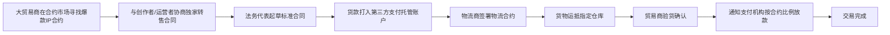

**说明：** 大贸易商通过平台合约市场发现爆款IP合约，与创作者/运营者协商独家转售合同，货款通过第三方支付机构托管，物流商作为参与者签署物流合约，货物运抵指定仓库后贸易商验货确认，最终按合约预设比例通知支付机构放款至各方账户。

## 四、合约认购与资金托管流程

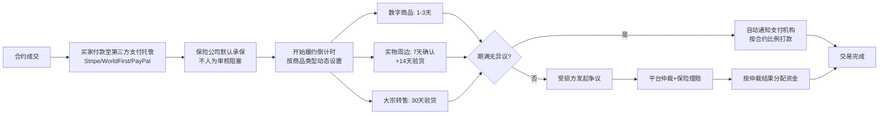

**说明：** v5.0 移除众筹概念。所有交易通过合约认购/成交模式进行，资金由第三方支付机构托管（非平台托管），保险公司默认承保。履约期满后无异议则自动打款，有争议则启动仲裁+保险理赔流程。

## 五、法律咨询与线上仲裁流程

```mermaid
flowchart LR
    A[律师在法务广场发布标准化合同数字模板] --> B[合约模板经平台审核]
    B --> C[创作者一键调用模板挂牌合约]
    C --> D[合约成交后系统从撮合费中自动扣除分成拨付给法务代表]
    D --> E{发生纠纷?}
    E -->|否| F[正常履约]
    E -->|是| G[受害方一键提起"线上分布式仲裁申请"]
    G --> H[系统自动打包争议合约/存证证书/C2PA痕迹文件]
    H --> I[入驻律师自愿选择接单]
    I --> J{纠纷类型?}
    J -->|侵权| K[律师发送DMCA下架函/法庭传票]
    J -->|违约| L[线上仲裁裁决]
    K --> M{胜诉?}
    L --> N[执行裁决]
    M -->|是| O[赔偿金按预设比例自动划转<br/>律师30% / 创作者70%]
    M -->|否| P[案件关闭]
    O --> Q[零门槛跨国维权闭环]
```

---

# 第九部分：系统工程撮合

## 一、平台主动撮合引擎（v5.0 变更）

v5.0 移除了"异构创意-同质物料"集单合并算法。平台不做供应链集单调度，不建WMS系统，不做柔性制造撮合。

合约匹配通过平台的主动撮合引擎实现：信息展示推荐 + 个性化推送 + 价值分析报告推送 + 需求反向匹配。大贸易商和运营者通过合约市场主动发现匹配的IP合约，而非通过物料属性聚合算法被动撮合。

## 二、分布式信誉保障体系（SCR）

```mermaid
flowchart LR
    subgraph "数据采集"
        A1[链上履约记录]
        A2[平台交易数据]
        A3[物流商运单数据]
        A4[用户评价反馈]
    end
    subgraph "评分模型"
        B1[权重分配算法]
        B2[信誉分计算 SCR = f(履约率, 投诉率, 延迟率...)]
    end
    subgraph "信用等级"
        C1[黄金级 SCR ≥ 95]
        C2[白银级 80 ≤ SCR < 95]
        C3[青铜级 70 ≤ SCR < 80]
        C4[失信级 SCR < 70]
    end
    subgraph "奖惩机制"
        D1[低佣金/优先派单/免除保证金]
        D2[正常费率/正常排产]
        D3[限制新合约挂牌/延长提现90天]
        D4[取消高价值撮合资格/100%预付/注销DID]
    end
    A1 --> B1
    A2 --> B1
    A3 --> B1
    A4 --> B1
    B1 --> B2
    B2 --> C1
    B2 --> C2
    B2 --> C3
    B2 --> C4
    C1 --> D1
    C2 --> D2
    C3 --> D2
    C4 --> D3
    C4 --> D4
```

| 角色 | 高信誉特权（SCR ≥ 95） | 低信誉惩戒（SCR < 70） |
|------|---------------------|----------------------|
| **创作者/运营者** | 撮合佣金降低、合约市场置顶加权、免除首期保证金 | 限制新合约挂牌/提现延至90天/Fork权限受限 |
| **物流商** | "黄金履约物流"勋章、优先派单、缩短结算账期 | 运单异常率过高降低权重、严重违约注销DID |
| **贸易商/采购商** | 更高优先级撮合、海外仓延期免息付款 | 取消高价值撮合资格、100%全款预付 |

---

# 第九点五部分：关键子系统详细工程设计

## 一、AIGC痕迹审计集成枢纽

### 1.1 核心定位

**OriSpark不做创作工具，不做深度采集引擎，做信任枢纽。**

```
不做：监听Photoshop/Procreate/剪映内部API
不做：解析PSD/AE/DAW工程文件格式
不做：与专业工具厂商竞争创作功能

做：统一证据标准（MCP/REST API）
做：元数据自动提取 + 人类贡献度评分
做：C2PA/TSA/区块链三重存证
做：创作者自声明系统 + 概率性抽查
```

### 1.2 三层证据体系

| 层级 | 来源 | 可靠性 | 实现方式 |
|------|------|--------|---------|
| Layer 1 | 平台内置编辑器 | 最高 | Vue 3 Canvas/富文本原生操作日志，Pinia Store 版本快照 |
| Layer 2 | 导出文件元数据 | 中 | REST API 上传成品文件，后端自动提取 EXIF/XMP/C2PA/频谱特征 |
| Layer 3 | 创作者自声明 + MCP 事件流 | 中~高 | 结构化表单 + 专业工具 MCP Server 实时推送 |

### 1.3 集成枢纽架构

```mermaid
flowchart TB
    subgraph "外部专业创作工具"
        A1[Photoshop / Procreate / DAW<br/>通过MCP Client连接]
        A2[剪映 / DaVinci Resolve]
        A3[ComfyUI / SD WebUI]
        A4[Midjourney / Runway]
        A5[其他 AI/传统工具]
    end

    subgraph "OriSpark 集成层"
        B1[MCP Server<br/>实时事件流 + 取证查询]
        B2[REST API<br/>文件上传 + 元数据提取]
        B3[过程文件接收网关<br/>自动/按需上传]
        B4[元数据解析器<br/>EXIF/XMP/C2PA/频谱]
    end

    subgraph "OriSpark 信任层"
        C1[人类贡献度评分引擎]
        C2[创作者自声明系统]
        C3[C2PA Manifest 注入]
        C4[TSA时间戳 + 区块链存证]
    end

    subgraph "平台内置编辑器"
        D1[Vue 3 Canvas/富文本<br/>原生操作日志]
    end

    A1 --> B1
    A2 --> B1
    A3 --> B1
    A4 --> B2
    A5 --> B2
    D1 --> B3
    B3 --> B4
    B4 --> C1
    C1 --> C2
    C2 --> C3
    C3 --> C4
```

### 1.4 REST API（MVP 优先）

| 端点 | 方法 | 用途 | 输入 |
|------|------|------|------|
| `/api/v1/audit/upload` | POST | 上传导出成品文件 | PNG/JPG/MP4/WAV + 品类标签 |
| `/api/v1/audit/process-files` | POST | 上传过程性文件（可选） | PSD/AE/工程文件/日志 |
| `/api/v1/audit/declaration` | POST | 提交创作者自声明 | Prompt 历史、AI 工具列表、人工干预描述 |
| `/api/v1/audit/report/{id}` | GET | 获取审计报告 | — |
| `/api/v1/audit/verify` | POST | 验证存证真伪 | C2PA manifest URL 或链上哈希 |

**关键约束：**
- 成品文件上传不要求原始工程文件，降低信任门槛
- 过程文件支持端到端加密上传，平台只存哈希
- 所有文件存储使用对象存储（S3/OSS），审计引擎只读取元数据

### 1.5 MCP Server（Phase 1.5）

| MCP 工具名 | 能力 | 触发时机 |
|------------|------|---------|
| `upload_event_stream` | 推送创作过程事件 | 创作者授权后实时推送 |
| `request_snapshot` | 取证时请求时间快照 | 争议场景，需创作者授权 |
| `write_back_credential` | 回写确权凭证 | 确权完成后自动回写 |
| `query_audit_status` | 查询审计状态 | 创作者主动查询 |

**MCP 协议标准化原则：**
- 同一套 MCP schema，Adobe/Canva/ComfyUI 等工具接入无需修改 OriSpark 后端
- 工具端只需实现 MCP Client，OriSpark 提供 SDK 和示例代码
- 事件格式采用统一 JSON Schema，不同工具映射到标准字段

### 1.6 信任与隐私机制

| 顾虑 | 应对机制 |
|------|---------|
| 上传原文件会被窃取创意 | 分级上传：只传导出成品即可启动；过程文件可选上传 |
| Prompt/工程内容隐私泄露 | MCP 只推事件元数据（类型+时间戳+参数指纹），不推原始像素/音频 |
| 平台滥用数据 | 审计数据仅用于确权，不进入撮合/推荐/商业化流程 |
| 无法验证平台行为 | 所有存证上链，创作者可随时下载完整审计报告自行验证 |
| 操作复杂 | MCP 自动接入零操作；手动上传提供引导式界面 |

### 1.7 人类贡献度评分（多源交叉验证版）

不再依赖单一深度插件数据，改为多源交叉验证：

| 信号来源 | 权重 | 可靠性 | 获取方式 |
|---------|------|--------|---------|
| 平台内置编辑器操作日志 | 30% | 最高 | 原生记录，无需额外采集 |
| MCP 实时事件流 | 25% | 高 | 专业工具主动推送 |
| 导出文件元数据完整性 | 20% | 中 | EXIF/XMP/C2PA 自动提取 |
| 创作者自声明一致性 | 15% | 中 | 结构化表单 + 概率性抽查 |
| 作品质量/复杂度信号 | 10% | 辅助 | 图像复杂度、频谱特征等 |

**阈值规则：**
- ≥ 0.60 → 通过（具备版权保护资格）
- 0.40 - 0.60 → 需补充 AI 使用声明
- < 0.40 → 标记为"低人类贡献"，不进入确权流水线

### 1.8 建设阶段

| 阶段 | 时间 | 内容 | 产出 |
|------|------|------|------|
| Phase 1 | M1-M3 | REST API + 元数据提取 + 自声明系统 + 平台内置编辑器追踪 | MVP 可用，覆盖基础确权需求 |
| Phase 1.5 | M4-M6 | MCP Server + 3-5 个头部工具对接（ComfyUI/SD/PS） | 实时事件流 + 取证查询 |
| Phase 2 | M7-M12 | 更多工具接入 + 端到端加密 + 概率性抽查机制完善 | 标准开放，生态形成 |

## 二、Escrow智能合约详细设计

### 2.1 合约履约与资金释放流程

```mermaid
flowchart LR
    A[合约成交] --> B[买家付款至第三方支付托管]
    B --> C[保险公司默认承保]
    C --> D[开始履约倒计时<br/>按商品类型动态设置]
    D --> D1[数字商品: 1-3天]
    D --> D2[实物周边: 7天确认<br/>+14天验货]
    D --> D3[大宗转售: 30天验货]
    D1 --> E{期满无异议?}
    D2 --> E
    D3 --> E
    E -->|是| F[自动通知支付机构<br/>按合约比例打款]
    E -->|否| G[受损方发起争议]
    G --> H[平台仲裁+保险理赔]
    H --> I[按仲裁结果分配资金]
    F --> J[交易完成]
    I --> J
```

### 2.2 数据库事务版分润模型（替代智能合约）

单体架构下，分润逻辑通过 SQLAlchemy 声明式模型 + 数据库事务实现，不依赖 Solidity 智能合约。

```python
# backend/api/settlement/models.py
from sqlalchemy import Column, String, Float, DateTime, Enum as SAEnum
from datetime import datetime
import enum

class ContractStatus(str, enum.Enum):
    LISTED = "LISTED"           # 挂牌中
    TRADED = "TRADED"           # 已成交
    FULFILLING = "FULFILLING"   # 履约中
    COMPLETED = "COMPLETED"     # 已完成
    REFUNDED = "REFUNDED"       # 已退款
    DISPUTED = "DISPUTED"       # 争议中

class ContractInstance(Base):
    """合约实例 — 平台交易的核心标的"""
    __tablename__ = "contract_instances"
    id = Column(String(36), primary_key=True)
    work_id = Column(String(36), ForeignKey("works.id"))
    template_id = Column(String(36), ForeignKey("contract_templates.id"))
    contract_type = Column(String(50))  # copyright/product/license
    seller_id = Column(String(36), ForeignKey("users.id"))
    buyer_id = Column(String(36), ForeignKey("users.id"), nullable=True)
    status = Column(SAEnum(ContractStatus), default=ContractStatus.LISTED)
    total_amount = Column(Float, nullable=False)
    payment_gateway = Column(String(50))  # stripe/worldfirst/paypal
    escrow_ref = Column(String(200))  # 第三方支付托管引用
    insurance_policy_id = Column(String(100))  # 保险保单号
    split_rules_json = Column(JSON)  # 市场化分润比例（各方自愿报价锁定）
    fulfillment_terms_json = Column(JSON)  # 履约条款
    created_at = Column(DateTime, nullable=False)
    traded_at = Column(DateTime, nullable=True)
    completed_at = Column(DateTime, nullable=True)

class SplitRules(Base):
    """分润规则 — 市场化定价，各方自愿报价竞争形成"""
    __tablename__ = "split_rules"
    id = Column(String(36), primary_key=True)
    contract_id = Column(String(36), ForeignKey("contract_instances.id"))
    participant_role = Column(String(50))  # seller/legal_agent/tax_agent/insurer/operator/platform/logistics
    participant_id = Column(String(36))
    percentage = Column(Integer, nullable=False)  # 万分比
    voluntary_quote = Column(Float)  # 自愿报价金额
```

**分润执行逻辑（service.py）：**

```python
# backend/api/settlement/service.py
def execute_split(contract_id: str, amount: float) -> list[dict]:
    """按合约锁定的市场化分润比例通知支付机构打款"""
    rules = db.query(SplitRules).filter_by(contract_id=contract_id).all()
    total_pct = sum(r.percentage for r in rules)
    assert total_pct == 10000, f"分润比例总和必须等于10000，实际={total_pct}"
    
    results = []
    for r in rules:
        share = amount * r.percentage / 10000
        results.append({
            "participant_role": r.participant_role,
            "participant_id": r.participant_id,
            "amount": round(share, 2),
            "voluntary_quote": r.voluntary_quote,
        })
        wallet = db.query(Wallet).filter_by(user_id=r.participant_id).first()
        if wallet:
            wallet.balance += share
    
    db.commit()
    return results
```

**为什么不用Solidity智能合约：**
- 单体架构下所有资金操作在同一进程内，一个DB事务即可保证ACID一致性
- 智能合约的gas成本和审计风险在单体架构下无必要
- 区块链仅作为存证管道（记录交易哈希到链上），不作为资金执行层
- 未来拆分微服务时，settlement-service可独立引入智能合约

### 2.3 合约匹配与认购流程

```mermaid
flowchart LR
    A[创作者/运营者挂牌合约] --> B[平台主动撮合引擎<br/>信息展示+推荐算法+价值分析推送]
    B --> C[潜在买方接收推送]
    C --> D{是否匹配?}
    D -->|否| E[继续浏览其他合约]
    D -->|是| F[买方发起认购/接受要约]
    F --> G[各方达成一致]
    G --> H[合约成交<br/>支付托管+保险承保]
    E --> B
```

**说明：** v5.0 使用平台主动撮合引擎替代拼单逻辑。合约通过信息展示、推荐算法和价值分析报告主动推送给潜在认购方，买卖双方直接协商成交，无需通过 MOQ 聚拢订单。

## 三、Reverse Traceback Router技术实现

### 3.1 问题描述

主流社交媒体（抖音、TikTok、Instagram等）会拦截外部链接的预览信息，导致消费者点击创作者主页链接时无法直接跳转到购买页面。

### 3.2 技术方案

```mermaid
flowchart LR
    A[消费者在社交媒体看到内容] --> B{点击方式?}
    B -->|点击主页链接| C[浏览器打开 deep-link URL]
    B -->|长按识别二维码| D[系统识别设备类型]
    C --> E[Reverse Traceback Router服务端]
    D --> E
    E --> F[检测用户设备/UA/IP]
    F --> G{是否被拦截?}
    G -->|否| H[直接跳转购买页]
    G -->|是| I[中间页引导]
    I --> I1[显示"点击此处前往购买"]
    I1 --> I2[利用iOS Universal Links / Android App Links]
    I2 --> H
    H --> J[购买转化页面]
```

**具体实现：**

| 组件 | 技术选型 | 说明 |
|------|---------|------|
| **Deep Link URL** | `https://link.orispark.com/u/{contract_id}` | 短链服务，携带contract_id + utm_source + utm_campaign |
| **Router服务端** | Python/FastAPI 中间件 | 请求拦截，检测UA/设备类型，返回对应构建产物 |
| **iOS Universal Link** | apple-app-site-association | iOS Safari自动唤起App或跳转Safari购买页 |
| **Android App Link** | assetlinks.json | Android Chrome自动处理 |
| **中间页** | PWA Progressive Web App | 当deep link失败时，提供渐进式引导 |
| **归因** | Branch.io SDK | 跨设备归因，追踪从点击到转化的完整漏斗 |

## 四、平台主动撮合引擎（v5.0 替代原集单算法）

**v5.0 移除了"异构创意-同质物料"集单合并算法。** 平台不做供应链集单调度，不建WMS系统，不做柔性制造撮合。

合约撮合通过以下机制实现：

| 撮合方式 | 说明 | 触发时机 |
|---------|------|---------|
| **信息展示推荐** | 合约市场首页/分类页/标签页展示，按热度/新上架/价值评分排序 | 持续 |
| **个性化推送** | 基于参与者画像，推送匹配的合约挂牌 | 新合约挂牌时 |
| **价值分析报告** | 系统自动生成合约的价值分析，主动推荐给潜在认购方 | 合约挂牌时 |
| **需求反向匹配** | 运营者/贸易商发布需求 → 系统匹配符合条件的创作者和合约 | 需求发布时 |
| **协同创作仓库** | Fork-Merge半成品仓库，合作创作者检索并Fork派生 | 持续 |

合约撮合的核心不是"把同类商品合并成一个大单"，而是**让正确的合约找到正确的买方**。平台作为机会引擎主动制造撮合机会，而非被动等待交易发生。

---

# 第十部分：实施路径

## 一、三阶段落地计划

```mermaid
gantt
    title "OriSpark 实施路线图"
    dateFormat  YYYY-MM
    axisFormat  %y-%m
    
    section 阶段一_核心确权与国内跑通_1_4个月
    AIGC痕迹捕捉集成枢纽开发          :p1-1, 2026-08, 2mo
    C2PA/TSA/区块链三重确权流水线   :p1-2, after p1-1, 2mo
    创作者工作台MVP               :p1-3, after p1-1, 2mo
    物流商接入（首批20家）         :p1-4, after p1-2, 2mo
    国内合约撮合MVP跑通             :p1-5, after p1-3, 2mo
    
    section 阶段二_多边协同与法税对接_5_8个月
    Fork-Merge协同创作系统          :p2-1, after p1-5, 2mo
    Avalara税务API接入            :p2-2, after p1-5, 2mo
    合约撮合MVP上线               :p2-3, after p2-2, 1mo
    律师/税务代表入驻              :p2-4, after p2-1, 2mo
    支付渠道适配层上线             :p2-5, after p2-3, 2mo
    
    section 阶段三_全球分发与出海_9_12个月
    TikTok/Instagram/YouTube OpenAPI :p3-1, after p2-5, 2mo
    隐形数字水印部署               :p3-2, after p2-5, 2mo
    反向追踪可信链接路由           :p3-3, after p3-2, 1mo
    跨境IP全链路出海外循环         :p3-4, after p3-1, 2mo
    全球SCR信誉系统上线            :p3-5, after p3-4, 1mo
```

## 二、各阶段交付物清单

### 阶段一交付物（M1-M4）

| 编号 | 交付物 | 验收标准 |
|------|--------|---------|
| D1.1 | 创作者工作台MVP（Electron） | 支持MCP Client集成、基础AIGC痕迹捕捉 |
| D1.2 | C2PA Manifest注入服务 | 100%作品成功注入C2PA元数据 |
| D1.3 | TSA时间戳申请服务 | 对接国家授时中心，99%请求成功率 |
| D1.4 | 蚂蚁司法链存证服务 | 存证哈希可被互联网法院检索验证 |
| D1.5 | 合约撮合MVP上线 | 支持版权/产品/使用权合约挂牌与认购 |
| D1.6 | 合约撮合MVP | 支持合约挂牌/认购/成交+第三方支付托管+交易保险 |
| D1.7 | 跨国版权一键申报网关MVP | 支持DCC/USCO两法区一键申报 |

### 阶段二交付物（M5-M8）

| 编号 | 交付物 | 验收标准 |
|------|--------|---------|
| D2.1 | Fork-Merge协同创作系统 | 支持有条件Fork+Merge Request+市场化分润 |
| D2.2 | 全球税务计算引擎 | 覆盖欧盟VAT+美国Sales Tax+中国跨境电商税 |
| D2.3 | 交易保险机制上线 | 保险公司默认承保，不人为审核阻塞 |
| D2.4 | 支付渠道适配层 | Stripe/WorldFirst/PayPal可插拔适配 |
| D2.5 | 律师/税务师入驻平台 | ≥10位跨国版权律师、≥5家税务师入驻 |
| D2.6 | 四级版权防御L2+L3上线 | YouTube Content ID/B站原创标识自动注册 + DCC/USCO/EUIPO/JPO四法区覆盖 |

### 阶段三交付物（M9-M12）

| 编号 | 交付物 | 验收标准 |
|------|--------|---------|
| D3.1 | 海外媒体分发网关 | 对接TikTok/Instagram/YouTube OpenAPI |
| D3.2 | 隐形数字水印系统 | 音频高频水印+视频点阵二维码 |
| D3.3 | 反向追踪可信链接路由 | 绕过媒体平台拦截，转化率≥15% |
| D3.4 | 跨境清结算系统 | 支持USD/EUR/GBP/CNY多币种秒级分润 |
| D3.5 | SCR分布式信誉系统 | 全量参与者DID+链上信誉不可篡改 |

---

# 第十一部分：风险与应对

## 一、关键技术风险

| 风险 | 影响 | 概率 | 缓解措施 |
|------|------|------|---------|
| AIGC痕迹审计插件兼容性不足 | 部分创作工具无法采集人类贡献数据 | 中 | 优先覆盖头部5款工具，其余逐步适配 |
| 区块链性能瓶颈 | 海量确权请求导致链上拥堵 | 低 | 国内蚂蚁链（高吞吐），海外Polygon |
| 3D高斯泼溅精度不足 | 实物逆向建模质量差 | 低 | 集成Nerfstudio开源管线 |

## 二、关键业务风险

| 风险 | 影响 | 概率 | 缓解措施 |
|------|------|------|---------|
| 创作者不愿迁移到新平台 | 现有平台粘性强 | 高 | 工具免费+独家分润合约+迁移补贴 |
| 合约撮合流动性不足 | 买卖双方匹配效率低 | 中 | 平台主动撮合引擎（推荐算法+价值分析推送）；运营者作为杠杆角色批量引入供给 |
| 冷启动失败 | 双边市场无法跨越临界点 | 高 | 工具先行+示范项目+社区驱动 |

## 三、关键法律风险及工程应对

| 法律风险 | 概率 | 影响 | 工程应对方案 |
|---------|------|------|------------|
| **AIGC版权政策收紧** | 中 | 高 | ① 人类贡献度评分器设阈值：≥0.60通过、0.40-0.60需补充AI声明、<0.40不进入确权流水线；② 审计报告按贡献比例分级保护；③ 政策监测机制，48小时内更新策略 |
| **跨境数据合规（GDPR/PIPA）** | 高 | 高 | ① 数据本地化架构：欧洲用户数据存欧洲节点，中国用户数据存中国节点；② DID设计：PII本地存储，链上仅存哈希值；③ 三地独立法律实体 |
| **加密货币监管** | 中 | 高 | ① Polygon仅用于哈希存证，不涉及代币流通；② 所有资金通过持牌支付机构（Stripe/万里汇/PayPal企业版）合规流转；③ 国内完全使用蚂蚁司法链（permissioned链），与Polygon物理隔离 |
| **跨境资金流动管制** | 高 | 高 | ① 持牌支付机构多币种钱包实现"境内人民币+境外本地货币"闭环；② >$1万交易走银行电汇+贸易背景审核；③ 各地本地清算节点 |
| **商标抢注风险** | 中 | 中 | ① L3法律层自动推荐商标核心类别；② 作品发布时自动在马德里体系成员国提交预告；③ 连接商标监测服务，发现抢注立即异议 |
| **智能合约法律效力** | 中 | 中 | ① 智能合约仅作"执行层"，上层始终有自然语言法律文本；② 合同模板经三地律师交叉审查；③ 参考联合国《电子通信公约》和欧盟eIDAS条例 |

---

# 第十二部分：附录

## 附录一：技术选型完整清单

| 层级 | 组件 | 选型 | 理由 |
|------|------|------|------|
| 层级 | 组件 | 选型 | 理由 |
|------|------|------|------|
| **前端-桌面端** | Electron + Vue 3 | 跨平台桌面应用，复用Vue组件库，通过MCP Client与专业创作工具连通 |
| **前端-Web端** | Vue 3 (Composition API + <script setup>) + TypeScript + Pinia + Vite (:5174) | SPA架构，组件可复用，Pinia状态管理，Axios HTTP客户端 |
| **前端-宣传门户** | Nuxt 3 (独立项目) | SSR/SEO优化，与OriStudio前端代码分离，Phase 2建设 |
| **前端-移动端** | 微信小程序（Phase 3 远期） | 未来将全部功能移植至微信小程序 |
| **前端-E2E测试** | Playwright | 跨浏览器E2E测试 |
| **后端-API** | Python 3.13 + FastAPI | 高性能异步API，天然契合AIGC生态（PyTorch/Transformers），自动OpenAPI文档 |
| **后端-ORM** | SQLAlchemy 2.0（声明式） | 每个模块独立models.py，预留切换PostgreSQL的抽象层 |
| **后端-验证** | Pydantic v2 | 数据验证+OpenAPI生成一体化 |
| **后端-区块链** | web3.py + httpx | Polygon交互(web3.py)，版权家/蚂蚁链/至信链HTTP API(httpx) |
| **后端-C2PA** | 纯Python二进制嵌入 | cryptography库签名，无外部SDK依赖 |
| **后端-TSA** | RFC 3161 DigiCert HTTP POST | 标准协议，httpx异步调用 |
| **后端-Git** | pygit2 | Fork-Merge协同创作的版本控制底层 |
| **数据库** | SQLite（WAL模式） | 生产级配置，MVP阶段足够；Alembic迁移管理 |
| **对象存储** | MinIO (自建) + CDN | 大文件存储+全球分发 |
| **区块链-国内** | 版权家 / 蚂蚁链 / 至信链 | 通过HTTP API适配器对接，司法采信 |
| **区块链-海外** | Polygon (PoS) | ETH兼容，Gas费低，生态成熟 |
| **清结算** | 数据库事务（单体架构） | 分润/支付在同一DB事务内完成，第三方支付机构托管资金 |
| **API路由** | FastAPI Router（模块化单体） | 每个模块独立router.py，非Kong网关 |
| **部署** | Docker + systemd/supervisor | 单体架构无需K8s，Docker容器化部署 |
| **消息队列** | 暂不使用（单体阶段） | 异步任务通过Celery+Redis处理，后续按需引入RabbitMQ/Kafka |
| **CI/CD** | GitHub Actions | 自动化构建+测试+Docker镜像推送 |

## 附录二：关键API接口清单（核心）

| 接口路径 | 方法 | 描述 | 认证 |
|---------|------|------|------|
| `/api/v1/auth/login` | POST | 用户登录/DID绑定 | - |
| `/api/v1/workspaces/upload` | POST | 作品资产上传（分片） | Bearer Token |
| `/api/v1/audit/human-contribution` | POST | 触发人类贡献度审计 | Bearer Token |
| `/api/v1/trust/c2pa-inject` | POST | C2PA Manifest注入 | Bearer Token |
| `/api/v1/trust/tsa-request` | POST | TSA时间戳申请 | Bearer Token |
| `/api/v1/trust/blockchain-anchor` | POST | 区块链存证锚定 | Bearer Token |
| `/api/v1/collab/fork` | POST | 创意资产Fork | Bearer Token |
| `/api/v1/collab/merge-request` | POST | Merge Request提交 | Bearer Token |
| `/api/v1/contract/create` | POST | 众筹项目创建 | Bearer Token |
| `/api/v1/contract/bid` | POST | 粉丝众筹支持 | Bearer Token |
| `/api/v1/matching/list` | GET | 合约市场列表浏览 | Bearer Token |
| `/api/v1/settlement/release` | POST | 支付渠道分账执行 | Bearer Token |
| `/api/v1/tax/calculate` | POST | 实时税率计算 | Bearer Token |
| `/api/v1/distribution/publish` | POST | 媒体一键分发 | Bearer Token |
| `/api/v1/scr/score` | GET | 查询参与者信誉分 | Bearer Token |

## 附录三：术语表

| 术语 | 全称 | 解释 |
|------|------|------|
| C2PA | Content Authenticity Initiative | 内容真实性倡议，Adobe/Microsoft/Google联合制定的数字内容溯源标准 |
| TSA | Time Stamping Authority | 可信时间戳认证机构，RFC 3161国际标准 |
| POD | Print on Demand | 按需印刷，无需库存的柔性制造模式 |
| C2M | Consumer to Manufacturer | 消费者直连工厂的定制模式 |
| Escrow | 第三方托管账户 | 交易中立的资金保管机制 |
| SCR | Smart Credit Rating | 分布式信誉积分评级系统 |
| DID | Decentralized Identifier | 去中心化数字身份，W3C标准 |
| NFT | Non-Fungible Token | 非同质化代币，本平台仅用作底层存证技术 |
| DVC | Data Version Control | 数据版本控制，用于多媒体资产Git-style管理 |
| DTG | Direct-to-Garment | 数码直喷，T恤印花工艺 |
| GMV | Gross Merchandise Volume | 商品交易总额 |
| ARPU | Average Revenue Per User | 每用户平均收入 |
| LTV | Lifetime Value | 用户生命周期价值 |
| CAC | Customer Acquisition Cost | 客户获取成本 |
