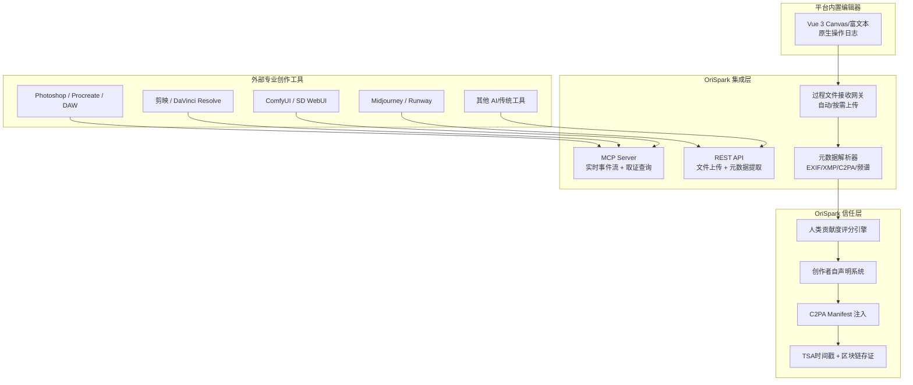

# AIGC 痕迹捕捉 — 集成枢纽方案设计

> **创建日期：** 2026-07-19
> **状态：** 已批准
> **关联文档：** `03-项目建设方案.md` 功能域一 / AIGC 痕迹审计插件体系

---

## 1. 背景与问题

当前 `03-项目建设方案.md` 将 AIGC 痕迹捕捉设计为**原生插件体系**（PS/Procreate/剪映/DAW CEP 扩展、DLL/SO Hook、VST3），要求实时监听创作软件内部事件。这存在三个核心矛盾：

1. **与专业工具厂商竞争**：图层变更监听、笔触轨迹捕获、Prompt 记录是 Photoshop/Procreate/剪映/Ableton 的看家能力，OriSpark 作为撮合平台不可能在短期内做出同等深度的采集能力。
2. **信任门槛过高**：要求创作者上传原始工程文件（PSD/AE/项目文件）才能完成确权，触发创意泄露担忧，阻碍冷启动。
3. **开发成本不可控**：每个创作工具都需要独立开发插件 SDK，覆盖头部 5 款工具就需要数月工程投入，而 OriSpark MVP 阶段资源有限。

---

## 2. 核心定位

**OriSpark 不做创作工具，不做深度采集引擎，做信任枢纽。**

```
不做：监听 PS/Procreate/剪映内部 API
不做：解析 PSD/AE/DAW 工程文件格式
不做：与专业工具厂商竞争创作功能

做：统一证据标准（MCP/REST API）
做：元数据自动提取 + 人类贡献度评分
做：C2PA/TSA/区块链三重存证
做：创作者自声明系统 + 概率性抽查
```

---

## 3. 架构设计

### 3.1 三层证据体系

| 层级 | 来源 | 可靠性 | 实现方式 |
|------|------|--------|---------|
| Layer 1 | 平台内置编辑器 | 最高 | Vue 3 Canvas/富文本原生操作日志，Pinia Store 版本快照 |
| Layer 2 | 导出文件元数据 | 中 | REST API 上传成品文件，后端自动提取 EXIF/XMP/C2PA/频谱特征 |
| Layer 3 | 创作者自声明 + MCP 事件流 | 中~高 | 结构化表单 + 专业工具 MCP Server 实时推送 |

### 3.2 系统架构图



---

## 4. 集成层详细设计

### 4.1 REST API（MVP 优先）

| 端点 | 方法 | 用途 | 输入 |
|------|------|------|------|
| `/api/v1/audit/upload` | POST | 上传导出成品文件 | PNG/JPG/MP4/WAV + 品类标签 |
| `/api/v1/audit/process-files` | POST | 上传过程性文件（可选） | PSD/AE/工程文件/日志 |
| `/api/v1/audit/declaration` | POST | 提交创作者自声明 | Prompt 历史、AI 工具列表、人工干预描述 |
| `/api/v1/audit/report/{id}` | GET | 获取审计报告 | — |
| `/api/v1/audit/verify` | POST | 验证存证真伪 | C2PA manifest URL 或链上哈希 |

**关键约束：**
- 成品文件上传不要求原始工程文件，降低信任门槛
- 过程文件支持端到端加密上传，平台只存哈希
- 所有文件存储使用对象存储（S3/OSS），审计引擎只读取元数据

### 4.2 MCP Server（Phase 1.5）

| MCP 工具名 | 能力 | 触发时机 |
|------------|------|---------|
| `upload_event_stream` | 推送创作过程事件 | 创作者授权后实时推送 |
| `request_snapshot` | 取证时请求时间快照 | 争议场景，需创作者授权 |
| `write_back_credential` | 回写确权凭证 | 确权完成后自动回写 |
| `query_audit_status` | 查询审计状态 | 创作者主动查询 |

**MCP 协议标准化原则：**
- 同一套 MCP schema，Adobe/Canva/ComfyUI 等工具接入无需修改 OriSpark 后端
- 工具端只需实现 MCP Client，OriSpark 提供 SDK 和示例代码
- 事件格式采用统一 JSON Schema，不同工具映射到标准字段

---

## 5. 信任与隐私机制

| 顾虑 | 应对机制 |
|------|---------|
| 上传原文件会被窃取创意 | 分级上传：只传导出成品即可启动；过程文件可选上传 |
| Prompt/工程内容隐私泄露 | MCP 只推事件元数据（类型+时间戳+参数指纹），不推原始像素/音频 |
| 平台滥用数据 | 审计数据仅用于确权，不进入撮合/推荐/商业化流程 |
| 无法验证平台行为 | 所有存证上链，创作者可随时下载完整审计报告自行验证 |
| 操作复杂 | MCP 自动接入零操作；手动上传提供引导式界面 |

---

## 6. 人类贡献度评分（简化版）

不再依赖单一深度插件数据，改为多源交叉验证：

| 信号来源 | 权重 | 可靠性 | 获取方式 |
|---------|------|--------|---------|
| 平台内置编辑器操作日志 | 30% | 最高 | 原生记录，无需额外采集 |
| MCP 实时事件流 | 25% | 高 | 专业工具主动推送 |
| 导出文件元数据完整性 | 20% | 中 | EXIF/XMP/C2PA 自动提取 |
| 创作者自声明一致性 | 15% | 中 | 结构化表单 + 概率性抽查 |
| 作品质量/复杂度信号 | 10% | 辅助 | 图像复杂度、频谱特征等 |

**阈值规则：**
- ≥ 0.60 → 通过（具备版权保护资格）
- 0.40 - 0.60 → 需补充 AI 使用声明
- < 0.40 → 标记为"低人类贡献"，不进入确权流水线

---

## 7. 建设阶段

| 阶段 | 时间 | 内容 | 产出 |
|------|------|------|------|
| Phase 1 | M1-M3 | REST API + 元数据提取 + 自声明系统 + 平台内置编辑器追踪 | MVP 可用，覆盖基础确权需求 |
| Phase 1.5 | M4-M6 | MCP Server + 3-5 个头部工具对接（ComfyUI/SD/PS） | 实时事件流 + 取证查询 |
| Phase 2 | M7-M12 | 更多工具接入 + 端到端加密 + 概率性抽查机制完善 | 标准开放，生态形成 |

---

## 8. 更新文档清单

本设计确认后，需要同步更新以下文档：

| 文档 | 路径 | 更新内容 |
|------|------|---------|
| 项目建设方案 | `03-项目建设方案.md` | 功能域一表格、AIGC 痕迹审计插件体系章节、技术架构中的插件描述 |
| 商业企划书 | `02-商业企划书.md` | 产品差异化对比表、护城河分析、VC 问答 Q3 |
| 可行性分析报告 | `01-可行性分析报告.md` | 技术可行性章节、风险分析 |
